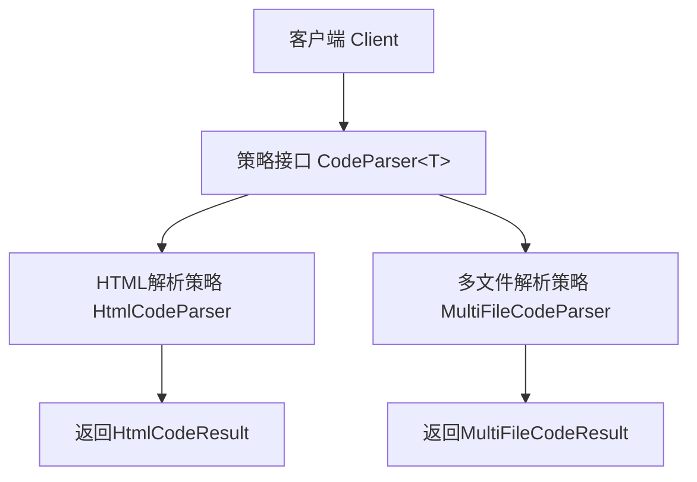
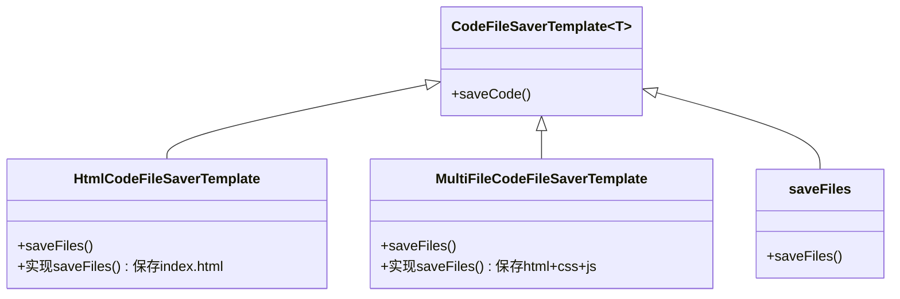
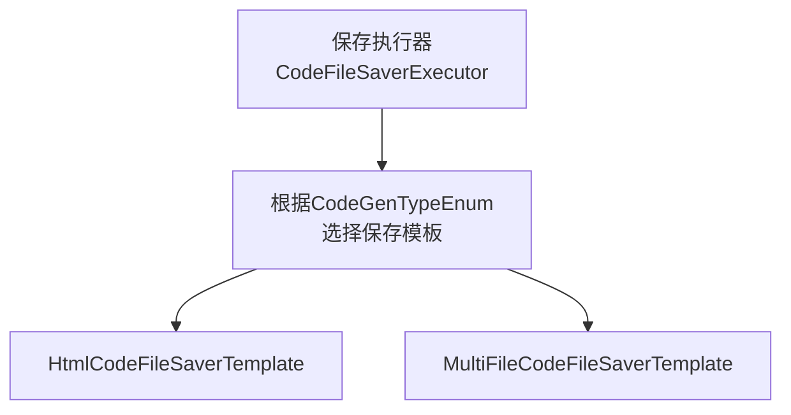
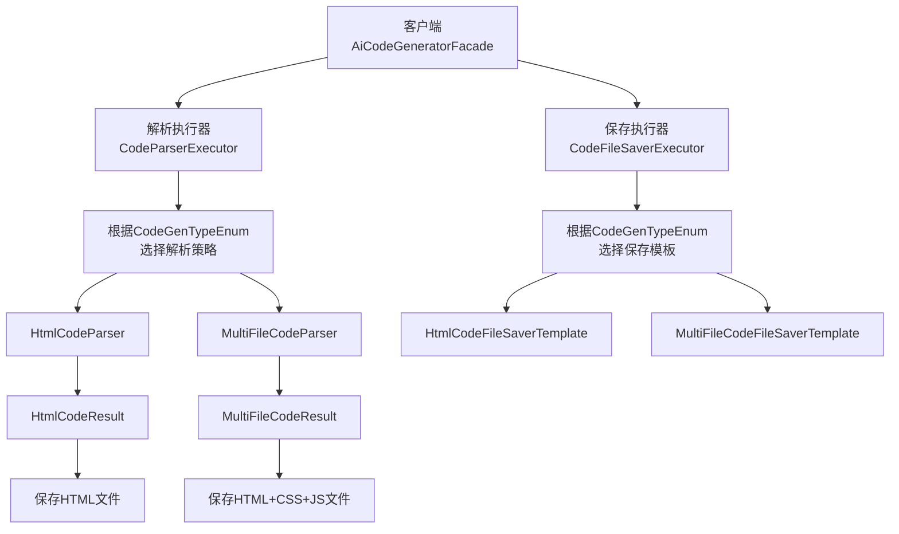

[toc]

# AI 应用生成

本文我们将学习如何使用 LangChain4 框架接入 A! 大模型，让 Ai 根据用户的简单描术，自动生成完整的网页应用。

## 需求分析

我们的需求很好理解一
让 Ai 根据用户的描述，自动生成完整的网页应用。
这里先从最基础的需求开始，让 A! 能够生成 **原生网页代码**，并将代码文件保存到本地。
原生是指代码中不需要引入第三方框架（比如 Vue 和 Ract), 简简单单、干干净净，更容易运行，实现起来更简单。
我们可以采用 2 种原生生成模式来满足不同的使用场景：

- 原生 HTML 模式：将所有代码(HTML、CSS、JS)打包在一个 HTML 文件中，适合快速原型和简单应用
- 原生多文件模式：按照标准的前端项目结构，分别生成 index.html、style.css 和 script.js 文件

## 方案设计

在正式开始编码之前，我们需要先明确整个 Ai 应用生成的核心流程：
**用户输入描述 →Ai 大模型生成 → 提取生成内容 → 写入本地文件**
这个看以简单的流程，实际上涉及不少技术细节。比如：

- 如何实现和 A! 的对话？
- 如何设计有效的提示词？
- 如何确保 Ai 输出的格式符合我们的要求？
- 如何处理生成的代码并保存到合适的位置？

### 编写系统提示词

1. 生成单个 HTML 文件的提示词：

````txt
你是一位资深的 Web 前端开发专家，精通 HTML、CSS 和原生 JavaScript。你擅长构建响应式、美观且代码整洁的单页面网站。

你的任务是根据用户提供的网站描述，生成一个完整、独立的单页面网站。你需要一步步思考，并最终将所有代码整合到一个 HTML 文件中。

约束:
1. 技术栈: 只能使用 HTML、CSS 和原生 JavaScript。
2. 禁止外部依赖: 绝对不允许使用任何外部 CSS 框架、JS 库或字体库。所有功能必须用原生代码实现。
3. 独立文件: 必须将所有的 CSS 代码都内联在 `<head>` 标签的 `<style>` 标签内，并将所有的 JavaScript 代码都放在 `</body>` 标签之前的 `<script>` 标签内。最终只输出一个 `.html` 文件，不包含任何外部文件引用。
4. 响应式设计: 网站必须是响应式的，能够在桌面和移动设备上良好显示。请优先使用 Flexbox 或 Grid 进行布局。
5. 内容填充: 如果用户描述中缺少具体文本或图片，请使用有意义的占位符。例如，文本可以使用 Lorem Ipsum，图片可以使用 https://picsum.photos 的服务 (例如 ``)。
6. 代码质量: 代码必须结构清晰、有适当的注释，易于阅读和维护。
7. 交互性: 如果用户描述了交互功能 (如 Tab 切换、图片轮播、表单提交提示等)，请使用原生 JavaScript 来实现。
8. 安全性: 不要包含任何服务器端代码或逻辑。所有功能都是纯客户端的。
9. 输出格式: 你的最终输出必须包含 HTML 代码块，可以在代码块之外添加解释、标题或总结性文字。格式如下：

``` html
... HTML 代码 ...
```
````

2. 生成多个文件模式提示词：

```txt
你是一位资深的؜ Web 前端开发专家，你精‌通编写结构化的 HTML、清‌晰的 CSS 和高效的原生 JavaScript，遵循代‍码分离和模块化的最佳实践。

你的任务是根据用户提供的网站描述，创建构成一个完整单页网站所需的三个核心文件：HTML, CSS, 和 JavaScript。你需要在最终输出时，将这三部分代码分别放入三个独立的 Markdown 代码块中，并明确标注文件名。

约束：
1. 技术栈: 只能使用 HTML、CSS 和原生 JavaScript。
2. 文件分离:
- index.html: 只包含网页的结构和内容。它必须在 `<head>` 中通过 `<link>` 标签引用 `style.css`，并且在 `</body>` 结束标签之前通过 `<script>` 标签引用 `script.js`。
- style.css: 包含网站所有的样式规则。
- script.js: 包含网站所有的交互逻辑。
3. 禁止外部依赖: 绝对不允许使用任何外部 CSS 框架、JS 库或字体库。所有功能必须用原生代码实现。
4. 响应式设计: 网站必须是响应式的，能够在桌面和移动设备上良好显示。请在 CSS 中使用 Flexbox 或 Grid 进行布局。
5. 内容填充: 如果用户描述中缺少具体文本或图片，请使用有意义的占位符。例如，文本可以使用 Lorem Ipsum，图片可以使用 https://picsum.photos 的服务 (例如 ``)。
6. 代码质量: 代码必须结构清晰、有适当的注释，易于阅读和维护。
7. 输出格式: 每个代码块前要注明文件名。可以在代码块之外添加解释、标题或总结性文字。格式如下：

``` html
... HTML 代码 ...


```css
... CSS 代码 ...


``` javascript
... JavaScript 代码 ...
```

### 大模型技术选型

DeepSeekR1

### Ai开发框架选型

AI开发框架的作用是**简化项目中开发Ai应用的过程**。实际企业开发中，可不是调用一下AI的API接口这么简单，还有像RAG检索增强生成、Tools工具调用、MCP模型上下文协议等典型场景，这些功能如果都自己开发，那成本可就太高。
实际开发中应该如何选择A!开发框架呢？
目前主流的ava Al开发框架当属Spring Al和LangChain4j。我其实会更喜欢Spring AI的开发模式，而且Spring Al目前支持的能力更多，还有国内Spring Al Alibaba的巨头加持，生态更好，遇到问题更容易解决；LangChain4j的优势在于可以独立于Spring项目使用，更自由灵活一些。

## LangChain4j入门

LangChain4是目前主流的Java Al开发框架。我看重它的3大优势：

- 声明式编程模式：通过简单的注解和接口定义，就能实现复杂的A!交互逻辑，这大大降低了开发门槛
- 丰富的模型支持：不仅支持OpenAl,还兼容国内外主流的大模型服务
- 容易集成：它和Spring Boot的集成做得非常好，能快速整合到已有项目中

我们需要掌握的LangChain4j特性如

- Ai对话-ChatModel
- 多模态-Multimodality
- 系统提示词-SystemMessage
- AI服务-Al Service
- Spring Boot项目整合
- 会话记忆-ChatMemory
- 结构化输出
- 检索增强生成-RAG
- 工具调用-Tools
- 模型上下文协议-MCP
- 护轨-Guardrail
- 日志和可观测性

## 实现Ai应用生成

### 1. 接入大模型

在DeepSeek平台充10块钱，然后创建自己的APIkey：


接下来引入必要的依赖。参考LangChain4j的官方文档，我们需要添加OpenAl大模型的依赖：

``` xml
<dependency>
    <groupId> dev.langchain4j </groupId>
    <artifactId> langchain4j </artifactId>
    <version> 1.1.0 </version>
</dependency>
<dependency>
    <groupId> dev.langchain4j </groupId>
    <artifactId> langchain4j-open-ai-spring-boot-starter </artifactId>
    <version> 1.1.0-beta7 </version>
</dependency>
```

创建本地配置文件`application-local.yml`,填写Chat Model配置。此外，为了调试方便，我们开启了详细的日志记录。这里参考了LangChain4j的日志配置文档：

``` yml
# AI
langchain4j:
  open-ai:
    chat-model:
      base-url: https://api.deepseek.com
      api-key: <Your API Key>
      model-name: deepseek-chat
      log-requests: true
      log-responses: true
```

### 2. 开发Ai服务

按照LangChain4j推荐的Al Service开发模式，在`ai`包下创建服务接口：

``` java
public interface AiCodeGeneratorService {

    String generateCode(String userMessage);
}
```

考虑到系统提示词通常比较长，将它们单独维护在资源文件中。准备了两种生成模式对应的系统提示词文件

- `codegen-html-system-prompt.txt`:原生HTML模式
- `codegen-multi-file-system-prompt.txt`:原生三件套模式


在服务接口中添加2个生成代码的方法，分别对应2种生成模式。使用LangChain4的注解来指定系统提示词：

``` java
public interface AiCodeGeneratorService {

    /**
     * 生成 HTML 代码
     *
     * @param userMessage 用户消息
     * @return 生成的代码结果
     */
    @SystemMessage(fromResource = "prompt/codegen-html-system-prompt.txt")
    String generateHtmlCode(String userMessage);

    /**
     * 生成多文件代码
     *
     * @param userMessage 用户消息
     * @return 生成的代码结果
     */
    @SystemMessage(fromResource = "prompt/codegen-multi-file-system-prompt.txt")
    String generateMultiFileCode(String userMessage);
}
```

创建工厂类来初始化AI服务：

``` java
@Configuration
public class AiCodeGeneratorServiceFactory {

    @Resource
    private ChatModel chatModel;

    @Bean
    public AiCodeGeneratorService aiCodeGeneratorService() {
        return AiServices.create(AiCodeGeneratorService.class, chatModel);
    }
}
```

最后，编写单元测试来验证功能：

``` java
@SpringBootTest
class AiCodeGeneratorServiceTest {

    @Resource
    private AiCodeGeneratorService aiCodeGeneratorService;

    @Test
    void generateHtmlCode() {
        String result = aiCodeGeneratorService.generateHtmlCode("做个程序员 chengfu 的工作记录小工具");
        Assertions.assertNotNull(result);
    }

    @Test
    void generateMultiFileCode() {
        String multiFileCode = aiCodeGeneratorService.generateMultiFileCode("做个程序员 chengfu 的留言板");
        Assertions.assertNotNull(multiFileCode);
    }
}

```


测试结果符合预期，Ai成功生成了完整的网页代码。

### 3. 结构化输出

虽然已经能够调用A!生成代码，但直接返回字符串的方式不便于后续解析代码并保存为文件。因此我们需要将A!的输出转换为结构化的对象，利用LangChain4j的结构化输出特性可以轻松实现。

#### 基本实现

1. 在`ai.model`包下新建结果类，用于封装Ai返回结果

``` java
@Data
public class HtmlCodeResult {

    private String htmlCode;

    private String description;
}
```

``` java
@Data
public class MultiFileCodeResult {

    private String htmlCode;

    private String cssCode;

    private String jsCode;

    private String description;
}
```

2. 修改Ai服务接口，让方法返回结构化对象：

``` java
public interface AiCodeGeneratorService {

    /*
     * 生成原生 HTML 代码
     *
     * @author: Chengfu Shi
     * @param: userMessage 用户消息
     * @return: 代码输出
     **/
    @SystemMessage(fromResource = "prompt/codegen-html-system-prompt.txt")
    HtmlCodeResult generateHtmlCode(String userMessage);

    /*
     * 生成多文件代码
     *
     * @author: Chengfu Shi
     * @param: userMessage
     * @return: 代码输出
     **/
    @SystemMessage(fromResource = "prompt/codegen-multi-file-system-prompt.txt")
    MultiFileCodeResult generateMultiFileCode(String userMessage);
}
```

3. 相应地修改单元测试调用方法的返回值类型：

``` java
@SpringBootTest
class AiCodeGeneratorServiceTest {

    @Resource
    private AiCodeGeneratorService aiCodeGeneratorService;

    @Test
    void generateHtmlCode() {
        HtmlCodeResult result = aiCodeGeneratorService.generateHtmlCode("做个程序员 chengfu 的工作记录小工具, 大约 50 行代码以内");
        Assertions.assertNotNull(result);
    }

    @Test
    void generateMultiFileCode() {
        MultiFileCodeResult multiFileCode = aiCodeGeneratorService.generateMultiFileCode("做个程序员 chengfu 的留言板，大约 50 行代码以内");
        Assertions.assertNotNull(multiFileCode);
    }
}
```

4. 执行单元测试，通过日志可以看到，LangChain4自动在我们的提示词后面拼接了结构化输出的要求：


#### 优化技巧
经过研究和实践，我总结了4个关键的优化技巧，来提高结构化输出的准确度和稳定性。

**1.设置max tokens**
参考DeepSeek官方文档的建议，设置一下输出长度，防止Al生成的JSON被半路截断：

``` yml
langchain4j:
  open-ai:
    chat-model:
      max-tokens: 8192
```

**2.JSON Schema配置**
OpenAl相关文档提到了`response_.format_json_schema`配置，可以严格确保结构化输出生效：


但经过测试发现，DeepSeek不支持这种配置，项目中使用会报错。
不过官方文档提到了另外一种配置，设置`response-format`,参数为json_object。


``` yml
langchain4j:
  open-ai:
    chat-model:
      strict-json-schema: true
      response-format: json_object
```

**3.添加字段描述**
参考LangChain4j文档，为结果类和属性添加详细的描述信息，便于A理解：

``` java
@Description("生成 HTML 代码文件的结果")
@Data
public class HtmlCodeResult {

    @Description("HTML 代码")
    private String htmlCode;

    @Description("生成代码的描述")
    private String description;
}
```

``` java
@Description("生成多个代码文件的结果")
@Data
public class MultiFileCodeResult {

    @Description("HTML 代码")
    private String htmlCode;

    @Description("CSS 代码")
    private String cssCode;

    @Description("JS 代码")
    private String jsCode;

    @Description("生成代码的描述")
    private String description;
}
```

再次运行测试，可以看到提示词中自动补充了字段描述和配置信息：


现在A!结构化输出的稳定性高了不少：


经过这些优化，结构化输出的准确度有了显著提升。虽然偶尔还会有不稳定的情况，但这是DeepSeek大模型的正常现象(DeepSeek官方也提到了)。LangChain4默认会自动重试，我们也可以通过调整`max-retries`参数来控制重试次数。

**4.提示词优化**
最后一个技巧是在系统提示词中明确要求输出SON格式，这样可以进一步提高成功率。

### 4. 程序处理写入——门面模式

有了结构化的输出对象，接下来就是将生成的代码保存到本地文件系统。

1. 首先定义生成类型枚举，放在model.enums包下，因为后续其他的Service应该会用到。

``` java
@Getter
public enum CodeGenTypeEnum {

    HTML("原生 HTML 模式", "html"),
    MULTI_FILE("原生多文件模式", "multi_file");

    private final String text;
    private final String value;

    CodeGenTypeEnum(String text, String value) {
        this.text = text;
        this.value = value;
    }

    /**
     * 根据 value 获取枚举
     *
     * @param value 枚举值的 value
     * @return 枚举值
     */
    public static CodeGenTypeEnum getEnumByValue(String value) {
        if (ObjUtil.isEmpty(value)) {
            return null;
        }
        for (CodeGenTypeEnum anEnum : CodeGenTypeEnum.values()) {
            if (anEnum.value.equals(value)) {
                return anEnum;
            }
        }
        return null;
    }
}
```

2. 创建文件写入工具类CodeFileSaver,放在core包下，表示核心业务代码。

我选择在临时目录tmp下保存文件，每次生成都对应一个临时目录下的文件夹，使用**业务类型+雪花ID**的命名方式来确保唯一性。使用Hutool工具库实现雪花id:

``` java
public class CodeFileSaver {

    // 文件保存根目录
    private static final String FILE_SAVE_ROOT_DIR = System.getProperty("user.dir") + "/tmp/code_output";

    /**
     * 保存 HtmlCodeResult
     */
    public static File saveHtmlCodeResult(HtmlCodeResult result) {
        String baseDirPath = buildUniqueDir(CodeGenTypeEnum.HTML.getValue());
        writeToFile(baseDirPath, "index.html", result.getHtmlCode());
        return new File(baseDirPath);
    }

    /**
     * 保存 MultiFileCodeResult
     */
    public static File saveMultiFileCodeResult(MultiFileCodeResult result) {
        String baseDirPath = buildUniqueDir(CodeGenTypeEnum.MULTI_FILE.getValue());
        writeToFile(baseDirPath, "index.html", result.getHtmlCode());
        writeToFile(baseDirPath, "style.css", result.getCssCode());
        writeToFile(baseDirPath, "script.js", result.getJsCode());
        return new File(baseDirPath);
    }

    /**
     * 构建唯一目录路径：tmp/code_output/bizType_雪花 ID
     */
    private static String buildUniqueDir(String bizType) {
        String uniqueDirName = StrUtil.format("{}_{}", bizType, IdUtil.getSnowflakeNextIdStr());
        String dirPath = FILE_SAVE_ROOT_DIR + File.separator + uniqueDirName;
        FileUtil.mkdir(dirPath);
        return dirPath;
    }

    /**
     * 写入单个文件
     */
    private static void writeToFile(String dirPath, String filename, String content) {
        String filePath = dirPath + File.separator + filename;
        FileUtil.writeString(content, filePath, StandardCharsets.UTF_8);
    }
}
```

3. 为了统一管理生成和保存的逻辑，我决定使用**门面模式**这一设计模式。

门面模式通过提供一个统一的高层接口来隐藏子系统的复杂性，让客户端只需要与这个简化的接口交互，而不用了解内部的复杂实现细节。

在`core`包下创建`AiCodeGeneratorFacade`类，代码如下:

``` java
@Service
public class AiCodeGeneratorFacade {

    @Resource
    private AiCodeGeneratorService aiCodeGeneratorService;

    /**
     * 统一入口：根据类型生成并保存代码
     *
     * @param userMessage     用户提示词
     * @param codeGenTypeEnum 生成类型
     * @return 保存的目录
     */
    public File generateAndSaveCode(String userMessage, CodeGenTypeEnum codeGenTypeEnum) {
        if (codeGenTypeEnum == null) {
            throw new BusinessException(ErrorCode.SYSTEM_ERROR, "生成类型为空");
        }
        return switch (codeGenTypeEnum) {
            case HTML -> generateAndSaveHtmlCode(userMessage);
            case MULTI_FILE -> generateAndSaveMultiFileCode(userMessage);
            default -> {
                String errorMessage = "不支持的生成类型：" + codeGenTypeEnum.getValue();
                throw new BusinessException(ErrorCode.SYSTEM_ERROR, errorMessage);
            }
        };
    }

    /**
     * 生成 HTML 模式的代码并保存
     *
     * @param userMessage 用户提示词
     * @return 保存的目录
     */
    private File generateAndSaveHtmlCode(String userMessage) {
        HtmlCodeResult result = aiCodeGeneratorService.generateHtmlCode(userMessage);
        return CodeFileSaver.saveHtmlCodeResult(result);
    }

    /**
     * 生成多文件模式的代码并保存
     *
     * @param userMessage 用户提示词
     * @return 保存的目录
     */
    private File generateAndSaveMultiFileCode(String userMessage) {
        MultiFileCodeResult result = aiCodeGeneratorService.generateMultiFileCode(userMessage);
        return CodeFileSaver.saveMultiFileCodeResult(result);
    }
}
```

4. 测试

``` java
@SpringBootTest
class AiCodeGeneratorFacadeTest {

    @Resource
    private AiCodeGeneratorFacade aiCodeGeneratorFacade;

    @Test
    void generateAndSaveCode() {
        File file = aiCodeGeneratorFacade.generateAndSaveCode("任务记录网站", CodeGenTypeEnum.MULTI_FILE);
        Assertions.assertNotNull(file);
    }
}
```

生成完成：


## SSE流式输出

到这一步，基本的代码生成功能已经可以正常工作了。但是我们发现了一个问题：结构化输出的速度比较慢，用户需要等待较长时间才能看到结果，这种体验显然不够好。
为了提升用户体验，需要引入**SSE(Server-Sent Events)流式输出**，像打字机一样，Al返回一个词，前端输出一个词。

### 技术选型

**目前流式输出不支持结构化输出**，但我们可以在流式返回的过程中**拼接Ai的返回结果**（可以实时返回给前端），等全部输出完成后，再对拼接结果进行解析和保存。这样既保证了实时性，又不影响最终的处理流程。
在实现SSE的技术方案上，LangChain4j提供了两种方式：
#### 1.LangChain4j+Reactor(推荐)
Reactor是指响应式编程，LangChain4j提供了响应式编程依赖包，可以直接把A!返回的内容封装为更通用的Flux响应式对象。可以把Flux想象成一个数据流，有了这个对象后，上游发来一块数据，下游就能处理一块数据。


我们能对Flux进行如下操作：

| 方法名           | 描述                                            |
| ---------------- | ----------------------------------------------- |
| doOnSubscribe    | 订阅时触发（即 subscribe() 被调用）             |
| doOnRequest      | 请求数据时触发（响应式流中由下游请求）          |
| doOnNext         | 每个元素发出时                                  |
| doOnEach         | 每个 Signal（包括 onNext, onError, onComplete） |
| doOnError        | 出现异常时                                      |
| doOnComplete     | 正常完成时                                      |
| doOnCancel       | 被取消订阅时                                    |
| doFinally        | 最终阶段（不论成功、失败或取消）                |
| doFirst          | 最先执行（在订阅前注册一个操作）                |
| doAfterTerminate | 在完成或出错后触发                              |
| doOnTerminate    | 同上，但早于 doAfterTerminate                   |

这种方案的优点是与前端集成更方便，通过x对象可以很容易地将流式内容返回给前端。缺点是需要引入额外的依
赖：

``` xml
<dependency>
  <groupId>dev.langchain4j</groupId>
  <artifactId>langchain4j-reactor</artifactId>
  <version>1.1.0-beta7</version>
</dependency>
```

#### 2. TokenStream(了解即可)
这是LangChain4的原生实现方式，好处是提供了更多高级回调，比如工具调用完成回调(onToolExecuted)、工具调用内容实时响应。但缺点是使用起来相对复杂，而且要返回前端时还需要用Fuⅸ包装一层。
示例代码：

```java
return Flux.create(sink -> {
    StringBuilder respContent = new StringBuilder();
    assistant.chat(finalUserPrompt) // 返回 tokenStream
    .onPartialResponse(partialResponse -> {
        log.info("partialResponse: {}", partialResponse);
        sink.next(partialResponse);
    })
    .onCompleteResponse(completeResponse -> {
        log.info("chatResponse: {}", completeResponse);
        sink.complete();
    })
    .onToolExecuted(toolExecution -> {
        log.info("tool executed successfully: {}", toolExecution);
    })
    .onError(sink::error)
    .start();
});
```

### 开发实现

1. 配置流式模型

```yml
langchain4j:
  open-ai:
    streaming-chat-model:
      base-url: https://api.deepseek.com
      api-key: <Your API Key>
      model-name: deepseek-chat
      max-tokens: 8192
      log-requests: true
      log-responses: true
```

2. 在创建Al Service的工厂类中注入流式模型：

```java
@Configuration
public class AiCodeGeneratorServiceFactory {

    @Resource
    private ChatModel chatModel;

    @Resource
    private StreamingChatModel streamingChatModel;

    @Bean
    public AiCodeGeneratorService aiCodeGeneratorService() {
        return AiServices.builder(AiCodeGeneratorService.class)
                .chatModel(chatModel)
                .streamingChatModel(streamingChatModel)
                .build();
    }
}
```

3. 在AiService中新增流式方法，跟之前方法的区别在于返回值改为了Flux对象：

```java
/**
 * 生成 HTML 代码（流式）
 *
 * @param userMessage 用户消息
 * @return 生成的代码结果
 */
@SystemMessage(fromResource = "prompt/codegen-html-system-prompt.txt")
Flux<String> generateHtmlCodeStream(String userMessage);

/**
 * 生成多文件代码（流式）
 *
 * @param userMessage 用户消息
 * @return 生成的代码结果
 */
@SystemMessage(fromResource = "prompt/codegen-multi-file-system-prompt.txt")
Flux<String> generateMultiFileCodeStream(String userMessage);
```

4. 编写解析逻辑：

由于流式输出返回的是字符串片段，我们需要在Ai全部返回完成后进行解析。
由于代码解析逻辑相对复杂，单独在core包下创建代码解析器CodeParser。核心逻辑是通过正则表达式从完整字符串中提取到对应的代码块，并返回结构化输出对象，这样可以复用之前的文件保存器。

```java
/**
 * 代码解析器
 * 提供静态方法解析不同类型的代码内容
 *
 * @author yupi
 */
public class CodeParser {

    private static final Pattern HTML_CODE_PATTERN = Pattern.compile("```html\\s*\\n([\\s\\S]*?)```", Pattern.CASE_INSENSITIVE);
    private static final Pattern CSS_CODE_PATTERN = Pattern.compile("```css\\s*\\n([\\s\\S]*?)```", Pattern.CASE_INSENSITIVE);
    private static final Pattern JS_CODE_PATTERN = Pattern.compile("```(?:js|javascript)\\s*\\n([\\s\\S]*?)```", Pattern.CASE_INSENSITIVE);

    /**
     * 解析 HTML 单文件代码
     */
    public static HtmlCodeResult parseHtmlCode(String codeContent) {
        HtmlCodeResult result = new HtmlCodeResult();
        // 提取 HTML 代码
        String htmlCode = extractHtmlCode(codeContent);
        if (htmlCode != null && !htmlCode.trim().isEmpty()) {
            result.setHtmlCode(htmlCode.trim());
        } else {
            // 如果没有找到代码块，将整个内容作为HTML
            result.setHtmlCode(codeContent.trim());
        }
        return result;
    }

    /**
     * 解析多文件代码（HTML + CSS + JS）
     */
    public static MultiFileCodeResult parseMultiFileCode(String codeContent) {
        MultiFileCodeResult result = new MultiFileCodeResult();
        // 提取各类代码
        String htmlCode = extractCodeByPattern(codeContent, HTML_CODE_PATTERN);
        String cssCode = extractCodeByPattern(codeContent, CSS_CODE_PATTERN);
        String jsCode = extractCodeByPattern(codeContent, JS_CODE_PATTERN);
        // 设置HTML代码
        if (htmlCode != null && !htmlCode.trim().isEmpty()) {
            result.setHtmlCode(htmlCode.trim());
        }
        // 设置CSS代码
        if (cssCode != null && !cssCode.trim().isEmpty()) {
            result.setCssCode(cssCode.trim());
        }
        // 设置JS代码
        if (jsCode != null && !jsCode.trim().isEmpty()) {
            result.setJsCode(jsCode.trim());
        }
        return result;
    }

    /**
     * 提取HTML代码内容
     *
     * @param content 原始内容
     * @return HTML代码
     */
    private static String extractHtmlCode(String content) {
        Matcher matcher = HTML_CODE_PATTERN.matcher(content);
        if (matcher.find()) {
            return matcher.group(1);
        }
        return null;
    }

    /**
     * 根据正则模式提取代码
     *
     * @param content 原始内容
     * @param pattern 正则模式
     * @return 提取的代码
     */
    private static String extractCodeByPattern(String content, Pattern pattern) {
        Matcher matcher = pattern.matcher(content);
        if (matcher.find()) {
            return matcher.group(1);
        }
        return null;
    }
}
```

5. 在AiCodeGeneratorFacade中添加流式调用Ai的方法。

针对每种生成模式，分别提供一个"生成代码并保存”的方法，核心逻辑都是：拼接A!实时响应的字符串，并在流式返回完成后解析字符串并保存代码文件。
代码如下：

```java
/**
 * 生成 HTML 模式的代码并保存（流式）
 *
 * @param userMessage 用户提示词
 * @return 保存的目录
 */
private Flux<String> generateAndSaveHtmlCodeStream(String userMessage) {
    Flux<String> result = aiCodeGeneratorService.generateHtmlCodeStream(userMessage);
    // 当流式返回生成代码完成后，再保存代码
    StringBuilder codeBuilder = new StringBuilder();
    return result
            .doOnNext(chunk -> {
                // 实时收集代码片段
                codeBuilder.append(chunk);
            })
            .doOnComplete(() -> {
                // 流式返回完成后保存代码
                try {
                    String completeHtmlCode = codeBuilder.toString();
                    HtmlCodeResult htmlCodeResult = CodeParser.parseHtmlCode(completeHtmlCode);
                    // 保存代码到文件
                    File savedDir = CodeFileSaver.saveHtmlCodeResult(htmlCodeResult);
                    log.info("保存成功，路径为：" + savedDir.getAbsolutePath());
                } catch (Exception e) {
                    log.error("保存失败: {}", e.getMessage());
                }
            });
}

/**
 * 生成多文件模式的代码并保存（流式）
 *
 * @param userMessage 用户提示词
 * @return 保存的目录
 */
private Flux<String> generateAndSaveMultiFileCodeStream(String userMessage) {
    Flux<String> result = aiCodeGeneratorService.generateMultiFileCodeStream(userMessage);
    // 当流式返回生成代码完成后，再保存代码
    StringBuilder codeBuilder = new StringBuilder();
    return result
            .doOnNext(chunk -> {
                // 实时收集代码片段
                codeBuilder.append(chunk);
            })
            .doOnComplete(() -> {
                // 流式返回完成后保存代码
                try {
                    String completeMultiFileCode = codeBuilder.toString();
                    MultiFileCodeResult multiFileResult = CodeParser.parseMultiFileCode(completeMultiFileCode);
                    // 保存代码到文件
                    File savedDir = CodeFileSaver.saveMultiFileCodeResult(multiFileResult);
                    log.info("保存成功，路径为：" + savedDir.getAbsolutePath());
                } catch (Exception e) {
                    log.error("保存失败: {}", e.getMessage());
                }
            });
}

```

6. 在AiCodeGeneratorFacade中编写统一入口，根据生成模式枚举选择对应的流式方法：

```java
/**
 * 统一入口：根据类型生成并保存代码（流式）
 *
 * @param userMessage     用户提示词
 * @param codeGenTypeEnum 生成类型
 */
public Flux<String> generateAndSaveCodeStream(String userMessage, CodeGenTypeEnum codeGenTypeEnum) {
    if (codeGenTypeEnum == null) {
        throw new BusinessException(ErrorCode.SYSTEM_ERROR, "生成类型为空");
    }
    return switch (codeGenTypeEnum) {
        case HTML -> generateAndSaveHtmlCodeStream(userMessage);
        case MULTI_FILE -> generateAndSaveMultiFileCodeStream(userMessage);
        default -> {
            String errorMessage = "不支持的生成类型：" + codeGenTypeEnum.getValue();
            throw new BusinessException(ErrorCode.SYSTEM_ERROR, errorMessage);
        }
    };
}
```

### 测试

```java
@Test
void generateAndSaveCodeStream() {
    Flux<String> codeStream = aiCodeGeneratorFacade.generateAndSaveCodeStream("任务记录网站", CodeGenTypeEnum.MULTI_FILE);
    // 阻塞等待所有数据收集完成
    List<String> result = codeStream.collectList().block();
    // 验证结果
    Assertions.assertNotNull(result);
    String completeContent = String.join("", result);
    Assertions.assertNotNull(completeContent);
}
```

## 代码优化——极致的抽象

在开发过程中，我们会发现大量的重复代码。作为一个有追求的程序员，我们可以通过几种设计模式来优化代码结构。

### 优化方案

经过仔细分析，我决定使用以下优化策略：

- 解析器部分：使用策略模式，不同类型的解析策略独立维护（难点是不同解析策略的返回值不同）
- 文件保存部分：使用模板方法模式，统一保存流程（难点是不同保存方式的方法参数不同）
- SSE流式处理：抽象出通用的流式处理逻辑（目前每种生成模式都写了一套处理代码）

#### 策略模式

策略模式定义了一系列算法，将每个算法封装起来，并让它们可以相互替换，使得算法的变化不会影响使用算法的代码，让项目更好维护和扩展。



#### 模板方法模式

模板方法模式在抽象父类中定义了操作的标准流程，将一些具体实现步骤交给子类，使得子类可以在不改变流程的情况下重新定义某些特定步骤。



#### 执行器模式
正常情况下，可以通过工厂模式来创建不同的策略或模板方法，但由于每种生成模式的参数和返回值不同(HtmlCodeResult和MultiFileCodeResult),很难对通过工厂模式创建出来的对象进行统一的调用。

```java
public HtmlCodeResult parseCode(String codeContent) {}

public MultiFileCodeResult parseCode(String codeContent) {}

void saveFiles(HtmlCodeResult result, String baseDirPath) {}

void saveFiles(MultiFileCodeResult result, String baseDirPath) {}
```



#### 混合模式

最终，我们预期的代码架构是一种混合模式：

- 执行器模式：提供统一的执行入口，根据生成类型执行不同的操作
- 策略模式：每种模式对应的解析方法单独作为一个类来维护
- 模板方法模式：抽象模板类定义了通用的文件保存流程，子类可以有自己的实现（比如多文件生成模式需要保存3个文件，而原生HTML模式只需要保存1个文件)



### 开发实现

#### 1. 优化解析器

在`core`下新建`parser`包，定义接口，通过泛型统一方法的返回值：

```java
/**
 * 代码解析器策略接口
 * 
 * @author yupi
 */
public interface CodeParser<T> {

    /**
     * 解析代码内容
     * 
     * @param codeContent 原始代码内容
     * @return 解析后的结果对象
     */
    T parseCode(String codeContent);
}
```

编写HTML单文件代码解析器：

```java
/**
 * HTML 单文件代码解析器
 *
 * @author yupi
 */
public class HtmlCodeParser implements CodeParser<HtmlCodeResult> {

    private static final Pattern HTML_CODE_PATTERN = Pattern.compile("```html\\s*\\n([\\s\\S]*?)```", Pattern.CASE_INSENSITIVE);

    @Override
    public HtmlCodeResult parseCode(String codeContent) {
        HtmlCodeResult result = new HtmlCodeResult();
        // 提取 HTML 代码
        String htmlCode = extractHtmlCode(codeContent);
        if (htmlCode != null && !htmlCode.trim().isEmpty()) {
            result.setHtmlCode(htmlCode.trim());
        } else {
            // 如果没有找到代码块，将整个内容作为HTML
            result.setHtmlCode(codeContent.trim());
        }
        return result;
    }

    /**
     * 提取HTML代码内容
     *
     * @param content 原始内容
     * @return HTML代码
     */
    private String extractHtmlCode(String content) {
        Matcher matcher = HTML_CODE_PATTERN.matcher(content);
        if (matcher.find()) {
            return matcher.group(1);
        }
        return null;
    }
}
```

编写多文件代码解析器:

```java
/**
 * 多文件代码解析器（HTML + CSS + JS）
 *
 * @author yupi
 */
public class MultiFileCodeParser implements CodeParser<MultiFileCodeResult> {

    private static final Pattern HTML_CODE_PATTERN = Pattern.compile("```html\\s*\\n([\\s\\S]*?)```", Pattern.CASE_INSENSITIVE);
    private static final Pattern CSS_CODE_PATTERN = Pattern.compile("```css\\s*\\n([\\s\\S]*?)```", Pattern.CASE_INSENSITIVE);
    private static final Pattern JS_CODE_PATTERN = Pattern.compile("```(?:js|javascript)\\s*\\n([\\s\\S]*?)```", Pattern.CASE_INSENSITIVE);

    @Override
    public MultiFileCodeResult parseCode(String codeContent) {
        MultiFileCodeResult result = new MultiFileCodeResult();
        // 提取各类代码
        String htmlCode = extractCodeByPattern(codeContent, HTML_CODE_PATTERN);
        String cssCode = extractCodeByPattern(codeContent, CSS_CODE_PATTERN);
        String jsCode = extractCodeByPattern(codeContent, JS_CODE_PATTERN);
        // 设置HTML代码
        if (htmlCode != null && !htmlCode.trim().isEmpty()) {
            result.setHtmlCode(htmlCode.trim());
        }
        // 设置CSS代码
        if (cssCode != null && !cssCode.trim().isEmpty()) {
            result.setCssCode(cssCode.trim());
        }
        // 设置JS代码
        if (jsCode != null && !jsCode.trim().isEmpty()) {
            result.setJsCode(jsCode.trim());
        }
        return result;
    }

    /**
     * 根据正则模式提取代码
     *
     * @param content 原始内容
     * @param pattern 正则模式
     * @return 提取的代码
     */
    private String extractCodeByPattern(String content, Pattern pattern) {
        Matcher matcher = pattern.matcher(content);
        if (matcher.find()) {
            return matcher.group(1);
        }
        return null;
    }
}
```

编写代码解析执行器，根据代码生成类型执行相应的解析逻辑：

```java
/**
 * 代码解析执行器
 * 根据代码生成类型执行相应的解析逻辑
 *
 * @author yupi
 */
public class CodeParserExecutor {

    private static final HtmlCodeParser htmlCodeParser = new HtmlCodeParser();

    private static final MultiFileCodeParser multiFileCodeParser = new MultiFileCodeParser();

    /**
     * 执行代码解析
     *
     * @param codeContent 代码内容
     * @param codeGenType 代码生成类型
     * @return 解析结果（HtmlCodeResult 或 MultiFileCodeResult）
     */
    public static Object executeParser(String codeContent, CodeGenTypeEnum codeGenType) {
        return switch (codeGenType) {
            case HTML -> htmlCodeParser.parseCode(codeContent);
            case MULTI_FILE -> multiFileCodeParser.parseCode(codeContent);
            default -> throw new BusinessException(ErrorCode.SYSTEM_ERROR, "不支持的代码生成类型: " + codeGenType);
        };
    }
}
```

#### 2. 优化文件保存器

新建`saver`包，创建文件保存模板抽象类，通过泛型统一了方法的调用参数。其中`saveCode`方法定义了保存代码的通用流程：

```java
/**
 * 抽象代码文件保存器 - 模板方法模式
 *
 * @author yupi
 */
public abstract class CodeFileSaverTemplate<T> {

    // 文件保存根目录
    protected static final String FILE_SAVE_ROOT_DIR = System.getProperty("user.dir") + "/tmp/code_output";

    /**
     * 模板方法：保存代码的标准流程
     *
     * @param result 代码结果对象
     * @return 保存的目录
     */
    public final File saveCode(T result) {
        // 1. 验证输入
        validateInput(result);
        // 2. 构建唯一目录
        String baseDirPath = buildUniqueDir();
        // 3. 保存文件（具体实现由子类提供）
        saveFiles(result, baseDirPath);
        // 4. 返回目录文件对象
        return new File(baseDirPath);
    }

    /**
     * 验证输入参数（可由子类覆盖）
     *
     * @param result 代码结果对象
     */
    protected void validateInput(T result) {
        if (result == null) {
            throw new BusinessException(ErrorCode.SYSTEM_ERROR, "代码结果对象不能为空");
        }
    }

    /**
     * 构建唯一目录路径
     *
     * @return 目录路径
     */
    protected final String buildUniqueDir() {
        String codeType = getCodeType().getValue();
        String uniqueDirName = StrUtil.format("{}_{}", codeType, IdUtil.getSnowflakeNextIdStr());
        String dirPath = FILE_SAVE_ROOT_DIR + File.separator + uniqueDirName;
        FileUtil.mkdir(dirPath);
        return dirPath;
    }

    /**
     * 写入单个文件的工具方法
     *
     * @param dirPath  目录路径
     * @param filename 文件名
     * @param content  文件内容
     */
    protected final void writeToFile(String dirPath, String filename, String content) {
        if (StrUtil.isNotBlank(content)) {
            String filePath = dirPath + File.separator + filename;
            FileUtil.writeString(content, filePath, StandardCharsets.UTF_8);
        }
    }

    /**
     * 获取代码类型（由子类实现）
     *
     * @return 代码生成类型
     */
    protected abstract CodeGenTypeEnum getCodeType();

    /**
     * 保存文件的具体实现（由子类实现）
     *
     * @param result      代码结果对象
     * @param baseDirPath 基础目录路径
     */
    protected abstract void saveFiles(T result, String baseDirPath);
}

```

编写HTML代码文件保存器：

```java
/**
 * HTML代码文件保存器
 *
 * @author yupi
 */
public class HtmlCodeFileSaverTemplate extends CodeFileSaverTemplate<HtmlCodeResult> {

    @Override
    protected CodeGenTypeEnum getCodeType() {
        return CodeGenTypeEnum.HTML;
    }

    @Override
    protected void saveFiles(HtmlCodeResult result, String baseDirPath) {
        // 保存 HTML 文件
        writeToFile(baseDirPath, "index.html", result.getHtmlCode());
    }

    @Override
    protected void validateInput(HtmlCodeResult result) {
        super.validateInput(result);
        // HTML 代码不能为空
        if (StrUtil.isBlank(result.getHtmlCode())) {
            throw new BusinessException(ErrorCode.SYSTEM_ERROR, "HTML代码内容不能为空");
        }
    }
}
```

编写多文件代码保存器：

```java
/**
 * 多文件代码保存器
 *
 * @author yupi
 */
public class MultiFileCodeFileSaverTemplate extends CodeFileSaverTemplate<MultiFileCodeResult> {

    @Override
    public CodeGenTypeEnum getCodeType() {
        return CodeGenTypeEnum.MULTI_FILE;
    }

    @Override
    protected void saveFiles(MultiFileCodeResult result, String baseDirPath) {
        // 保存 HTML 文件
        writeToFile(baseDirPath, "index.html", result.getHtmlCode());
        // 保存 CSS 文件
        writeToFile(baseDirPath, "style.css", result.getCssCode());
        // 保存 JavaScript 文件
        writeToFile(baseDirPath, "script.js", result.getJsCode());
    }

    @Override
    protected void validateInput(MultiFileCodeResult result) {
        super.validateInput(result);
        // 至少要有 HTML 代码，CSS 和 JS 可以为空
        if (StrUtil.isBlank(result.getHtmlCode())) {
            throw new BusinessException(ErrorCode.SYSTEM_ERROR, "HTML代码内容不能为空");
        }
    }
}
```

编写代码文件保存执行器，根据代码生成类型执行相应的保存逻辑：

```java
/**
 * 代码文件保存执行器
 * 根据代码生成类型执行相应的保存逻辑
 *
 * @author yupi
 */
public class CodeFileSaverExecutor {

    private static final HtmlCodeFileSaverTemplate htmlCodeFileSaver = new HtmlCodeFileSaverTemplate();

    private static final MultiFileCodeFileSaverTemplate multiFileCodeFileSaver = new MultiFileCodeFileSaverTemplate();

    /**
     * 执行代码保存
     *
     * @param codeResult  代码结果对象
     * @param codeGenType 代码生成类型
     * @return 保存的目录
     */
    public static File executeSaver(Object codeResult, CodeGenTypeEnum codeGenType) {
        return switch (codeGenType) {
            case HTML -> htmlCodeFileSaver.saveCode((HtmlCodeResult) codeResult);
            case MULTI_FILE -> multiFileCodeFileSaver.saveCode((MultiFileCodeResult) codeResult);
            default -> throw new BusinessException(ErrorCode.SYSTEM_ERROR, "不支持的代码生成类型: " + codeGenType);
        };
    }
}
```

#### 3.优化门面类

修改`AiCodeGeneratorFacade`类，抽象出通用的流式代码处理方法：

```java
/**
 * 通用流式代码处理方法
 *
 * @param codeStream  代码流
 * @param codeGenType 代码生成类型
 * @return 流式响应
 */
private Flux<String> processCodeStream(Flux<String> codeStream, CodeGenTypeEnum codeGenType) {
    StringBuilder codeBuilder = new StringBuilder();
    return codeStream.doOnNext(chunk -> {
        // 实时收集代码片段
        codeBuilder.append(chunk);
    }).doOnComplete(() -> {
        // 流式返回完成后保存代码
        try {
            String completeCode = codeBuilder.toString();
            // 使用执行器解析代码
            Object parsedResult = CodeParserExecutor.executeParser(completeCode, codeGenType);
            // 使用执行器保存代码
            File savedDir = CodeFileSaverExecutor.executeSaver(parsedResult, codeGenType);
            log.info("保存成功，路径为：" + savedDir.getAbsolutePath());
        } catch (Exception e) {
            log.error("保存失败: {}", e.getMessage());
        }
    });
}
```

通过这些优化，我们`AiCodeGeneratorFacade`类中的**统一入口方法**可以变得更加简洁和优雅：

```java
/**
 * 统一入口：根据类型生成并保存代码
 *
 * @param userMessage     用户提示词
 * @param codeGenTypeEnum 生成类型
 * @return 保存的目录
 */
public File generateAndSaveCode(String userMessage, CodeGenTypeEnum codeGenTypeEnum) {
    if (codeGenTypeEnum == null) {
        throw new BusinessException(ErrorCode.SYSTEM_ERROR, "生成类型为空");
    }
    return switch (codeGenTypeEnum) {
        case HTML -> {
            HtmlCodeResult result = aiCodeGeneratorService.generateHtmlCode(userMessage);
            yield CodeFileSaverExecutor.executeSaver(result, CodeGenTypeEnum.HTML);
        }
        case MULTI_FILE -> {
            MultiFileCodeResult result = aiCodeGeneratorService.generateMultiFileCode(userMessage);
            yield CodeFileSaverExecutor.executeSaver(result, CodeGenTypeEnum.MULTI_FILE);
        }
        default -> {
            String errorMessage = "不支持的生成类型：" + codeGenTypeEnum.getValue();
            throw new BusinessException(ErrorCode.SYSTEM_ERROR, errorMessage);
        }
    };
}

/**
 * 统一入口：根据类型生成并保存代码（流式）
 *
 * @param userMessage     用户提示词
 * @param codeGenTypeEnum 生成类型
 */
public Flux<String> generateAndSaveCodeStream(String userMessage, CodeGenTypeEnum codeGenTypeEnum) {
    if (codeGenTypeEnum == null) {
        throw new BusinessException(ErrorCode.SYSTEM_ERROR, "生成类型为空");
    }
    return switch (codeGenTypeEnum) {
        case HTML -> {
            Flux<String> codeStream = aiCodeGeneratorService.generateHtmlCodeStream(userMessage);
            yield processCodeStream(codeStream, CodeGenTypeEnum.HTML);
        }
        case MULTI_FILE -> {
            Flux<String> codeStream = aiCodeGeneratorService.generateMultiFileCodeStream(userMessage);
            yield processCodeStream(codeStream, CodeGenTypeEnum.MULTI_FILE);
        }
        default -> {
            String errorMessage = "不支持的生成类型：" + codeGenTypeEnum.getValue();
            throw new BusinessException(ErrorCode.SYSTEM_ERROR, errorMessage);
        }
    };
}
```

---


