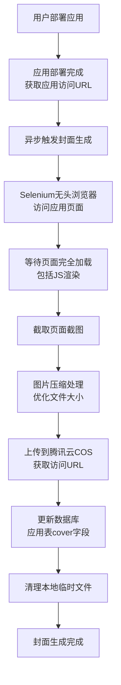
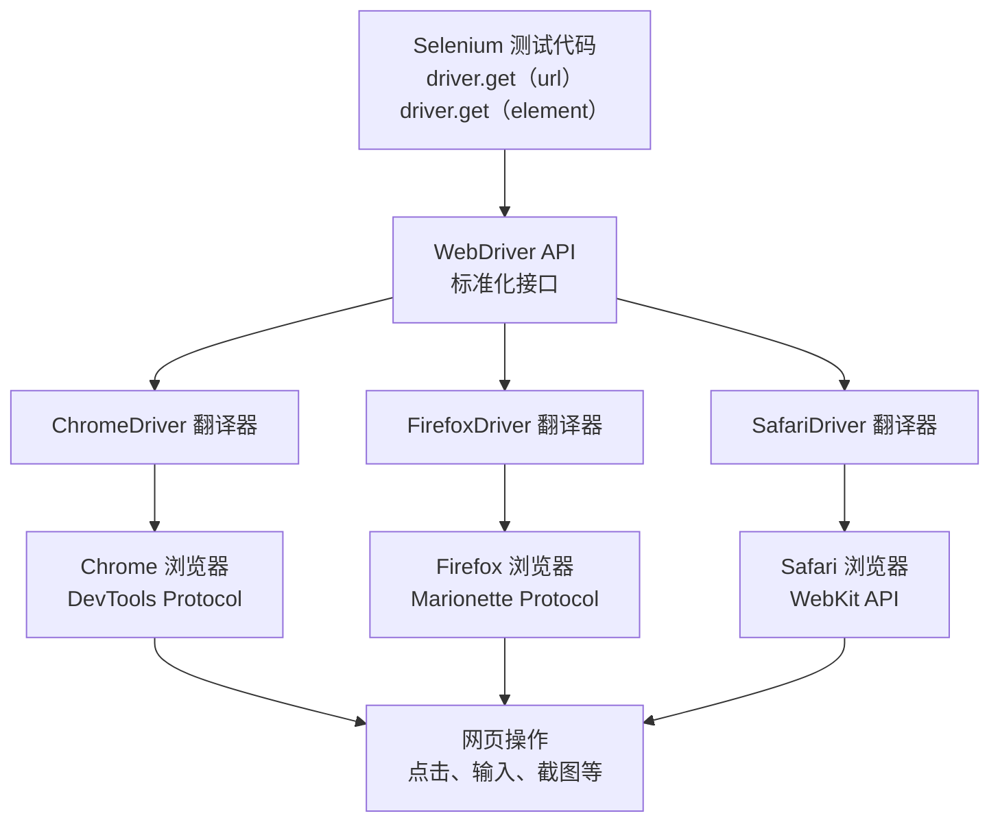
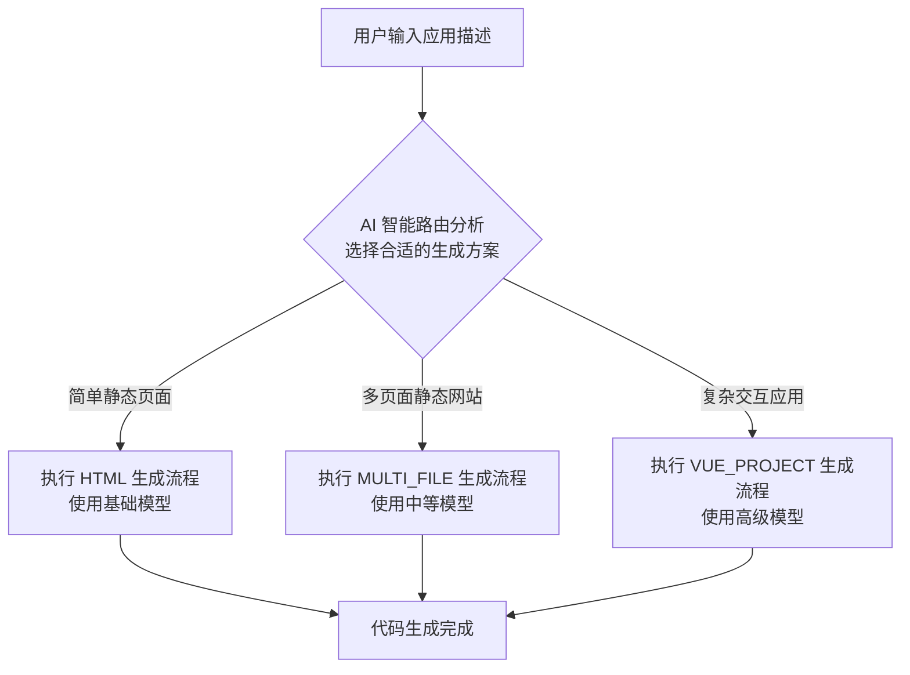

[toc]

# 功能扩展

之前我们已经实现了A!零代码应用生成平台的核心功能，用户可以通过简单的对话生成各种类型的前端应用。
这里我们将继续为平台扩展更多功能：

- 生成应用封面图
- 下载项目代码包
- AI智能选择方案

## 生成应用封面图

### 需求分析

如果每个应用都有一个精美的预览图，会让整个平台看起来更加专业和吸引人。

参考其他的大厂平台，可以直接将网站的实际运行效果作为应用封面图，做到所见即所得；而且应该要自动生成，总不能让管理品手动载图吧？


### 方案设计

#### 实现流程

实现应用封面图生成功能，我们需要考虑几个关键步骤：

1. 首先要获取到应用的可访问URL。由于我们的平台支持多种生成模式（原生HTML、多文件项目、Vue工程），其中原生模式和Vue工程模式生成可访问浏览URL的时机不一样。所以为了统一处理，而且确保应用已经可以正常访问，我们选择在**应用部署完成后再生成封面图**。
2. 使用Selenium这样的自动化工具打开一个无头浏览器，访问应用页面并进行截图。
3. 直接截图得到的图片通常比较大，不仅占用存储空间，加载速度也会比较慢。因此我们需要对图片进行压缩处理。虽然我们可以通过调整Selenium的窗口大小来控制截图尺寸，但这样可能会导致页面显示不全。更好的方案是先按正常尺寸截图，然后使用工具库对图片进行压缩。
4. 为了确保图片的持久化存储和快速访问，将压缩后的图片上传到腾讯云COS对象存储中，并将访问URL保存到数据库的应用表中。
5. 最后，记得清理本地临时文件。



#### 网页截图方案选型

在选择网页截图技术方案时，我们需要综合考虑多个因素。市面上有很多可选的技术，每种都有自己的优缺点：

| 评估维度      | Selenium            | Playwright            | HtmlUnit   | Puppeteer + Node.js | 云服务API  |
| ------------- | ------------------- | --------------------- | ---------- | ------------------- | ---------- |
| 依赖大小      | ~50MB               | ~100MB                | ~30MB      | ~200MB              | 0MB        |
| 启动时间      | 3-5秒               | 1-2秒                 | <1秒       | 2-3秒               | 网络延迟   |
| 内存占用      | 200-500MB           | 100-300MB             | 20-50MB    | 150-400MB           | 0MB        |
| CPU占用       | 中等                | 较低                  | 很低       | 中等                | 无         |
| 截图质量      | ★★★★★               | ★★★★★                 | ★★★        | ★★★★★               | ★★★★★      |
| JS执行        | 完整支持            | 完整支持              | 有限支持   | 完整支持            | 完整支持   |
| Vue/React支持 | ★★★★★               | ★★★★★                 | ★★         | ★★★★★               | ★★★★★      |
| 跨浏览器      | Chrome/Firefox/Edge | Chrome/Firefox/Safari | 模拟浏览器 | 仅Chrome系          | 多种选择   |
| 配置复杂度    | ★★★                 | ★★★★                  | ★★★★★      | ★★★★                | ★★★        |
| 学习成本      | ★★★                 | ★★★                   | ★          | ★★★                 | ★★★★       |
| 社区活跃度    | ★★★★★               | ★★★★★                 | ★★★        | ★★★★★               | 服务商决定 |
| 文档完善度    | ★★★★★               | ★★★★★                 | ★★★        | ★★★★★               | 服务商决定 |
| 错误处理      | ★★★                 | ★★★★★                 | ★★★        | ★★★★                | ★★★        |
| 并发支持      | ★★★                 | ★★★★★                 | ★★★        | ★★★★                | ★★★        |
| 企业采用      | 广泛使用            | 快速增长              | 传统项目   | 广泛使用            | 成本敏感   |
| 总体推荐度    | ★★★★                | ★★★★                  | ★★         | ★★★★                | ★★         |

通过对比可以看出，HtmlUnit虽然轻量，但对JS的支持度有限，这在现代前端应用中是一个致命问题。如果我们选择了它，可能到后面才发现很多应用的封面生成不了，再换技术就得不偿失了。

其他几种方案就要根据实际需求来选择了，追求稳定性选Selenium,追求性能选Playwright,如果用Node.js技术栈就选Puppeteer,有充足预算就选云服务API。

**考虑到我们是Java技术栈，以及对稳定性的要求，最终选择Selenium。**

#### 什么是Selenium

Selenium是一个非常成熟的Web自动化框架，它的核心概念是WebDriver(浏览器驱动)。

WebDriver是一个可以控制浏览器行为的接口，能够让程序像人类一祥操作浏览器：打开页面、点击按钮、输入文本、截取屏幕等。

可以说WebDriver是Selenium与浏览器之间的桥梁，因为不同浏览器(Chrome、Firefox、.Safari等)有不同的内部API和控制机制，驱动程序负责将Selenium的标准化命令翻译成各个浏览器能理解的具体指令，从而实现跨浏览器的统一自动化控制。



在实际使用Selenium时，最好搭配`WebDriverManager`使用。`WebDriverManager`是一个自动管理浏览器驱动程序的工具库，它解决了很多实际开发中的痛点：

1. 自动下载驱动程序：根据系统上安装的浏览器版本，自动下载对应的驱动程序
2. 版本匹配：确保驱动程序版本与浏览器版本兼容
3. 路径管理：自动设置系统属性，告诉Selenium驱动程序的位置

| 对比项     | 使用 WebDriverManager | 不使用 WebDriverManager |
| ---------- | --------------------- | ----------------------- |
| 配置复杂度 | 一行代码搞定          | 需要手动下载、配置路径  |
| 版本管理   | 自动匹配最佳版本      | 手动检查和更新          |
| 跨平台支持 | 自动适配操作系统      | 需要为每个平台准备驱动  |
| CI/CD 友好 | 开箱即用              | 需要额外脚本处理        |
| 维护成本   | 几乎为零              | 需要定期更新            |
| 错误处理   | 自动重试和降级        | 需要手动处理各种异常    |

### 开发实现

接下来，我们依次开发实现下列功能：

1. 本地生成截图
2. 保存截图到对象存储
3. 截图服务
4. 触发截图生成

#### 1.本地生成截图

引入依赖

```xml
<!-- Selenium 网页截图依赖 -->
<dependency>
    <groupId>org.seleniumhq.selenium</groupId>
    <artifactId>selenium-java</artifactId>
    <version>4.33.0</version>
</dependency>
<dependency>
    <groupId>io.github.bonigarcia</groupId>
    <artifactId>webdrivermanager</artifactId>
    <version>6.1.0</version>
</dependency>
```

接下来，我们在utils包下创建专门用于网页截图的工具类，提供根据URL生成截图文件并返回路径的方法。
1)第一步是初始化驱动。需要注意避免重复初始化驱动程序：
	1.在静态代码块里初始化区动，确保整个应用生命周期内只初始化一次
	2.默认使用已经初始化好的驱动实例
	3.在项目停止前正确销毁驱动，释放资源 

```java
@Slf4j
public class WebScreenshotUtils {

    private static final WebDriver webDriver;

    static {
        final int DEFAULT_WIDTH = 1600;
        final int DEFAULT_HEIGHT = 900;
        webDriver = initChromeDriver(DEFAULT_WIDTH, DEFAULT_HEIGHT);
    }

    @PreDestroy
    public void destroy() {
        webDriver.quit();
    }

    /**
     * 初始化 Chrome 浏览器驱动
     */
    private static WebDriver initChromeDriver(int width, int height) {
        try {
            // 自动管理 ChromeDriver
            WebDriverManager.chromedriver().setup();
            // 配置 Chrome 选项
            ChromeOptions options = new ChromeOptions();
            // 无头模式
            options.addArguments("--headless");
            // 禁用GPU（在某些环境下避免问题）
            options.addArguments("--disable-gpu");
            // 禁用沙盒模式（Docker环境需要）
            options.addArguments("--no-sandbox");
            // 禁用开发者shm使用
            options.addArguments("--disable-dev-shm-usage");
            // 设置窗口大小
            options.addArguments(String.format("--window-size=%d,%d", width, height));
            // 禁用扩展
            options.addArguments("--disable-extensions");
            // 设置用户代理
            options.addArguments("--user-agent=Mozilla/5.0 (Windows NT 10.0; Win64; x64) AppleWebKit/537.36 (KHTML, like Gecko) Chrome/91.0.4472.124 Safari/537.36");
            // 创建驱动
            WebDriver driver = new ChromeDriver(options);
            // 设置页面加载超时
            driver.manage().timeouts().pageLoadTimeout(Duration.ofSeconds(30));
            // 设置隐式等待
            driver.manage().timeouts().implicitlyWait(Duration.ofSeconds(10));
            return driver;
        } catch (Exception e) {
            log.error("初始化 Chrome 浏览器失败", e);
            throw new BusinessException(ErrorCode.SYSTEM_ERROR, "初始化 Chrome 浏览器失败");
        }
    }
}
```

这段代码看起来长，其实基本都是一些配置，属于样板代码。其中比较重要的是：

1. 无头模式运行：通过-headless参数，Chrome浏览器在后台运行，不会弹出窗口。
2. Docker兼容性：添加了-no-sandbox和-disable-dev-shm-usage参数，确保在容器环境中正常运行。

2)编写一些子方法，比如保存图片到文件：

```java
/**
 * 保存图片到文件
 */
private static void saveImage(byte[] imageBytes, String imagePath) {
    try {
        FileUtil.writeBytes(imageBytes, imagePath);
    } catch (Exception e) {
        log.error("保存图片失败: {}", imagePath, e);
        throw new BusinessException(ErrorCode.SYSTEM_ERROR, "保存图片失败");
    }
}
```

压缩图片：

```java
/**
 * 压缩图片
 */
private static void compressImage(String originalImagePath, String compressedImagePath) {
    // 压缩图片质量（0.1 = 10% 质量）
    final float COMPRESSION_QUALITY = 0.3f;
    try {
        ImgUtil.compress(
                FileUtil.file(originalImagePath),
                FileUtil.file(compressedImagePath),
                COMPRESSION_QUALITY
        );
    } catch (Exception e) {
        log.error("压缩图片失败: {} -> {}", originalImagePath, compressedImagePath, e);
        throw new BusinessException(ErrorCode.SYSTEM_ERROR, "压缩图片失败");
    }
}
```

等待页面加载完成：

```java
/**
 * 等待页面加载完成
 */
private static void waitForPageLoad(WebDriver driver) {
    try {
        // 创建等待页面加载对象
        WebDriverWait wait = new WebDriverWait(driver, Duration.ofSeconds(10));
        // 等待 document.readyState 为complete
        wait.until(webDriver ->
                ((JavascriptExecutor) webDriver).executeScript("return document.readyState")
                        .equals("complete")
        );
        // 额外等待一段时间，确保动态内容加载完成
        Thread.sleep(2000);
        log.info("页面加载完成");
    } catch (Exception e) {
        log.error("等待页面加载时出现异常，继续执行截图", e);
    }
}
```

3)最后编写完整的生成网页截图方法，访问网页、等待页面加载完成并截图、保存截图文件并压缩、最后返回压缩后的路径。

```java
/**
 * 生成网页截图
 *
 * @param webUrl 网页URL
 * @return 压缩后的截图文件路径，失败返回null
 */
public static String saveWebPageScreenshot(String webUrl) {
    if (StrUtil.isBlank(webUrl)) {
        log.error("网页URL不能为空");
        return null;
    }
    try {
        // 创建临时目录
        String rootPath = System.getProperty("user.dir") + File.separator + "tmp" + File.separator + "screenshots"
                + File.separator + UUID.randomUUID().toString().substring(0, 8);
        FileUtil.mkdir(rootPath);
        // 图片后缀
        final String IMAGE_SUFFIX = ".png";
        // 原始截图文件路径
        String imageSavePath = rootPath + File.separator + RandomUtil.randomNumbers(5) + IMAGE_SUFFIX;
        // 访问网页
        webDriver.get(webUrl);
        // 等待页面加载完成
        waitForPageLoad(webDriver);
        // 截图
        byte[] screenshotBytes = ((TakesScreenshot) webDriver).getScreenshotAs(OutputType.BYTES);
        // 保存原始图片
        saveImage(screenshotBytes, imageSavePath);
        log.info("原始截图保存成功: {}", imageSavePath);
        // 压缩图片
        final String COMPRESSION_SUFFIX = "_compressed.jpg";
        String compressedImagePath = rootPath + File.separator + RandomUtil.randomNumbers(5) + COMPRESSION_SUFFIX;
        compressImage(imageSavePath, compressedImagePath);
        log.info("压缩图片保存成功: {}", compressedImagePath);
        // 删除原始图片，只保留压缩图片
        FileUtil.del(imageSavePath);
        return compressedImagePath;
    } catch (Exception e) {
        log.error("网页截图失败: {}", webUrl, e);
        return null;
    }
}
```

4)编写单元测试来验证功能：

```JAVA
@Slf4j
@SpringBootTest
public class WebScreenshotUtilsTest {

    @Test
    void saveWebPageScreenshot() {
        String testUrl = "https://blog.csdn.net/2303_82176667?spm=1010.2135.3001.5343";
        String webPageScreenshot = WebScreenshotUtils.saveWebPageScreenshot(testUrl);
        Assertions.assertNotNull(webPageScreenshot);
    }
}
```

能够在临时目录下看到截图文件：


#### 2. 保存截图到对象存储

首先，在腾讯云控制台创建一个存储桶


创建成功后，在配置文件中添加COS相关配置:

```yml
# 添加 COS 对象存储配置（需要从腾讯云获取）
cos:
  client:
    host: your-custom-domain.com
    secretId: your-secret-id
    secretKey: your-secret-key
    region: ap-shanghai
    bucket: your-bucket-name
```

引入依赖

```xml
<dependency>
     <groupId>com.qcloud</groupId>
     <artifactId>cos_api</artifactId>
     <version>5.6.227</version>
</dependency>
```

在`config`包下创建COS客户端配置类：

```java
/**
 * 腾讯云COS配置类
 * 
 * @author Cheng Fu
 */
@Configuration
@ConfigurationProperties(prefix = "cos.client")
@Data
public class CosClientConfig {

    /**
     * 域名
     */
    private String host;

    /**
     * secretId
     */
    private String secretId;

    /**
     * 密钥（注意不要泄露）
     */
    private String secretKey;

    /**
     * 区域
     */
    private String region;

    /**
     * 桶名
     */
    private String bucket;

    @Bean
    public COSClient cosClient() {
        // 初始化用户身份信息(secretId, secretKey)
        COSCredentials cred = new BasicCOSCredentials(secretId, secretKey);
        // 设置bucket的区域, COS地域的简称请参照 https://www.qcloud.com/document/product/436/6224
        ClientConfig clientConfig = new ClientConfig(new Region(region));
        // 生成cos客户端
        return new COSClient(cred, clientConfig);
    }
}
```

然后在`manager`包下创建可复用的CosManager类，专门负责和COS对象存储进行交互，提供文件上传功能，不包含特殊的业务逻辑。

#### 3.截图服务
考虑到后续项目要改造为微服务，最好将截图功能单独封装为一个通用服务，将本地生成截图和文件上传整合在一起。不包含ppld等具体的业务参数，作用就是根据要截图的网址返回截图后的图片地址。

在service包下新建ScreenshotService和实现类，代码如下：

```java
@Service
@Slf4j
public class ScreenshotServiceImpl implements ScreenshotService {

    @Resource
    private CosManager cosManager;

    @Override
    public String generateAndUploadScreenshot(String webUrl) {
        ThrowUtils.throwIf(StrUtil.isBlank(webUrl), ErrorCode.PARAMS_ERROR, "网页URL不能为空");
        log.info("开始生成网页截图，URL: {}", webUrl);
        // 1. 生成本地截图
        String localScreenshotPath = WebScreenshotUtils.saveWebPageScreenshot(webUrl);
        ThrowUtils.throwIf(StrUtil.isBlank(localScreenshotPath), ErrorCode.OPERATION_ERROR, "本地截图生成失败");
        try {
            // 2. 上传到对象存储
            String cosUrl = uploadScreenshotToCos(localScreenshotPath);
            ThrowUtils.throwIf(StrUtil.isBlank(cosUrl), ErrorCode.OPERATION_ERROR, "截图上传对象存储失败");
            log.info("网页截图生成并上传成功: {} -> {}", webUrl, cosUrl);
            return cosUrl;
        } finally {
            // 3. 清理本地文件
            cleanupLocalFile(localScreenshotPath);
        }
    }

    /**
     * 上传截图到对象存储
     *
     * @param localScreenshotPath 本地截图路径
     * @return 对象存储访问URL，失败返回null
     */
    private String uploadScreenshotToCos(String localScreenshotPath) {
        if (StrUtil.isBlank(localScreenshotPath)) {
            return null;
        }
        File screenshotFile = new File(localScreenshotPath);
        if (!screenshotFile.exists()) {
            log.error("截图文件不存在: {}", localScreenshotPath);
            return null;
        }
        // 生成 COS 对象键
        String fileName = UUID.randomUUID().toString().substring(0, 8) + "_compressed.jpg";
        String cosKey = generateScreenshotKey(fileName);
        return cosManager.uploadFile(cosKey, screenshotFile);
    }

    /**
     * 生成截图的对象存储键
     * 格式：/screenshots/2025/07/31/filename.jpg
     */
    private String generateScreenshotKey(String fileName) {
        String datePath = LocalDate.now().format(DateTimeFormatter.ofPattern("yyyy/MM/dd"));
        return String.format("/screenshots/%s/%s", datePath, fileName);
    }

    /**
     * 清理本地文件
     *
     * @param localFilePath 本地文件路径
     */
    private void cleanupLocalFile(String localFilePath) {
        File localFile = new File(localFilePath);
        if (localFile.exists()) {
            File parentDir = localFile.getParentFile();
            FileUtil.del(parentDir);
            log.info("本地截图文件已清理: {}", localFilePath);
        }
    }
}
```

#### 4. 触发截图生成
最后，我们需要在应用部署完成后触发截图生成。在`AppserviceImpl`的`deployApp`方法中添加相关逻辑：

```java
// 10. 构建应用访问 URL
String appDeployUrl = String.format("%s/%s/", AppConstant.CODE_DEPLOY_HOST, deployKey);
// 11. 异步生成截图并更新应用封面
generateAppScreenshotAsync(appId, appDeployUrl);
return appDeployUrl;
```

由于截图生成是一个相对耗时的操作，我们必须使用异步方式处理，避免阻塞用户的部署流程：

```java
@Resource
private ScreenshotService screenshotService;

/**
 * 异步生成应用截图并更新封面
 *
 * @param appId  应用ID
 * @param appUrl 应用访问URL
 */
@Override
public void generateAppScreenshotAsync(Long appId, String appUrl) {
    // 使用虚拟线程异步执行
    Thread.startVirtualThread(() -> {
        // 调用截图服务生成截图并上传
        String screenshotUrl = screenshotService.generateAndUploadScreenshot(appUrl);
        // 更新应用封面字段
        App updateApp = new App();
        updateApp.setId(appId);
        updateApp.setCover(screenshotUrl);
        boolean updated = this.updateById(updateApp);
        ThrowUtils.throwIf(!updated, ErrorCode.OPERATION_ERROR, "更新应用封面字段失败");
    });
}
```

这里我们使用了Java21的虚拟线程(Virtual Thread)特性，这是由VM管理的轻量级线程。它的创建成本极低
(几乎无内存开销)，且在执行/O操作时会自动让出CPU给其他虚拟线程，从而在同样的系统资源下支持百万级并发而不是传统平台线程的几千级并发。而且它的使用和传统Java线程几乎没有区别，非常适合处理这种/O密集型的异步任务。

---

## 下载代码

### 需求分析

除了在线预览和使用生成的应用，用户可能需要下载代码到本地进行二次开发。这样一来，我们的平台不仅是一个在线工具，更是一个真正的开发起点。

### 方案设计

实现代码下载功能需要考虑几个关键步骤：

1. 基础校验：我们需要验证应用是否存在、用户是否有下载权限等。考虑到安全性，只有应用的创建者才能下载对应的代码。
2. 找到应用的生成目录。这里要特别注意，我们要下载的是原始的生成目录，而不是部署目录。部署目录是打包构建之后的文件，而生成目录包含的是源代码。
3. 定义文件过滤器，因为并不是所有文件都需要提供给用户下载。比如node modules目录体积庞大且可以通过npm install重新安装，dist和build目录是构建产物可以重新生成，.Ds_store、.env等文件包含系统信息或敏感配置不应该下载。
4. 最后将过滤后的文件打包成ZIP压缩包，通过HTTP响应直接返回给前端。需要设置正确的响应头，告诉浏览器这是一个需要下载的文件、并且传递下载的文件名称。

### 后端开发

和截图服务类似，我们将项目下载单独封装为一个service包下的通用服务`ProjectDownloadservice`，可以对指定路径下的文件进行打包下载。

可以使用Hutool工具库的ZipUtil实现ZIP包压缩，支持指定文件过滤器，正好满足我们的需求。

1. 实现文件过滤:

这里有个小设计，我们不仅要过滤特定的文件和目录名称，还过滤了特定的文件扩展名。过滤逻辑会检查路径中的每一部分，确保不会遗漏无用文件。

```java
@Service
@Slf4j
public class ProjectDownloadServiceImpl implements ProjectDownloadService {

    /**
     * 需要过滤的文件和目录名称
     */
    private static final Set<String> IGNORED_NAMES = Set.of(
            "node_modules",
            ".git",
            "dist",
            "build",
            ".DS_Store",
            ".env",
            "target",
            ".mvn",
            ".idea",
            ".vscode"
    );

    /**
     * 需要过滤的文件扩展名
     */
    private static final Set<String> IGNORED_EXTENSIONS = Set.of(
            ".log",
            ".tmp",
            ".cache"
    );

    /**
     * 检查路径是否允许包含在压缩包中
     *
     * @param projectRoot 项目根目录
     * @param fullPath    完整路径
     * @return 是否允许
     */
    private boolean isPathAllowed(Path projectRoot, Path fullPath) {
        // 获取相对路径
        Path relativePath = projectRoot.relativize(fullPath);
        // 检查路径中的每一部分
        for (Path part : relativePath) {
            String partName = part.toString();
            // 检查是否在忽略名称列表中
            if (IGNORED_NAMES.contains(partName)) {
                return false;
            }
            // 检查文件扩展名
            if (IGNORED_EXTENSIONS.stream().anyMatch(partName::endsWith)) {
                return false;
            }
        }
        return true;
    }
}
```

2. 下载压缩包核心方法：

```java
@Override
public void downloadProjectAsZip(String projectPath, String downloadFileName, HttpServletResponse response) {
    // 基础校验
    ThrowUtils.throwIf(StrUtil.isBlank(projectPath), ErrorCode.PARAMS_ERROR, "项目路径不能为空");
    ThrowUtils.throwIf(StrUtil.isBlank(downloadFileName), ErrorCode.PARAMS_ERROR, "下载文件名不能为空");
    File projectDir = new File(projectPath);
    ThrowUtils.throwIf(!projectDir.exists(), ErrorCode.NOT_FOUND_ERROR, "项目目录不存在");
    ThrowUtils.throwIf(!projectDir.isDirectory(), ErrorCode.PARAMS_ERROR, "指定路径不是目录");
    log.info("开始打包下载项目: {} -> {}.zip", projectPath, downloadFileName);
    // 设置 HTTP 响应头
    response.setStatus(HttpServletResponse.SC_OK);
    response.setContentType("application/zip");
    response.addHeader("Content-Disposition",
            String.format("attachment; filename=\"%s.zip\"", downloadFileName));
    // 定义文件过滤器
    FileFilter filter = file -> isPathAllowed(projectDir.toPath(), file.toPath());
    try {
        // 使用 Hutool 的 ZipUtil 直接将过滤后的目录压缩到响应输出流
        ZipUtil.zip(response.getOutputStream(), StandardCharsets.UTF_8, false, filter, projectDir);
        log.info("项目打包下载完成: {}", downloadFileName);
    } catch (Exception e) {
        log.error("项目打包下载异常", e);
        throw new BusinessException(ErrorCode.SYSTEM_ERROR, "项目打包下载失败");
    }
}
```

3. 接下来在AppController中编写接口，拼接好应用代码目录和下载文件名，然后调用下载服务：

```java
@Resource
private ProjectDownloadService projectDownloadService;

/**
 * 下载应用代码
 *
 * @param appId    应用ID
 * @param request  请求
 * @param response 响应
 */
@GetMapping("/download/{appId}")
public void downloadAppCode(@PathVariable Long appId,
                            HttpServletRequest request,
                            HttpServletResponse response) {
    // 1. 基础校验
    ThrowUtils.throwIf(appId == null || appId <= 0, ErrorCode.PARAMS_ERROR, "应用ID无效");
    // 2. 查询应用信息
    App app = appService.getById(appId);
    ThrowUtils.throwIf(app == null, ErrorCode.NOT_FOUND_ERROR, "应用不存在");
    // 3. 权限校验：只有应用创建者可以下载代码
    User loginUser = userService.getLoginUser(request);
    if (!app.getUserId().equals(loginUser.getId())) {
        throw new BusinessException(ErrorCode.NO_AUTH_ERROR, "无权限下载该应用代码");
    }
    // 4. 构建应用代码目录路径（生成目录，非部署目录）
    String codeGenType = app.getCodeGenType();
    String sourceDirName = codeGenType + "_" + appId;
    String sourceDirPath = AppConstant.CODE_OUTPUT_ROOT_DIR + File.separator + sourceDirName;
    // 5. 检查代码目录是否存在
    File sourceDir = new File(sourceDirPath);
    ThrowUtils.throwIf(!sourceDir.exists() || !sourceDir.isDirectory(),
            ErrorCode.NOT_FOUND_ERROR, "应用代码不存在，请先生成代码");
    // 6. 生成下载文件名（不建议添加中文内容）
    String downloadFileName = String.valueOf(appId);
    // 7. 调用通用下载服务
    projectDownloadService.downloadProjectAsZip(sourceDirPath, downloadFileName, response);
}
```

### 前端开发

后端开发完成后，记得先执行`openapi`命令，根据接口生成前端请求和数据模型代码。

1. 首先是在应用详情按钮右侧补充了一个下载按钮；

```vue
<a-button
  type="primary"
  ghost
  @click="downloadCode"
  :loading="downloading"
  :disabled="!isOwner"
>
  <template #icon>
    <DownloadOutlined />
  </template>
  下载代码
</a-button>
```

2. 然后提供了调用后端下载代码的函数。由于后端直接返回文件流，我们需要使用原生的fetch APl来获取响应，然后从响应头中提取文件名：

```ts
// 下载相关
const downloading = ref(false)

// 下载代码
const downloadCode = async () => {
  if (!appId.value) {
    message.error('应用ID不存在')
    return
  }
  downloading.value = true
  try {
    const API_BASE_URL = request.defaults.baseURL || ''
    const url = `${API_BASE_URL}/app/download/${appId.value}`
    const response = await fetch(url, {
      method: 'GET',
      credentials: 'include',
    })
    if (!response.ok) {
      throw new Error(`下载失败: ${response.status}`)
    }
    // 获取文件名
    const contentDisposition = response.headers.get('Content-Disposition')
    const fileName = contentDisposition?.match(/filename="(.+)"/)?.[1] || `app-${appId.value}.zip`
    // 下载文件
    const blob = await response.blob()
    const downloadUrl = URL.createObjectURL(blob)
    const link = document.createElement('a')
    link.href = downloadUrl
    link.download = fileName
    link.click()
    // 清理
    URL.revokeObjectURL(downloadUrl)
    message.success('代码下载成功')
  } catch (error) {
    console.error('下载失败：', error)
    message.error('下载失败，请重试')
  } finally {
    downloading.value = false
  }
}
```

这段代码的核心是创建一个临时的下载链接。我们将响应的二进制数据转换为Bob对象，然后创建一个对象URL,
最后通过模拟点击<a>标签来触发下载。下载完成后记得调用`URL.revokeobjectuRL()`释放内存。


## AI ؜智能选择方案

### 需求分析

目前我们平台提؜供了 3 套不同的代码生成‌方案：原生 HTML、原生‌多文件、Vue 工程。分别适合不同复杂度的项目需求，‍也使用了成本不同的大模型。

那么问题来؜了，当用户提出需求‌时，如何判断应该使‌用哪套方案呢？

让用户自己选择的话，会增加用户的使用门槛。更好的方案是让 AI 来自动判断，这就是所谓的 **智能路由**。



### 方案设计

在实际生产环境中，智能路由本身应该选择 **成本更低、输出更快** 的大模型，因为路由决策是一个相对简单的分类任务，不需要太强的模型。

官方也专门提出了 [利用 AI 进行分类的文档](https://docs.langchain4j.dev/tutorials/classification)。

我们可以利؜用 LangChai‌n4j 的结构化输出‌功能来实现智能路由。结构化输出支持枚举类‍型，这正好符合我们的需求：


编写一段用于 AI 路由的提示词，需要给出清晰的判断规则：

```
你是一个专业的代码生成方案路由器，需要根据用户需求返回最合适的代码生成类型。

可选的代码生成类型：
1. HTML - 适合简单的静态页面，单个 HTML 文件，包含内联 CSS 和 JS
2. MULTI_FILE - 适合简单的多文件静态页面，分离 HTML、CSS、JS 代码
3. VUE_PROJECT - 适合复杂的现代化前端项目

判断规则：
- 如果用户需求简单，只需要一个展示页面，选择 HTML
- 如果用户需要多个页面但不涉及复杂交互，选择 MULTI_FILE
- 如果用户需求复杂，涉及多页面、复杂交互、数据管理等，选择 VUE_PROJECT
```

### 后端开发

首先将提示词保存到 `resources/prompt/codegen-routing-system-prompt.txt` 文件中。

为了快速验证功能，我们先复用之前自动注入的 `chatModel`，跑通整个业务流程。

1. 在 `ai` 包下新建 AI 智能路由服务，也是一个 AI Service：

```java
/**
 * AI代码生成类型智能路由服务
 * 使用结构化输出直接返回枚举类型
 *
 * @author yupi
 */
public interface AiCodeGenTypeRoutingService {

    /**
     * 根据用户需求智能选择代码生成类型
     *
     * @param userPrompt 用户输入的需求描述
     * @return 推荐的代码生成类型
     */
    @SystemMessage(fromResource = "prompt/codegen-routing-system-prompt.txt")
    CodeGenTypeEnum routeCodeGenType(String userPrompt);
}
```

2. 创建 AI 智能路由服务工厂：

```java
/**
 * AI代码生成类型路由服务工厂
 *
 * @author yupi
 */
@Slf4j
@Configuration
public class AiCodeGenTypeRoutingServiceFactory {

    @Resource
    private ChatModel chatModel;

    /**
     * 创建AI代码生成类型路由服务实例
     */
    @Bean
    public AiCodeGenTypeRoutingService aiCodeGenTypeRoutingService() {
        return AiServices.builder(AiCodeGenTypeRoutingService.class)
                .chatModel(chatModel)
                .build();
    }
}
```

3. 将创建应؜用的逻辑从 Contr‌oller 提取到 S‌ervice 中（因为这个方法有更多业务逻辑‍了），并集成智能路由服务：

```java
@Resource
private AiCodeGenTypeRoutingService aiCodeGenTypeRoutingService;

@Override
public Long createApp(AppAddRequest appAddRequest, User loginUser) {
    // 参数校验
    String initPrompt = appAddRequest.getInitPrompt();
    ThrowUtils.throwIf(StrUtil.isBlank(initPrompt), ErrorCode.PARAMS_ERROR, "初始化 prompt 不能为空");
    // 构造入库对象
    App app = new App();
    BeanUtil.copyProperties(appAddRequest, app);
    app.setUserId(loginUser.getId());
    // 应用名称暂时为 initPrompt 前 12 位
    app.setAppName(initPrompt.substring(0, Math.min(initPrompt.length(), 12)));
    // 使用 AI 智能选择代码生成类型
    CodeGenTypeEnum selectedCodeGenType = aiCodeGenTypeRoutingService.routeCodeGenType(initPrompt);
    app.setCodeGenType(selectedCodeGenType.getValue());
    // 插入数据库
    boolean result = this.save(app);
    ThrowUtils.throwIf(!result, ErrorCode.OPERATION_ERROR);
    log.info("应用创建成功，ID: {}, 类型: {}", app.getId(), selectedCodeGenType.getValue());
    return app.getId();
}
```

4. 相应地，AppController 的代码可以简化：

```java
@PostMapping("/add")
public BaseResponse<Long> addApp(@RequestBody AppAddRequest appAddRequest, HttpServletRequest request) {
    ThrowUtils.throwIf(appAddRequest == null, ErrorCode.PARAMS_ERROR);
    // 获取当前登录用户
    User loginUser = userService.getLoginUser(request);
    Long appId = appService.createApp(appAddRequest, loginUser);
    return ResultUtils.success(appId);
}
```

5. 注意：由于我们返回的是简单的枚举类型而不是复杂的SON对象，需要在配置文件中注释掉模型的JSON约束，否则可能会报错：

```yml
langchain4j:
  open-ai:
    chat-model:
#      strict-json-schema: true
#      response-format: json_object
```


### 前端开发

1. 修改؜AppChat‌Page，应用标题‌右侧增加了生成类型标签：

```vue
<!-- 顶部栏 -->
<div class="header-bar">
  <div class="header-left">
    <h1 class="app-name">{{ appInfo?.appName || '网站生成器' }}</h1>
    <a-tag v-if="appInfo?.codeGenType" color="blue" class="code-gen-type-tag">
      {{ formatCodeGenType(appInfo.codeGenType) }}
    </a-tag>
  </div>
```

2. 添加对应样式

```css
.code-gen-type-tag {
  font-size: 12px;
}
```

3. 修؜改AppDet‌ailModal ‌弹窗组件，在应用创建时间下新增了类型‍信息：

```vue
<div class="info-item">
  <span class="info-label">生成类型：</span>
  <a-tag v-if="app?.codeGenType" color="blue">
    {{ formatCodeGenType(app.codeGenType) }}
  </a-tag>
  <span v-else>未知类型</span>
</div>
```

---

