[toc]

# 可视化修改

这里继续对ai应用生成平台功能进行扩展——可视化修改，让用户能够通过点击选择网页元素，结合
提示词来精确修改生成的网站应用，更直观地对生成的网站进行个性化定制。

主要内容：

- 可视化编辑方案设计
- 前端元素选择与通信机制
- 原生应用全量修改
- 工程项目增量修改

## 需求分析

我们实现了对话历史和记忆功能，A!已经能够基于历史上下文进行网站的迭代优化。但是用户在修改网
站时，仍然需要通过文字描述来告诉A!要修改哪个部分，如果描述不清楚，A可能就会修改错误、或者造成额外的修改。

举个例子，用户生成了一个包含多个卡片的网站，现在想要修改其中某一个卡片的标题。如果只是说"修改卡片标题”，AI可能不知道要修改哪个卡片。即使用户详细描述"修改第二个卡片的标题”，A!也有可能理解错误。

因此，我们需要实现可视化修改功能，让用户能够直接点击网页上的元素，然后输入修改需求，AI就能精确知道要修改的是哪个部分。

## 方案设计

通过对NoCode和秒哒的分析，我总结了几个关键发现：

1. 手动编辑的开发成本太高。如果要追求良好的效果，需要前端开发完整的可视化代码编辑器，并且还要从零开始约定一套DSL规范，让代码能够准确修改。这个过程坑点巨大，对我们的项目来说有些本末倒置。
2. 没有必要传递大量的参数。美团是将所有文件都传给后端，这种做法虽然保险，但会造成网络传输和处理的浪费，毕竟我们也没有大厂级别的服务器。
3. 无论哪种编辑方案，都需要获取被修改的元素信息，但不建议获取具体的代码位置。特别是对于打包类的Vue工程，很难精确获取元素在源码中的位置，容易出现Bug。

基于这些点，我们可以设计出自己的实现方案：重点开发**可视化选择加AI提示词编辑的模式。**

具体流程是：

1. 用户开启编辑模式，选中网页元素
2. 前端获取用户选中的元素信息，将其关联到提示词中，并发送给后端
3. 后端调用A!进行修改，让A!自己判断如何修改并返回结果。

这种方案的优点是更简单、好理解，缺点是准确度可能有限，其实就是开发成本和效果的综合权衡了。

### 选中网页元素方案

我们目前是通过在前端页面内嵌iframe来实现实时预览。现在需要在此基础上实现一个新功能：当点击iframe中的元素时，将被点击元素的信息上报给父网站。

这相当于子网站要添加逻辑，展示鼠标在元素上悬浮的效果，并且点击元素后，告诉父网站元素信息。

我们可以利用postMessage实现子父网站通信。需要在子网站的JS文件中添加以下代码，注入情报上报逻辑：

```javascript
document.addEventListener('click', (event) => {
  const selectedElement = event.target;
  if (selectedElement) {
    // 找到了源码位置，向主页面汇报！
    window.parent.postMessage({
      type: 'element-selected',
      payload: {
        data: selectedElement
      }
    }, '*'); // 在生产环境中，应指定确切的目标源
  }
}, true); // 使用捕获阶段以确保监听到所有点击事件
```

父网站通过以下代码接收并处理：

```javascript
const handleIframeMessage = (event: MessageEvent) => {
  const data = event.data
  // 增加健壮性：确保 data 是一个对象且包含 selector 属性，并且 selector 是字符串
  if (data && typeof data === 'object' && data.type === 'element-selected') {
    console.log('接收到新的元素位置:', data.payload)
    selectedElementLocation.value = data.payload.data
  }
}
```

接收到这些数据后，就可以拼接提示词然后传递给后端了。

但问题是子网站是提前生成好的，怎么增加postMessage相关的代码呢？这里有2种具体的方案。

#### 方案1-提前生成代码

直接修改AI的提示词、或者修改Al生成的JS文件，添加上述postMessage代码。

这种方式的优点是子父网站可以不同源，更灵活。但是修改AI生成的代码并不是一个很好的选择，毕竟代码是可以给户下载的，我们应该尽量保证生成代码的纯净性。

**什么是同源？**

浏览器的同源策略(Same-Origin Policy).规定，两个页面若要被视为“同源”，必须同时满足以下3个条件：

1. 协议相同。如都是http或https
2. 域名相同。如都是chengfu.cn;包括子域名是否一致.
3. 端口相同。若未指定端口，默认端口为8o(http)或443(https)

#### 方案2-动态注入代码

在进入可视化编辑模式时，父网站动态地给子网站注入代码。但是要求子父网站必须同源！

通过在前端配置代理，可以让子网站和父网站同源。

本地可以使用Vite配置对后端接口的代理（线上可以用Nginx),修改`vite.config.ts`:

```javascript
// https://vite.dev/config/
export default defineConfig({
  plugins: [vue(), vueDevTools()],
  resolve: {
    alias: {
      '@': fileURLToPath(new URL('./src', import.meta.url)),
    },
  },
  server: {
    proxy: {
      '/api': {
        target: 'http://localhost:8123',
        changeOrigin: true,
        secure: false,
      },
    },
  },
})
```

修改环境配置`.env.development`中本地请求后端的地址为相对目录：

```properties
VITE_DEPLOY_DOMAIN=http://localhost

VITE_API_BASE_URL=/api
```

这样一来，前端请求后端时，由于没有指定绝对路径，会自动请求和前端域名相同的路径（比如localhost:5173/api),
然后通过Vte代理到实际的后端接口地址。这样就解决了同源问题，可以实现代码动态注入，不用让AI生成额外的代码了，推荐这种方案。

## 前端开发

首先我们按照方案2配置Vite代理、并且修改环境配置。

### 可视化编辑

可视化编辑文件负责定义子父网站通讯事件，由父组件向子组件注入代码。这个文件极其复杂，封装了所有与可视化编辑相关的逻辑，包括脚本注入、事件监听、元素选择等功能。

```ts
/**
 * 可视化编辑器工具类
 * 负责管理iframe内的可视化编辑功能
 */
export interface ElementInfo {
  tagName: string
  id: string
  className: string
  textContent: string
  selector: string
  pagePath: string
  rect: {
    top: number
    left: number
    width: number
    height: number
  }
}

export interface VisualEditorOptions {
  onElementSelected?: (elementInfo: ElementInfo) => void
  onElementHover?: (elementInfo: ElementInfo) => void
}

export class VisualEditor {
  private iframe: HTMLIFrameElement | null = null
  private isEditMode = false
  private options: VisualEditorOptions

  constructor(options: VisualEditorOptions = {}) {
    this.options = options
  }

  /**
   * 初始化编辑器
   */
  init(iframe: HTMLIFrameElement) {
    this.iframe = iframe
  }

  /**
   * 开启编辑模式
   */
  enableEditMode() {
    if (!this.iframe) {
      return
    }
    this.isEditMode = true
    setTimeout(() => {
      this.injectEditScript()
    }, 300)
  }

  /**
   * 关闭编辑模式
   */
  disableEditMode() {
    this.isEditMode = false
    this.sendMessageToIframe({
      type: 'TOGGLE_EDIT_MODE',
      editMode: false,
    })
    // 清除所有编辑状态
    this.sendMessageToIframe({
      type: 'CLEAR_ALL_EFFECTS',
    })
  }

  /**
   * 切换编辑模式
   */
  toggleEditMode() {
    if (this.isEditMode) {
      this.disableEditMode()
    } else {
      this.enableEditMode()
    }
    return this.isEditMode
  }

  /**
   * 强制同步状态并清理
   */
  syncState() {
    if (!this.isEditMode) {
      this.sendMessageToIframe({
        type: 'CLEAR_ALL_EFFECTS',
      })
    }
  }

  /**
   * 清除选中的元素
   */
  clearSelection() {
    this.sendMessageToIframe({
      type: 'CLEAR_SELECTION',
    })
  }

  /**
   * iframe 加载完成时调用
   */
  onIframeLoad() {
    if (this.isEditMode) {
      setTimeout(() => {
        this.injectEditScript()
      }, 500)
    } else {
      // 确保非编辑模式时清理状态
      setTimeout(() => {
        this.syncState()
      }, 500)
    }
  }

  /**
   * 处理来自 iframe 的消息
   */
  handleIframeMessage(event: MessageEvent) {
    const { type, data } = event.data
    switch (type) {
      case 'ELEMENT_SELECTED':
        if (this.options.onElementSelected && data.elementInfo) {
          this.options.onElementSelected(data.elementInfo)
        }
        break
      case 'ELEMENT_HOVER':
        if (this.options.onElementHover && data.elementInfo) {
          this.options.onElementHover(data.elementInfo)
        }
        break
    }
  }

  /**
   * 向 iframe 发送消息
   */
  private sendMessageToIframe(message: Record<string, any>) {
    if (this.iframe?.contentWindow) {
      this.iframe.contentWindow.postMessage(message, '*')
    }
  }

  /**
   * 注入编辑脚本到 iframe
   */
  private injectEditScript() {
    if (!this.iframe) return

    const waitForIframeLoad = () => {
      try {
        if (this.iframe!.contentWindow && this.iframe!.contentDocument) {
          // 检查是否已经注入过脚本
          if (this.iframe!.contentDocument.getElementById('visual-edit-script')) {
            this.sendMessageToIframe({
              type: 'TOGGLE_EDIT_MODE',
              editMode: true,
            })
            return
          }

          const script = this.generateEditScript()
          const scriptElement = this.iframe!.contentDocument.createElement('script')
          scriptElement.id = 'visual-edit-script'
          scriptElement.textContent = script
          this.iframe!.contentDocument.head.appendChild(scriptElement)
        } else {
          setTimeout(waitForIframeLoad, 100)
        }
      } catch {
        // 静默处理注入失败
      }
    }

    waitForIframeLoad()
  }

  /**
   * 生成编辑脚本内容
   */
  private generateEditScript() {
    return `
      (function() {
        let isEditMode = true;
        let currentHoverElement = null;
        let currentSelectedElement = null;

        function injectStyles() {
          if (document.getElementById('edit-mode-styles')) return;
          const style = document.createElement('style');
          style.id = 'edit-mode-styles';
          style.textContent = \`
            .edit-hover {
              outline: 2px dashed #1890ff !important;
              outline-offset: 2px !important;
              cursor: crosshair !important;
              transition: outline 0.2s ease !important;
              position: relative !important;
            }
            .edit-hover::before {
              content: '' !important;
              position: absolute !important;
              top: -4px !important;
              left: -4px !important;
              right: -4px !important;
              bottom: -4px !important;
              background: rgba(24, 144, 255, 0.02) !important;
              pointer-events: none !important;
              z-index: -1 !important;
            }
            .edit-selected {
              outline: 3px solid #52c41a !important;
              outline-offset: 2px !important;
              cursor: default !important;
              position: relative !important;
            }
            .edit-selected::before {
              content: '' !important;
              position: absolute !important;
              top: -4px !important;
              left: -4px !important;
              right: -4px !important;
              bottom: -4px !important;
              background: rgba(82, 196, 26, 0.03) !important;
              pointer-events: none !important;
              z-index: -1 !important;
            }
          \`;
          document.head.appendChild(style);
        }

        // 生成元素选择器
        function generateSelector(element) {
          const path = [];
          let current = element;
          while (current && current !== document.body) {
            let selector = current.tagName.toLowerCase();
            if (current.id) {
              selector += '#' + current.id;
              path.unshift(selector);
              break;
            }
            if (current.className) {
              const classes = current.className.split(' ').filter(c => c && !c.startsWith('edit-'));
              if (classes.length > 0) {
                selector += '.' + classes.join('.');
              }
            }
            const siblings = Array.from(current.parentElement?.children || []);
            const index = siblings.indexOf(current) + 1;
            selector += ':nth-child(' + index + ')';
            path.unshift(selector);
            current = current.parentElement;
          }
          return path.join(' > ');
        }

        // 获取元素信息
        function getElementInfo(element) {
          const rect = element.getBoundingClientRect();
          // 获取 HTML 文件名后面的部分（查询参数和锚点）
          let pagePath = window.location.search + window.location.hash;
          // 如果没有查询参数和锚点，则显示为空
          if (!pagePath) {
            pagePath = '';
          }

          return {
            tagName: element.tagName,
            id: element.id,
            className: element.className,
            textContent: element.textContent?.trim().substring(0, 100) || '',
            selector: generateSelector(element),
            pagePath: pagePath,
            rect: {
              top: rect.top,
              left: rect.left,
              width: rect.width,
              height: rect.height
            }
          };
        }

        // 清除悬浮效果
        function clearHoverEffect() {
          if (currentHoverElement) {
            currentHoverElement.classList.remove('edit-hover');
            currentHoverElement = null;
          }
        }

        // 清除选中效果
        function clearSelectedEffect() {
          const selected = document.querySelectorAll('.edit-selected');
          selected.forEach(el => el.classList.remove('edit-selected'));
          currentSelectedElement = null;
        }

        let eventListenersAdded = false;

        function addEventListeners() {
           if (eventListenersAdded) return;

           const mouseoverHandler = (event) => {
             if (!isEditMode) return;

             const target = event.target;
             if (target === currentHoverElement || target === currentSelectedElement) return;
             if (target === document.body || target === document.documentElement) return;
             if (target.tagName === 'SCRIPT' || target.tagName === 'STYLE') return;

             clearHoverEffect();
             target.classList.add('edit-hover');
             currentHoverElement = target;
           };

           const mouseoutHandler = (event) => {
             if (!isEditMode) return;

             const target = event.target;
             if (!event.relatedTarget || !target.contains(event.relatedTarget)) {
               clearHoverEffect();
             }
           };

           const clickHandler = (event) => {
             if (!isEditMode) return;

             event.preventDefault();
             event.stopPropagation();

             const target = event.target;
             if (target === document.body || target === document.documentElement) return;
             if (target.tagName === 'SCRIPT' || target.tagName === 'STYLE') return;

             clearSelectedEffect();
             clearHoverEffect();

             target.classList.add('edit-selected');
             currentSelectedElement = target;

             const elementInfo = getElementInfo(target);
             try {
               window.parent.postMessage({
                 type: 'ELEMENT_SELECTED',
                 data: { elementInfo }
               }, '*');
             } catch {
               // 静默处理发送失败
             }
           };

           document.body.addEventListener('mouseover', mouseoverHandler, true);
           document.body.addEventListener('mouseout', mouseoutHandler, true);
           document.body.addEventListener('click', clickHandler, true);
           eventListenersAdded = true;
         }

         function setupEventListeners() {
           addEventListeners();
         }

        // 监听父窗口消息
        window.addEventListener('message', (event) => {
           const { type, editMode } = event.data;
           switch (type) {
             case 'TOGGLE_EDIT_MODE':
               isEditMode = editMode;
               if (isEditMode) {
                 injectStyles();
                 setupEventListeners();
                 showEditTip();
               } else {
                 clearHoverEffect();
                 clearSelectedEffect();
               }
               break;
             case 'CLEAR_SELECTION':
               clearSelectedEffect();
               break;
             case 'CLEAR_ALL_EFFECTS':
               isEditMode = false;
               clearHoverEffect();
               clearSelectedEffect();
               const tip = document.getElementById('edit-tip');
               if (tip) tip.remove();
               break;
           }
         });

         function showEditTip() {
           if (document.getElementById('edit-tip')) return;
           const tip = document.createElement('div');
           tip.id = 'edit-tip';
           tip.innerHTML = '🎯 编辑模式已开启<br/>悬浮查看元素，点击选中元素';
           tip.style.cssText = \`
             position: fixed;
             top: 20px;
             right: 20px;
             background: #1890ff;
             color: white;
             padding: 12px 16px;
             border-radius: 6px;
             font-size: 14px;
             z-index: 9999;
             box-shadow: 0 4px 12px rgba(0,0,0,0.15);
             animation: fadeIn 0.3s ease;
           \`;
           const style = document.createElement('style');
           style.textContent = '@keyframes fadeIn { from { opacity: 0; transform: translateY(-10px); } to { opacity: 1; transform: translateY(0); } }';
           document.head.appendChild(style);
           document.body.appendChild(tip);
           setTimeout(() => {
             if (tip.parentNode) {
               tip.style.animation = 'fadeIn 0.3s ease reverse';
               setTimeout(() => tip.remove(), 300);
             }
           }, 3000);
         }
         injectStyles();
         setupEventListeners();
         showEditTip();
      })();
    `
  }
}
```

### 修改对话页面

在对话页面中，我们添加了选中元素信息的显示区域，以及编辑和退出编辑的按钮。这样用户就能清楚地看到当前选中的是哪个元素，也能方便地进入和退出编辑模式。
完整的`AppChatPage.vue`代码如下，直接替换就好：

```vue
<template>
  <div id="appChatPage">
    <!-- 顶部栏 -->
    <div class="header-bar">
      <div class="header-left">
        <h1 class="app-name">{{ appInfo?.appName || '网站生成器' }}</h1>
        <a-tag v-if="appInfo?.codeGenType" color="blue" class="code-gen-type-tag">
          {{ formatCodeGenType(appInfo.codeGenType) }}
        </a-tag>
      </div>
      <div class="header-right">
        <a-button type="default" @click="showAppDetail">
          <template #icon>
            <InfoCircleOutlined />
          </template>
          应用详情
        </a-button>
        <a-button
          type="primary"
          ghost
          @click="downloadCode"
          :loading="downloading"
          :disabled="!isOwner"
        >
          <template #icon>
            <DownloadOutlined />
          </template>
          下载代码
        </a-button>
        <a-button type="primary" @click="deployApp" :loading="deploying">
          <template #icon>
            <CloudUploadOutlined />
          </template>
          部署
        </a-button>
      </div>
    </div>

    <!-- 主要内容区域 -->
    <div class="main-content">
      <!-- 左侧对话区域 -->
      <div class="chat-section">
        <!-- 消息区域 -->
        <div class="messages-container" ref="messagesContainer">
          <!-- 加载更多按钮 -->
          <div v-if="hasMoreHistory" class="load-more-container">
            <a-button type="link" @click="loadMoreHistory" :loading="loadingHistory" size="small">
              加载更多历史消息
            </a-button>
          </div>
          <div v-for="(message, index) in messages" :key="index" class="message-item">
            <div v-if="message.type === 'user'" class="user-message">
              <div class="message-content">{{ message.content }}</div>
              <div class="message-avatar">
                <a-avatar :src="loginUserStore.loginUser.userAvatar" />
              </div>
            </div>
            <div v-else class="ai-message">
              <div class="message-avatar">
                <a-avatar :src="aiAvatar" />
              </div>
              <div class="message-content">
                <MarkdownRenderer v-if="message.content" :content="message.content" />
                <div v-if="message.loading" class="loading-indicator">
                  <a-spin size="small" />
                  <span>AI 正在思考...</span>
                </div>
              </div>
            </div>
          </div>
        </div>

        <!-- 选中元素信息展示 -->
        <a-alert
          v-if="selectedElementInfo"
          class="selected-element-alert"
          type="info"
          closable
          @close="clearSelectedElement"
        >
          <template #message>
            <div class="selected-element-info">
              <div class="element-header">
                <span class="element-tag">
                  选中元素：{{ selectedElementInfo.tagName.toLowerCase() }}
                </span>
                <span v-if="selectedElementInfo.id" class="element-id">
                  #{{ selectedElementInfo.id }}
                </span>
                <span v-if="selectedElementInfo.className" class="element-class">
                  .{{ selectedElementInfo.className.split(' ').join('.') }}
                </span>
              </div>
              <div class="element-details">
                <div v-if="selectedElementInfo.textContent" class="element-item">
                  内容: {{ selectedElementInfo.textContent.substring(0, 50) }}
                  {{ selectedElementInfo.textContent.length > 50 ? '...' : '' }}
                </div>
                <div v-if="selectedElementInfo.pagePath" class="element-item">
                  页面路径: {{ selectedElementInfo.pagePath }}
                </div>
                <div class="element-item">
                  选择器:
                  <code class="element-selector-code">{{ selectedElementInfo.selector }}</code>
                </div>
              </div>
            </div>
          </template>
        </a-alert>

        <!-- 用户消息输入框 -->
        <div class="input-container">
          <div class="input-wrapper">
            <a-tooltip v-if="!isOwner" title="无法在别人的作品下对话哦~" placement="top">
              <a-textarea
                v-model:value="userInput"
                :placeholder="getInputPlaceholder()"
                :rows="4"
                :maxlength="1000"
                @keydown.enter.prevent="sendMessage"
                :disabled="isGenerating || !isOwner"
              />
            </a-tooltip>
            <a-textarea
              v-else
              v-model:value="userInput"
              :placeholder="getInputPlaceholder()"
              :rows="4"
              :maxlength="1000"
              @keydown.enter.prevent="sendMessage"
              :disabled="isGenerating"
            />
            <div class="input-actions">
              <a-button
                type="primary"
                @click="sendMessage"
                :loading="isGenerating"
                :disabled="!isOwner"
              >
                <template #icon>
                  <SendOutlined />
                </template>
              </a-button>
            </div>
          </div>
        </div>
      </div>
      <!-- 右侧网页展示区域 -->
      <div class="preview-section">
        <div class="preview-header">
          <h3>生成后的网页展示</h3>
          <div class="preview-actions">
            <a-button
              v-if="isOwner && previewUrl"
              type="link"
              :danger="isEditMode"
              @click="toggleEditMode"
              :class="{ 'edit-mode-active': isEditMode }"
              style="padding: 0; height: auto; margin-right: 12px"
            >
              <template #icon>
                <EditOutlined />
              </template>
              {{ isEditMode ? '退出编辑' : '编辑模式' }}
            </a-button>
            <a-button v-if="previewUrl" type="link" @click="openInNewTab">
              <template #icon>
                <ExportOutlined />
              </template>
              新窗口打开
            </a-button>
          </div>
        </div>
        <div class="preview-content">
          <div v-if="!previewUrl && !isGenerating" class="preview-placeholder">
            <div class="placeholder-icon">🌐</div>
            <p>网站文件生成完成后将在这里展示</p>
          </div>
          <div v-else-if="isGenerating" class="preview-loading">
            <a-spin size="large" />
            <p>正在生成网站...</p>
          </div>
          <iframe
            v-else
            :src="previewUrl"
            class="preview-iframe"
            frameborder="0"
            @load="onIframeLoad"
          ></iframe>
        </div>
      </div>
    </div>

    <!-- 应用详情弹窗 -->
    <AppDetailModal
      v-model:open="appDetailVisible"
      :app="appInfo"
      :show-actions="isOwner || isAdmin"
      @edit="editApp"
      @delete="deleteApp"
    />

    <!-- 部署成功弹窗 -->
    <DeploySuccessModal
      v-model:open="deployModalVisible"
      :deploy-url="deployUrl"
      @open-site="openDeployedSite"
    />
  </div>
</template>

<script setup lang="ts">
import { ref, onMounted, nextTick, onUnmounted, computed } from 'vue'
import { useRoute, useRouter } from 'vue-router'
import { message } from 'ant-design-vue'
import { useLoginUserStore } from '@/stores/loginUser'
import {
  getAppVoById,
  deployApp as deployAppApi,
  deleteApp as deleteAppApi,
} from '@/api/appController'
import { listAppChatHistory } from '@/api/chatHistoryController'
import { CodeGenTypeEnum, formatCodeGenType } from '@/utils/codeGenTypes'
import request from '@/request'

import MarkdownRenderer from '@/components/MarkdownRenderer.vue'
import AppDetailModal from '@/components/AppDetailModal.vue'
import DeploySuccessModal from '@/components/DeploySuccessModal.vue'
import aiAvatar from '@/assets/aiAvatar.png'
import { API_BASE_URL, getStaticPreviewUrl } from '@/config/env'
import { VisualEditor, type ElementInfo } from '@/utils/visualEditor'

import {
  CloudUploadOutlined,
  SendOutlined,
  ExportOutlined,
  InfoCircleOutlined,
  DownloadOutlined,
  EditOutlined,
} from '@ant-design/icons-vue'

const route = useRoute()
const router = useRouter()
const loginUserStore = useLoginUserStore()

// 应用信息
const appInfo = ref<API.AppVO>()
const appId = ref<any>()

// 对话相关
interface Message {
  type: 'user' | 'ai'
  content: string
  loading?: boolean
  createTime?: string
}

const messages = ref<Message[]>([])
const userInput = ref('')
const isGenerating = ref(false)
const messagesContainer = ref<HTMLElement>()

// 对话历史相关
const loadingHistory = ref(false)
const hasMoreHistory = ref(false)
const lastCreateTime = ref<string>()
const historyLoaded = ref(false)

// 预览相关
const previewUrl = ref('')
const previewReady = ref(false)

// 部署相关
const deploying = ref(false)
const deployModalVisible = ref(false)
const deployUrl = ref('')

// 下载相关
const downloading = ref(false)

// 可视化编辑相关
const isEditMode = ref(false)
const selectedElementInfo = ref<ElementInfo | null>(null)
const visualEditor = new VisualEditor({
  onElementSelected: (elementInfo: ElementInfo) => {
    selectedElementInfo.value = elementInfo
  },
})

// 权限相关
const isOwner = computed(() => {
  return appInfo.value?.userId === loginUserStore.loginUser.id
})

const isAdmin = computed(() => {
  return loginUserStore.loginUser.userRole === 'admin'
})

// 应用详情相关
const appDetailVisible = ref(false)

// 显示应用详情
const showAppDetail = () => {
  appDetailVisible.value = true
}

// 加载对话历史
const loadChatHistory = async (isLoadMore = false) => {
  if (!appId.value || loadingHistory.value) return
  loadingHistory.value = true
  try {
    const params: API.listAppChatHistoryParams = {
      appId: appId.value,
      pageSize: 10,
    }
    // 如果是加载更多，传递最后一条消息的创建时间作为游标
    if (isLoadMore && lastCreateTime.value) {
      params.lastCreateTime = lastCreateTime.value
    }
    const res = await listAppChatHistory(params)
    if (res.data.code === 0 && res.data.data) {
      const chatHistories = res.data.data.records || []
      if (chatHistories.length > 0) {
        // 将对话历史转换为消息格式，并按时间正序排列（老消息在前）
        const historyMessages: Message[] = chatHistories
          .map((chat) => ({
            type: (chat.messageType === 'user' ? 'user' : 'ai') as 'user' | 'ai',
            content: chat.message || '',
            createTime: chat.createTime,
          }))
          .reverse() // 反转数组，让老消息在前
        if (isLoadMore) {
          // 加载更多时，将历史消息添加到开头
          messages.value.unshift(...historyMessages)
        } else {
          // 初始加载，直接设置消息列表
          messages.value = historyMessages
        }
        // 更新游标
        lastCreateTime.value = chatHistories[chatHistories.length - 1]?.createTime
        // 检查是否还有更多历史
        hasMoreHistory.value = chatHistories.length === 10
      } else {
        hasMoreHistory.value = false
      }
      historyLoaded.value = true
    }
  } catch (error) {
    console.error('加载对话历史失败：', error)
    message.error('加载对话历史失败')
  } finally {
    loadingHistory.value = false
  }
}

// 加载更多历史消息
const loadMoreHistory = async () => {
  await loadChatHistory(true)
}

// 获取应用信息
const fetchAppInfo = async () => {
  const id = route.params.id as string
  if (!id) {
    message.error('应用ID不存在')
    router.push('/')
    return
  }

  appId.value = id

  try {
    const res = await getAppVoById({ id: id as unknown as number })
    if (res.data.code === 0 && res.data.data) {
      appInfo.value = res.data.data

      // 先加载对话历史
      await loadChatHistory()
      // 如果有至少2条对话记录，展示对应的网站
      if (messages.value.length >= 2) {
        updatePreview()
      }
      // 检查是否需要自动发送初始提示词
      // 只有在是自己的应用且没有对话历史时才自动发送
      if (
        appInfo.value.initPrompt &&
        isOwner.value &&
        messages.value.length === 0 &&
        historyLoaded.value
      ) {
        await sendInitialMessage(appInfo.value.initPrompt)
      }
    } else {
      message.error('获取应用信息失败')
      router.push('/')
    }
  } catch (error) {
    console.error('获取应用信息失败：', error)
    message.error('获取应用信息失败')
    router.push('/')
  }
}

// 发送初始消息
const sendInitialMessage = async (prompt: string) => {
  // 添加用户消息
  messages.value.push({
    type: 'user',
    content: prompt,
  })

  // 添加AI消息占位符
  const aiMessageIndex = messages.value.length
  messages.value.push({
    type: 'ai',
    content: '',
    loading: true,
  })

  await nextTick()
  scrollToBottom()

  // 开始生成
  isGenerating.value = true
  await generateCode(prompt, aiMessageIndex)
}

// 发送消息
const sendMessage = async () => {
  if (!userInput.value.trim() || isGenerating.value) {
    return
  }

  let message = userInput.value.trim()
  // 如果有选中的元素，将元素信息添加到提示词中
  if (selectedElementInfo.value) {
    let elementContext = `\n\n选中元素信息：`
    if (selectedElementInfo.value.pagePath) {
      elementContext += `\n- 页面路径: ${selectedElementInfo.value.pagePath}`
    }
    elementContext += `\n- 标签: ${selectedElementInfo.value.tagName.toLowerCase()}\n- 选择器: ${selectedElementInfo.value.selector}`
    if (selectedElementInfo.value.textContent) {
      elementContext += `\n- 当前内容: ${selectedElementInfo.value.textContent.substring(0, 100)}`
    }
    message += elementContext
  }
  userInput.value = ''
  // 添加用户消息（包含元素信息）
  messages.value.push({
    type: 'user',
    content: message,
  })

  // 发送消息后，清除选中元素并退出编辑模式
  if (selectedElementInfo.value) {
    clearSelectedElement()
    if (isEditMode.value) {
      toggleEditMode()
    }
  }

  // 添加AI消息占位符
  const aiMessageIndex = messages.value.length
  messages.value.push({
    type: 'ai',
    content: '',
    loading: true,
  })

  await nextTick()
  scrollToBottom()

  // 开始生成
  isGenerating.value = true
  await generateCode(message, aiMessageIndex)
}

// 生成代码 - 使用 EventSource 处理流式响应
const generateCode = async (userMessage: string, aiMessageIndex: number) => {
  let eventSource: EventSource | null = null
  let streamCompleted = false

  try {
    // 获取 axios 配置的 baseURL
    const baseURL = request.defaults.baseURL || API_BASE_URL

    // 构建URL参数
    const params = new URLSearchParams({
      appId: appId.value || '',
      message: userMessage,
    })

    const url = `${baseURL}/app/chat/gen/code?${params}`

    // 创建 EventSource 连接
    eventSource = new EventSource(url, {
      withCredentials: true,
    })

    let fullContent = ''

    // 处理接收到的消息
    eventSource.onmessage = function (event) {
      if (streamCompleted) return

      try {
        // 解析JSON包装的数据
        const parsed = JSON.parse(event.data)
        const content = parsed.d

        // 拼接内容
        if (content !== undefined && content !== null) {
          fullContent += content
          messages.value[aiMessageIndex].content = fullContent
          messages.value[aiMessageIndex].loading = false
          scrollToBottom()
        }
      } catch (error) {
        console.error('解析消息失败:', error)
        handleError(error, aiMessageIndex)
      }
    }

    // 处理done事件
    eventSource.addEventListener('done', function () {
      if (streamCompleted) return

      streamCompleted = true
      isGenerating.value = false
      eventSource?.close()

      // 延迟更新预览，确保后端已完成处理
      setTimeout(async () => {
        await fetchAppInfo()
        updatePreview()
      }, 1000)
    })

    // 处理错误
    eventSource.onerror = function () {
      if (streamCompleted || !isGenerating.value) return
      // 检查是否是正常的连接关闭
      if (eventSource?.readyState === EventSource.CONNECTING) {
        streamCompleted = true
        isGenerating.value = false
        eventSource?.close()

        setTimeout(async () => {
          await fetchAppInfo()
          updatePreview()
        }, 1000)
      } else {
        handleError(new Error('SSE连接错误'), aiMessageIndex)
      }
    }
  } catch (error) {
    console.error('创建 EventSource 失败：', error)
    handleError(error, aiMessageIndex)
  }
}

// 错误处理函数
const handleError = (error: unknown, aiMessageIndex: number) => {
  console.error('生成代码失败：', error)
  messages.value[aiMessageIndex].content = '抱歉，生成过程中出现了错误，请重试。'
  messages.value[aiMessageIndex].loading = false
  message.error('生成失败，请重试')
  isGenerating.value = false
}

// 更新预览
const updatePreview = () => {
  if (appId.value) {
    const codeGenType = appInfo.value?.codeGenType || CodeGenTypeEnum.HTML
    const newPreviewUrl = getStaticPreviewUrl(codeGenType, appId.value)
    previewUrl.value = newPreviewUrl
    previewReady.value = true
  }
}

// 滚动到底部
const scrollToBottom = () => {
  if (messagesContainer.value) {
    messagesContainer.value.scrollTop = messagesContainer.value.scrollHeight
  }
}

// 下载代码
const downloadCode = async () => {
  if (!appId.value) {
    message.error('应用ID不存在')
    return
  }
  downloading.value = true
  try {
    const API_BASE_URL = request.defaults.baseURL || ''
    const url = `${API_BASE_URL}/app/download/${appId.value}`
    const response = await fetch(url, {
      method: 'GET',
      credentials: 'include',
    })
    if (!response.ok) {
      throw new Error(`下载失败: ${response.status}`)
    }
    // 获取文件名
    const contentDisposition = response.headers.get('Content-Disposition')
    const fileName = contentDisposition?.match(/filename="(.+)"/)?.[1] || `app-${appId.value}.zip`
    // 下载文件
    const blob = await response.blob()
    const downloadUrl = URL.createObjectURL(blob)
    const link = document.createElement('a')
    link.href = downloadUrl
    link.download = fileName
    link.click()
    // 清理
    URL.revokeObjectURL(downloadUrl)
    message.success('代码下载成功')
  } catch (error) {
    console.error('下载失败：', error)
    message.error('下载失败，请重试')
  } finally {
    downloading.value = false
  }
}

// 部署应用
const deployApp = async () => {
  if (!appId.value) {
    message.error('应用ID不存在')
    return
  }

  deploying.value = true
  try {
    const res = await deployAppApi({
      appId: appId.value as unknown as number,
    })

    if (res.data.code === 0 && res.data.data) {
      deployUrl.value = res.data.data
      deployModalVisible.value = true
      message.success('部署成功')
    } else {
      message.error('部署失败：' + res.data.message)
    }
  } catch (error) {
    console.error('部署失败：', error)
    message.error('部署失败，请重试')
  } finally {
    deploying.value = false
  }
}

// 在新窗口打开预览
const openInNewTab = () => {
  if (previewUrl.value) {
    window.open(previewUrl.value, '_blank')
  }
}

// 打开部署的网站
const openDeployedSite = () => {
  if (deployUrl.value) {
    window.open(deployUrl.value, '_blank')
  }
}

// iframe加载完成
const onIframeLoad = () => {
  previewReady.value = true
  const iframe = document.querySelector('.preview-iframe') as HTMLIFrameElement
  if (iframe) {
    visualEditor.init(iframe)
    visualEditor.onIframeLoad()
  }
}

// 编辑应用
const editApp = () => {
  if (appInfo.value?.id) {
    router.push(`/app/edit/${appInfo.value.id}`)
  }
}

// 删除应用
const deleteApp = async () => {
  if (!appInfo.value?.id) return

  try {
    const res = await deleteAppApi({ id: appInfo.value.id })
    if (res.data.code === 0) {
      message.success('删除成功')
      appDetailVisible.value = false
      router.push('/')
    } else {
      message.error('删除失败：' + res.data.message)
    }
  } catch (error) {
    console.error('删除失败：', error)
    message.error('删除失败')
  }
}

// 可视化编辑相关函数
const toggleEditMode = () => {
  // 检查 iframe 是否已经加载
  const iframe = document.querySelector('.preview-iframe') as HTMLIFrameElement
  if (!iframe) {
    message.warning('请等待页面加载完成')
    return
  }
  // 确保 visualEditor 已初始化
  if (!previewReady.value) {
    message.warning('请等待页面加载完成')
    return
  }
  const newEditMode = visualEditor.toggleEditMode()
  isEditMode.value = newEditMode
}

const clearSelectedElement = () => {
  selectedElementInfo.value = null
  visualEditor.clearSelection()
}

const getInputPlaceholder = () => {
  if (selectedElementInfo.value) {
    return `正在编辑 ${selectedElementInfo.value.tagName.toLowerCase()} 元素，描述您想要的修改...`
  }
  return '请描述你想生成的网站，越详细效果越好哦'
}

// 页面加载时获取应用信息
onMounted(() => {
  fetchAppInfo()

  // 监听 iframe 消息
  window.addEventListener('message', (event) => {
    visualEditor.handleIframeMessage(event)
  })
})

// 清理资源
onUnmounted(() => {
  // EventSource 会在组件卸载时自动清理
})
</script>

<style scoped>
#appChatPage {
  height: 100vh;
  display: flex;
  flex-direction: column;
  padding: 16px;
  background: #fdfdfd;
}

/* 顶部栏 */
.header-bar {
  display: flex;
  justify-content: space-between;
  align-items: center;
  padding: 12px 16px;
}

.header-left {
  display: flex;
  align-items: center;
  gap: 12px;
}

.code-gen-type-tag {
  font-size: 12px;
}

.app-name {
  margin: 0;
  font-size: 18px;
  font-weight: 600;
  color: #1a1a1a;
}

.header-right {
  display: flex;
  gap: 12px;
}

/* 主要内容区域 */
.main-content {
  flex: 1;
  display: flex;
  gap: 16px;
  padding: 8px;
  overflow: hidden;
}

/* 左侧对话区域 */
.chat-section {
  flex: 2;
  display: flex;
  flex-direction: column;
  background: white;
  border-radius: 8px;
  box-shadow: 0 2px 8px rgba(0, 0, 0, 0.1);
  overflow: hidden;
}

.messages-container {
  flex: 0.9;
  padding: 16px;
  overflow-y: auto;
  scroll-behavior: smooth;
}

.message-item {
  margin-bottom: 12px;
}

.user-message {
  display: flex;
  justify-content: flex-end;
  align-items: flex-start;
  gap: 8px;
}

.ai-message {
  display: flex;
  justify-content: flex-start;
  align-items: flex-start;
  gap: 8px;
}

.message-content {
  max-width: 70%;
  padding: 12px 16px;
  border-radius: 12px;
  line-height: 1.5;
  word-wrap: break-word;
}

.user-message .message-content {
  background: #1890ff;
  color: white;
}

.ai-message .message-content {
  background: #f5f5f5;
  color: #1a1a1a;
  padding: 8px 12px;
}

.message-avatar {
  flex-shrink: 0;
}

.loading-indicator {
  display: flex;
  align-items: center;
  gap: 8px;
  color: #666;
}

/* 加载更多按钮 */
.load-more-container {
  text-align: center;
  padding: 8px 0;
  margin-bottom: 16px;
}

/* 输入区域 */
.input-container {
  padding: 16px;
  background: white;
}

.input-wrapper {
  position: relative;
}

.input-wrapper .ant-input {
  padding-right: 50px;
}

.input-actions {
  position: absolute;
  bottom: 8px;
  right: 8px;
}

/* 右侧预览区域 */
.preview-section {
  flex: 3;
  display: flex;
  flex-direction: column;
  background: white;
  border-radius: 8px;
  box-shadow: 0 2px 8px rgba(0, 0, 0, 0.1);
  overflow: hidden;
}

.preview-header {
  display: flex;
  justify-content: space-between;
  align-items: center;
  padding: 16px;
  border-bottom: 1px solid #e8e8e8;
}

.preview-header h3 {
  margin: 0;
  font-size: 16px;
  font-weight: 600;
}

.preview-actions {
  display: flex;
  gap: 8px;
}

.preview-content {
  flex: 1;
  position: relative;
  overflow: hidden;
}

.preview-placeholder {
  display: flex;
  flex-direction: column;
  align-items: center;
  justify-content: center;
  height: 100%;
  color: #666;
}

.placeholder-icon {
  font-size: 48px;
  margin-bottom: 16px;
}

.preview-loading {
  display: flex;
  flex-direction: column;
  align-items: center;
  justify-content: center;
  height: 100%;
  color: #666;
}

.preview-loading p {
  margin-top: 16px;
}

.preview-iframe {
  width: 100%;
  height: 100%;
  border: none;
}

.selected-element-alert {
  margin: 0 16px;
}

/* 响应式设计 */
@media (max-width: 1024px) {
  .main-content {
    flex-direction: column;
  }

  .chat-section,
  .preview-section {
    flex: none;
    height: 50vh;
  }
}

@media (max-width: 768px) {
  .header-bar {
    padding: 12px 16px;
  }

  .app-name {
    font-size: 16px;
  }

  .main-content {
    padding: 8px;
    gap: 8px;
  }

  .message-content {
    max-width: 85%;
  }

  /* 选中元素信息样式 */
  .selected-element-alert {
    margin: 0 16px;
  }

  .selected-element-info {
    line-height: 1.4;
  }

  .element-header {
    margin-bottom: 8px;
  }

  .element-details {
    margin-top: 8px;
  }

  .element-item {
    margin-bottom: 4px;
    font-size: 13px;
  }

  .element-item:last-child {
    margin-bottom: 0;
  }

  .element-tag {
    font-family: 'Monaco', 'Menlo', monospace;
    font-size: 14px;
    font-weight: 600;
    color: #007bff;
  }

  .element-id {
    color: #28a745;
    margin-left: 4px;
  }

  .element-class {
    color: #ffc107;
    margin-left: 4px;
  }

  .element-selector-code {
    font-family: 'Monaco', 'Menlo', monospace;
    background: #f6f8fa;
    padding: 2px 4px;
    border-radius: 3px;
    font-size: 12px;
    color: #d73a49;
    border: 1px solid #e1e4e8;
  }

  /* 编辑模式按钮样式 */
  .edit-mode-active {
    background-color: #52c41a !important;
    border-color: #52c41a !important;
    color: white !important;
  }

  .edit-mode-active:hover {
    background-color: #73d13d !important;
    border-color: #73d13d !important;
  }
}
</style>
```

效果如图：


## 原生应用全量修改

对于原生HTML和原生多文件模式的应用，由于代码量相对较小，我们可以采用全量修改的方式。这种方式下，A!会重新生成完整的文件内容，不需要使用额外的工具。

先不改任何后端代码，直接测试一下效果：


结果翻车了，后端错误地解析了第一个代码块，直接用要修改的内容替换了整个网站！

### 提示词优化

这个问题可以通过修改提示词来解决。我们需要在原生HTML提示词和原生多文件提示词中明确指出代码块的解析规则，确保AI能够正确识别和处理代码内容。

原生HTML提示词：

```
你是一位资深的 Web 前端开发专家，精通 HTML、CSS 和原生 JavaScript。你擅长构建响应式、美观且代码整洁的单页面网站。

你的任务是根据用户提供的网站描述，生成一个完整、独立的单页面网站。你需要一步步思考，并最终将所有代码整合到一个 HTML 文件中。

约束:
1. 技术栈: 只能使用 HTML、CSS 和原生 JavaScript。
2. 禁止外部依赖: 绝对不允许使用任何外部 CSS 框架、JS 库或字体库。所有功能必须用原生代码实现。
3. 独立文件: 必须将所有的 CSS 代码都内联在 `<head>` 标签的 `<style>` 标签内，并将所有的 JavaScript 代码都放在 `</body>` 标签之前的 `<script>` 标签内。最终只输出一个 `.html` 文件，不包含任何外部文件引用。
4. 响应式设计: 网站必须是响应式的，能够在桌面和移动设备上良好显示。请优先使用 Flexbox 或 Grid 进行布局。
5. 内容填充: 如果用户描述中缺少具体文本或图片，请使用有意义的占位符。例如，文本可以使用 Lorem Ipsum，图片可以使用 https://picsum.photos 的服务 (例如 ``)。
6. 代码质量: 代码必须结构清晰、有适当的注释，易于阅读和维护。
7. 交互性: 如果用户描述了交互功能 (如 Tab 切换、图片轮播、表单提交提示等)，请使用原生 JavaScript 来实现。
8. 安全性: 不要包含任何服务器端代码或逻辑。所有功能都是纯客户端的。
9. 输出格式: 你的最终输出必须包含 HTML 代码块，可以在代码块之外添加解释、标题或总结性文字。格式如下：

```html
... HTML 代码 ...


特别注意：؜在生成代码后，用户‌可能会提出修改要求‌并给出要修改的元素信息。
1. 你必须严格按照要求修改，不要额外修改用户要求之外的元素和内容
2. 确保始终最多输出 1 个 HTML 代码块，里面包含了完整的页面代码（而不是要修改的部分代码）。
3. 一定不能输出超过 1 个代码块，否则会导致保存错误！
```

原生多文件提示词：

```
你是一位资深的؜ Web 前端开发专家，你精‌通编写结构化的 HTML、清‌晰的 CSS 和高效的原生 JavaScript，遵循代‍码分离和模块化的最佳实践。

你的任务是根据用户提供的网站描述，创建构成一个完整单页网站所需的三个核心文件：HTML, CSS, 和 JavaScript。你需要在最终输出时，将这三部分代码分别放入三个独立的 Markdown 代码块中，并明确标注文件名。

约束：
1. 技术栈: 只能使用 HTML、CSS 和原生 JavaScript。
2. 文件分离:
- index.html: 只包含网页的结构和内容。它必须在 `<head>` 中通过 `<link>` 标签引用 `style.css`，并且在 `</body>` 结束标签之前通过 `<script>` 标签引用 `script.js`。
- style.css: 包含网站所有的样式规则。
- script.js: 包含网站所有的交互逻辑。
3. 禁止外部依赖: 绝对不允许使用任何外部 CSS 框架、JS 库或字体库。所有功能必须用原生代码实现。
4. 响应式设计: 网站必须是响应式的，能够在桌面和移动设备上良好显示。请在 CSS 中使用 Flexbox 或 Grid 进行布局。
5. 内容填充: 如果用户描述中缺少具体文本或图片，请使用有意义的占位符。例如，文本可以使用 Lorem Ipsum，图片可以使用 https://picsum.photos 的服务 (例如 ``)。
6. 代码质量: 代码必须结构清晰、有适当的注释，易于阅读和维护。
7. 输出格式: 每个代码块前要注明文件名。可以在代码块之外添加解释、标题或总结性文字。格式如下：

```html
... HTML 代码 ...


```css
... CSS 代码 ...


```javascript
... JavaScript 代码 ...


特别注意：在生成代码后，用户可能会提出修改要求并给出要修改的元素信息。
1. 你必须严格按照要求修改，不要额外修改用户要求之外的元素和内容
2. 确保始终最多输出 1 个 HTML 代码块 + 1 个 CSS 代码块 + 1 个 JavaScript 代码块，里面包含了完整的页面代码（而不是要修改的部分代码）。
3. 每种语言的代码块一定不能输出超过 1 个，否则会导致保存错误！
```

其实就是在底部加了“特别注意”事项，告诉AI用户可能会修改。

### 测试


## 工程项目增量修改

### 方案设计

对于Vu工程项目生成，代码量往往很大，每次修改都从零开始完整返回所有文件的内容是不现实的。我们可以利用AI的工具调用能力，提供给A!一系列工具，让它能够进行精确地增量修改。

我们需要为AI提供以下工具，每个工具单独一个类：

1. 读取单个文件，让AI能句够查看现有代码的内容
2. 递归获取某个目录下所有文件结构，帮助A!了解项目组织
3. 删除单个文件，用于清理不需要的文件
4. 修改单个文件，支持用指定的新内容替换指定的旧内容
5. 创建单个文件（之前已经实现）

同时我们需要修改提示词，在底部增加修改相关的内容，告诉A!如何使用这些工具来进行精确修改。

```txt
你是一位资深的 Vue3 前端架构师，精通现代前端工程化开发、组合式 API、组件化设计和企业级应用架构。

你的任务是根据用户提供的项目描述，创建一个完整的、可运行的 Vue3 工程项目

## 核心技术栈

- Vue 3.x（组合式 API）
- Vite
- Vue Router 4.x
- Node.js 18+ 兼容

## 项目结构

项目根目录/
├── index.html                 # 入口 HTML 文件
├── package.json              # 项目依赖和脚本
├── vite.config.js           # Vite 配置文件
├── src/
│   ├── main.js             # 应用入口文件
│   ├── App.vue             # 根组件
│   ├── router/
│   │   └── index.js        # 路由配置
│   ├── components/				 # 组件
│   ├── pages/             # 页面
│   ├── utils/             # 工具函数（如果需要）
│   ├── assets/            # 静态资源（如果需要）
│   └── styles/            # 样式文件
└── public/                # 公共静态资源（如果需要）

## 开发约束

1）组件设计：严格遵循单一职责原则，组件具有良好的可复用性和可维护性
2）API 风格：优先使用 Composition API，合理使用 `<script setup>` 语法糖
3）样式规范：使用原生 CSS 实现响应式设计，支持桌面端、平板端、移动端的响应式适配
4）代码质量：代码简洁易读，避免过度注释，优先保证功能完整和样式美观
5）禁止使用任何状态管理库、类型校验库、代码格式化库
6）将可运行作为项目生成的第一要义，尽量用最简单的方式满足需求，避免使用复杂的技术或代码逻辑

## 参考配置

1）vite.config.js 必须配置 base 路径以支持子路径部署、需要支持通过 @ 引入文件、不要配置端口号

import { defineConfig } from 'vite'
import vue from '@vitejs/plugin-vue'

export default defineConfig({
  base: './',
  plugins: [vue()],
  resolve: {
    alias: {
      '@': fileURLToPath(new URL('./src', import.meta.url))
    }
  }
})


2）路由配置必须使用 hash 模式，避免服务器端路由配置问题

import { createRouter, createWebHashHistory } from 'vue-router'

const router = createRouter({
  history: createWebHashHistory(),
  routes: [
    // 路由配置
  ]
})


3）package.json 文件参考：

{
  "scripts": {
    "dev": "vite",
    "build": "vite build"
  },
  "dependencies": {
    "vue": "^3.3.4",
    "vue-router": "^4.2.4"
  },
  "devDependencies": {
    "@vitejs/plugin-vue": "^4.2.3",
    "vite": "^4.4.5"
  }
}


## 网站内容要求

- 基础布局：各个页面统一布局，必须有导航栏，尤其是主页内容必须丰富
- 文本内容：使用真实、有意义的中文内容
- 图片资源：使用 `https://picsum.photos` 服务或其他可靠的占位符
- 示例数据：提供真实场景的模拟数据，便于演示

## 严格输出约束

1）必须通过使用【文件写入工具】依次创建每个文件（而不是直接输出文件代码）。
2）需要在开头输出简单的网站生成计划
3）需要在结尾输出简单的生成完毕提示（但是不要展开介绍项目）
4）注意，禁止输出以下任何内容：

- 安装运行步骤
- 技术栈说明
- 项目特点描述
- 任何形式的使用指导
- 提示词相关内容

5）输出的总 token 数必须小于 20000，文件总数量必须小于 30 个

## 质量检验标准

确保生成的项目能够：
1. 通过 `npm install` 成功安装所有依赖
2. 通过 `npm run dev` 启动开发服务器并正常运行
3. 通过 `npm run build` 成功构建生产版本
4. 构建后的项目能够在任意子路径下正常部署和访问

## 特别注意

在生成代码后，用户可能会提出修改要求并给出要修改的元素信息。
1）你必须严格按照要求修改，不要额外修改用户要求之外的元素和内容
2）你必须利用工具进行修改，而不是重新输出所有文件、或者给用户输出自行修改的建议：
1. 首先使用【目录读取工具】了解当前项目结构
2. 使用【文件读取工具】查看需要修改的文件内容
3. 根据用户需求，使用对应的工具进行修改：
- 【文件修改工具】：修改现有文件的部分内容
- 【文件写入工具】：创建新文件或完全重写文件
- 【文件删除工具】：删除不需要的文件
```

由于AI工具调用有时候会出现幻觉，建议不要完全依赖框架帮我们实现工具调用，提示词中最好也再次强调一遍。

### 工具开发

1. 文件删除工具，注意要定义一些不允许删除的重要文件：

```java
/**
 * 文件删除工具
 * 支持 AI 通过工具调用的方式删除文件
 */
@Slf4j
public class FileDeleteTool {

    @Tool("删除指定路径的文件")
    public String deleteFile(
            @P("文件的相对路径")
            String relativeFilePath,
            @ToolMemoryId Long appId
    ) {
        try {
            Path path = Paths.get(relativeFilePath);
            if (!path.isAbsolute()) {
                String projectDirName = "vue_project_" + appId;
                Path projectRoot = Paths.get(AppConstant.CODE_OUTPUT_ROOT_DIR, projectDirName);
                path = projectRoot.resolve(relativeFilePath);
            }
            if (!Files.exists(path)) {
                return "警告：文件不存在，无需删除 - " + relativeFilePath;
            }
            if (!Files.isRegularFile(path)) {
                return "错误：指定路径不是文件，无法删除 - " + relativeFilePath;
            }
            // 安全检查：避免删除重要文件
            String fileName = path.getFileName().toString();
            if (isImportantFile(fileName)) {
                return "错误：不允许删除重要文件 - " + fileName;
            }
            Files.delete(path);
            log.info("成功删除文件: {}", path.toAbsolutePath());
            return "文件删除成功: " + relativeFilePath;
        } catch (IOException e) {
            String errorMessage = "删除文件失败: " + relativeFilePath + ", 错误: " + e.getMessage();
            log.error(errorMessage, e);
            return errorMessage;
        }
    }

    /**
     * 判断是否是重要文件，不允许删除
     */
    private boolean isImportantFile(String fileName) {
        String[] importantFiles = {
                "package.json", "package-lock.json", "yarn.lock", "pnpm-lock.yaml",
                "vite.config.js", "vite.config.ts", "vue.config.js",
                "tsconfig.json", "tsconfig.app.json", "tsconfig.node.json",
                "index.html", "main.js", "main.ts", "App.vue", ".gitignore", "README.md"
        };
        for (String important : importantFiles) {
            if (important.equalsIgnoreCase(fileName)) {
                return true;
            }
        }
        return false;
    }
}
```

2. 文件目录读取工具，使用Hutool来递归获取所有文件：

```java
/**
 * 文件目录读取工具
 * 使用 Hutool 简化文件操作
 */
@Slf4j
public class FileDirReadTool {

    /**
     * 需要忽略的文件和目录
     */
    private static final Set<String> IGNORED_NAMES = Set.of(
            "node_modules", ".git", "dist", "build", ".DS_Store",
            ".env", "target", ".mvn", ".idea", ".vscode", "coverage"
    );

    /**
     * 需要忽略的文件扩展名
     */
    private static final Set<String> IGNORED_EXTENSIONS = Set.of(
            ".log", ".tmp", ".cache", ".lock"
    );

    @Tool("读取目录结构，获取指定目录下的所有文件和子目录信息")
    public String readDir(
            @P("目录的相对路径，为空则读取整个项目结构")
            String relativeDirPath,
            @ToolMemoryId Long appId
    ) {
        try {
            Path path = Paths.get(relativeDirPath == null ? "" : relativeDirPath);
            if (!path.isAbsolute()) {
                String projectDirName = "vue_project_" + appId;
                Path projectRoot = Paths.get(AppConstant.CODE_OUTPUT_ROOT_DIR, projectDirName);
                path = projectRoot.resolve(relativeDirPath == null ? "" : relativeDirPath);
            }
            File targetDir = path.toFile();
            if (!targetDir.exists() || !targetDir.isDirectory()) {
                return "错误：目录不存在或不是目录 - " + relativeDirPath;
            }
            StringBuilder structure = new StringBuilder();
            structure.append("项目目录结构:\n");
            // 使用 Hutool 递归获取所有文件
            List<File> allFiles = FileUtil.loopFiles(targetDir, file -> !shouldIgnore(file.getName()));
            // 按路径深度和名称排序显示
            allFiles.stream()
                    .sorted((f1, f2) -> {
                        int depth1 = getRelativeDepth(targetDir, f1);
                        int depth2 = getRelativeDepth(targetDir, f2);
                        if (depth1 != depth2) {
                            return Integer.compare(depth1, depth2);
                        }
                        return f1.getPath().compareTo(f2.getPath());
                    })
                    .forEach(file -> {
                        int depth = getRelativeDepth(targetDir, file);
                        String indent = "  ".repeat(depth);
                        structure.append(indent).append(file.getName());
                    });
            return structure.toString();

        } catch (Exception e) {
            String errorMessage = "读取目录结构失败: " + relativeDirPath + ", 错误: " + e.getMessage();
            log.error(errorMessage, e);
            return errorMessage;
        }
    }

    /**
     * 计算文件相对于根目录的深度
     */
    private int getRelativeDepth(File root, File file) {
        Path rootPath = root.toPath();
        Path filePath = file.toPath();
        return rootPath.relativize(filePath).getNameCount() - 1;
    }

    /**
     * 判断是否应该忽略该文件或目录
     */
    private boolean shouldIgnore(String fileName) {
        // 检查是否在忽略名称列表中
        if (IGNORED_NAMES.contains(fileName)) {
            return true;
        }

        // 检查文件扩展名
        return IGNORED_EXTENSIONS.stream().anyMatch(fileName::endsWith);
    }
}

```

3. 文件修改工具，支持精确的内容替换：

```java
/**
 * 文件修改工具
 * 支持 AI 通过工具调用的方式修改文件内容
 */
@Slf4j
public class FileModifyTool {

    @Tool("修改文件内容，用新内容替换指定的旧内容")
    public String modifyFile(
            @P("文件的相对路径")
            String relativeFilePath,
            @P("要替换的旧内容")
            String oldContent,
            @P("替换后的新内容")
            String newContent,
            @ToolMemoryId Long appId
    ) {
        try {
            Path path = Paths.get(relativeFilePath);
            if (!path.isAbsolute()) {
                String projectDirName = "vue_project_" + appId;
                Path projectRoot = Paths.get(AppConstant.CODE_OUTPUT_ROOT_DIR, projectDirName);
                path = projectRoot.resolve(relativeFilePath);
            }
            if (!Files.exists(path) || !Files.isRegularFile(path)) {
                return "错误：文件不存在或不是文件 - " + relativeFilePath;
            }
            String originalContent = Files.readString(path);
            if (!originalContent.contains(oldContent)) {
                return "警告：文件中未找到要替换的内容，文件未修改 - " + relativeFilePath;
            }
            String modifiedContent = originalContent.replace(oldContent, newContent);
            if (originalContent.equals(modifiedContent)) {
                return "信息：替换后文件内容未发生变化 - " + relativeFilePath;
            }
            Files.writeString(path, modifiedContent, StandardOpenOption.CREATE, StandardOpenOption.TRUNCATE_EXISTING);
            log.info("成功修改文件: {}", path.toAbsolutePath());
            return "文件修改成功: " + relativeFilePath;
        } catch (IOException e) {
            String errorMessage = "修改文件失败: " + relativeFilePath + ", 错误: " + e.getMessage();
            log.error(errorMessage, e);
            return errorMessage;
        }
    }
}
```

4. 文件读取工具，让A!能够查看现有代码：

```java
/**
 * 文件读取工具
 * 支持 AI 通过工具调用的方式读取文件内容
 */
@Slf4j
public class FileReadTool {

    @Tool("读取指定路径的文件内容")
    public String readFile(
            @P("文件的相对路径")
            String relativeFilePath,
            @ToolMemoryId Long appId
    ) {
        try {
            Path path = Paths.get(relativeFilePath);
            if (!path.isAbsolute()) {
                String projectDirName = "vue_project_" + appId;
                Path projectRoot = Paths.get(AppConstant.CODE_OUTPUT_ROOT_DIR, projectDirName);
                path = projectRoot.resolve(relativeFilePath);
            }
            if (!Files.exists(path) || !Files.isRegularFile(path)) {
                return "错误：文件不存在或不是文件 - " + relativeFilePath;
            }
            return Files.readString(path);
        } catch (IOException e) {
            String errorMessage = "读取文件失败: " + relativeFilePath + ", 错误: " + e.getMessage();
            log.error(errorMessage, e);
            return errorMessage;
        }
    }
}

```

### 使用工具

接下来我们需要修改创建Al Service的工厂类AiCodeGeneratorserviceFactory,为ue项目模式补充更多工具：

```java
case VUE_PROJECT -> AiServices.builder(AiCodeGeneratorService.class)
        .streamingChatModel(reasoningStreamingChatModel)
        .chatMemoryProvider(memoryId -> chatMemory)
        .tools(
                new FileWriteTool(),
                new FileReadTool(),
                new FileModifyTool(),
                new FileDirReadTool(),
                new FileDeleteTool()
        )
        .hallucinatedToolNameStrategy(toolExecutionRequest -> ToolExecutionResultMessage.from(
                toolExecutionRequest, "Error: there is no tool called " + toolExecutionRequest.name()
        ))
        .build();
```

### 工具信息优化

为了提供更好的用户体验，每个工具的参数和输出信息都应该有所区别。比如修改文件工具，应该同时展示修改的文件相对路径、被替换的旧内容、替换后的新内容。

如果在处理AI流的代码中，通过写if else来区分这些输出信息，代码可能会比较复杂。因此，我们可以结合策略模式和工厂模式的思路，每个工具类就像一个策略，提供了输出不同工具调用信息的方法；还需要一个工厂来创建和管理这些工具。

```mermaid
flowchart TD
    A[工具管理器<br/>ToolManager<br/>工厂模式] --> B[策略接口<br/>BaseTool<br/>generateToolExecutedResult（）]
    B --> C[文件写入工具<br/>FileWriteTool]
    B --> D[文件读取工具<br/>FileReadTool]
    B --> E[文件修改工具<br/>FileModifyTool]
    B --> F[文件删除工具<br/>FileDeleteTool]
    B --> G[目录读取工具<br/>FileDirReadTool]
    C --> H[输出: 文件路径 + 文件内容]
    D --> I[输出: 文件路径]
    E --> J[输出: 文件路径 + 旧内容 + 新内容]
    F --> K[输出: 删除的文件路径]
    G --> L[输出: 目录路径 + 文件列表]
```



1. 工具基类

在`ai.tools`包下，新建工具基类

```java
/**
 * 工具基类
 * 定义所有工具的通用接口
 */
public abstract class BaseTool {

    /**
     * 获取工具的英文名称（对应方法名）
     *
     * @return 工具英文名称
     */
    public abstract String getToolName();

    /**
     * 获取工具的中文显示名称
     *
     * @return 工具中文名称
     */
    public abstract String getDisplayName();

    /**
     * 生成工具请求时的返回值（显示给用户）
     *
     * @return 工具请求显示内容
     */
    public String generateToolRequestResponse() {
        return String.format("\n\n[选择工具] %s\n\n", getDisplayName());
    }

    /**
     * 生成工具执行结果格式（保存到数据库）
     *
     * @param arguments 工具执行参数
     * @return 格式化的工具执行结果
     */
    public abstract String generateToolExecutedResult(JSONObject arguments);
}
```

2. 具体工具优化

每个工具类都要继承基类，并实现自定义处理逻辑。可以把每个工具都定义为Spring Boot的Bean,采用自动注入的方式，便于项目启动时统一注册。

自动注入的优点是新增工具时不需要修改代码，并且能使用Spring Boot自动注入的依赖；缺点是可读性较差，代码更难理解，容易忽视对已注册工具的控制。

	1. 文件删除工具补充代码

```java
/**
 * 文件删除工具
 * 支持 AI 通过工具调用的方式删除文件
 */
@Slf4j
@Component
public class FileDeleteTool extends BaseTool {

    // 核心方法不变，此处省略

    @Override
    public String getToolName() {
        return "deleteFile";
    }

    @Override
    public String getDisplayName() {
        return "删除文件";
    }

    @Override
    public String generateToolExecutedResult(JSONObject arguments) {
        String relativeFilePath = arguments.getStr("relativeFilePath");
        return String.format("[工具调用] %s %s", getDisplayName(), relativeFilePath);
    }
}
```

	2. 文件目录读取工具补充代码：

```java
/**
 * 文件目录读取工具
 * 使用 Hutool 简化文件操作
 */
@Slf4j
@Component
public class FileDirReadTool extends BaseTool {
    
    // 核心方法不变，此处省略

    @Override
    public String getToolName() {
        return "readDir";
    }

    @Override
    public String getDisplayName() {
        return "读取目录";
    }

    @Override
    public String generateToolExecutedResult(JSONObject arguments) {
        String relativeDirPath = arguments.getStr("relativeDirPath");
        if (StrUtil.isEmpty(relativeDirPath)) {
            relativeDirPath = "根目录";
        }
        return String.format("[工具调用] %s %s", getDisplayName(), relativeDirPath);
    }
}
```

	3. 文件修改工具补充代码

```java
/**
 * 文件修改工具
 * 支持 AI 通过工具调用的方式修改文件内容
 */
@Slf4j
@Component
public class FileModifyTool extends BaseTool {

    // 核心方法不变，此处省略
    
    @Override
    public String getToolName() {
        return "modifyFile";
    }

    @Override
    public String getDisplayName() {
        return "修改文件";
    }

    @Override
    public String generateToolExecutedResult(JSONObject arguments) {
        String relativeFilePath = arguments.getStr("relativeFilePath");
        String oldContent = arguments.getStr("oldContent");
        String newContent = arguments.getStr("newContent");
        // 显示对比内容
        return String.format("""
                [工具调用] %s %s
                
                替换前：
                ```
                %s
                ```
                
                替换后：
                ```
                %s
                ```
                """, getDisplayName(), relativeFilePath, oldContent, newContent);
    }
}
```

	4. 文件读取工具补充代码

```java
/**
 * 文件读取工具
 * 支持 AI 通过工具调用的方式读取文件内容
 */
@Slf4j
@Component
public class FileReadTool extends BaseTool {

    // 核心方法不变，此处省略

    @Override
    public String getToolName() {
        return "readFile";
    }

    @Override
    public String getDisplayName() {
        return "读取文件";
    }

    @Override
    public String generateToolExecutedResult(JSONObject arguments) {
        String relativeFilePath = arguments.getStr("relativeFilePath");
        return String.format("[工具调用] %s %s", getDisplayName(), relativeFilePath);
    }
}
```

	5. 文件写入工具补充代码

```java
/**
 * 文件写入工具
 * 支持 AI 通过工具调用的方式写入文件
 */
@Slf4j
@Component
public class FileWriteTool extends BaseTool {

    // 核心方法不变，此处省略

    @Override
    public String getToolName() {
        return "writeFile";
    }

    @Override
    public String getDisplayName() {
        return "写入文件";
    }

    @Override
    public String generateToolExecutedResult(JSONObject arguments) {
        String relativeFilePath = arguments.getStr("relativeFilePath");
        String suffix = FileUtil.getSuffix(relativeFilePath);
        String content = arguments.getStr("content");
        return String.format("""
                        [工具调用] %s %s
                        ```%s
                        %s
                        ```
                        """, getDisplayName(), relativeFilePath, suffix, content);
    }
}
```

3. 工具管理类

ai.tools包下创建工具管理类，自动注册所有的工具Bean,并且提供了根据名称获取工具的方法。
本质上就是维护一个工具Map,代码如下：

```java
/**
 * 工具管理器
 * 统一管理所有工具，提供根据名称获取工具的功能
 */
@Slf4j
@Component
public class ToolManager {

    /**
     * 工具名称到工具实例的映射
     */
    private final Map<String, BaseTool> toolMap = new HashMap<>();

    /**
     * 自动注入所有工具
     */
    @Resource
    private BaseTool[] tools;

    /**
     * 初始化工具映射
     */
    @PostConstruct
    public void initTools() {
        for (BaseTool tool : tools) {
            toolMap.put(tool.getToolName(), tool);
            log.info("注册工具: {} -> {}", tool.getToolName(), tool.getDisplayName());
        }
        log.info("工具管理器初始化完成，共注册 {} 个工具", toolMap.size());
    }

    /**
     * 根据工具名称获取工具实例
     *
     * @param toolName 工具英文名称
     * @return 工具实例
     */
    public BaseTool getTool(String toolName) {
        return toolMap.get(toolName);
    }

    /**
     * 获取已注册的工具集合
     *
     * @return 工具实例集合
     */
    public BaseTool[] getAllTools() {
        return tools;
    }
}
```

注意，**必须使用数组自动注入所有的工具**，获取所有工具方法(getAllTools)的返回值必须是数组而不能是集合，否则LangChain4的Al Service无法正确注入工具：

4. AI绑定工具

修改AiCodeGeneratorServiceFactory,通过toolManager注入所有工具：

```java
@Resource
private ToolManager toolManager;

// Vue 项目生成使用推理模型
case VUE_PROJECT -> AiServices.builder(AiCodeGeneratorService.class)
        .streamingChatModel(reasoningStreamingChatModel)
        .chatMemoryProvider(memoryId -> chatMemory)
        .tools(toolManager.getAllTools())
        .hallucinatedToolNameStrategy(toolExecutionRequest -> ToolExecutionResultMessage.from(
                toolExecutionRequest, "Error: there is no tool called " + toolExecutionRequest.name()
        ))
        .build();
```

5. 修改流处理逻辑

最后修改流处理逻辑，从A!响应中获取到执行的工具名称，然后通过ToolManager获取到对应的工具实例，并通过调用方法来输出信息。代码非常优雅~。

```java
@Resource
private ToolManager toolManager;

case TOOL_REQUEST -> {
    ToolRequestMessage toolRequestMessage = JSONUtil.toBean(chunk, ToolRequestMessage.class);
    String toolId = toolRequestMessage.getId();
    String toolName = toolRequestMessage.getName();
    // 检查是否是第一次看到这个工具 ID
    if (toolId != null && !seenToolIds.contains(toolId)) {
        // 第一次调用这个工具，记录 ID 并返回工具信息
        seenToolIds.add(toolId);
        // 根据工具名称获取工具实例
        BaseTool tool = toolManager.getTool(toolName);
        // 返回格式化的工具调用信息
        return tool.generateToolRequestResponse();
    } else {
        // 不是第一次调用这个工具，直接返回空
        return "";
    }
}
case TOOL_EXECUTED -> {
    ToolExecutedMessage toolExecutedMessage = JSONUtil.toBean(chunk, ToolExecutedMessage.class);
    String toolName = toolExecutedMessage.getName();
    JSONObject jsonObject = JSONUtil.parseObj(toolExecutedMessage.getArguments());
    // 根据工具名称获取工具实例并生成相应的结果格式
    BaseTool tool = toolManager.getTool(toolName);
    String result = tool.generateToolExecutedResult(jsonObject);
    // 输出前端和要持久化的内容
    String output = String.format("\n\n%s\n\n", result);
    chatHistoryStringBuilder.append(output);
    return output;
}
```


