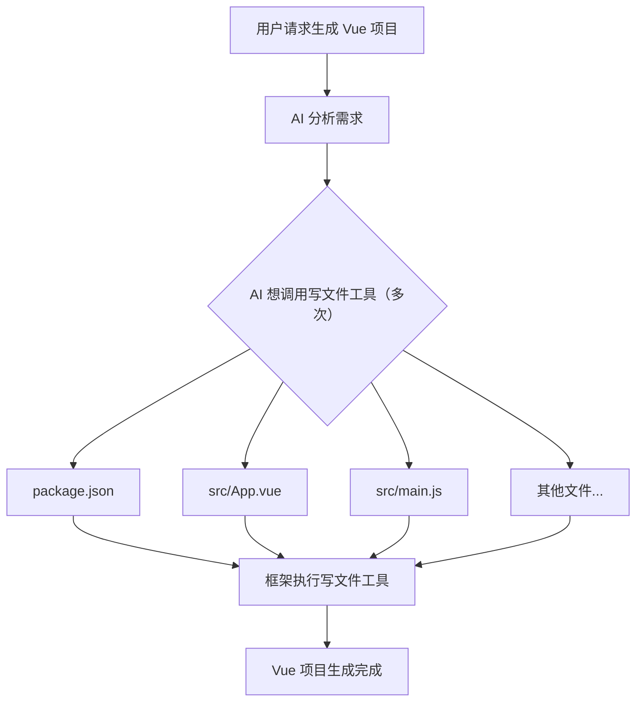
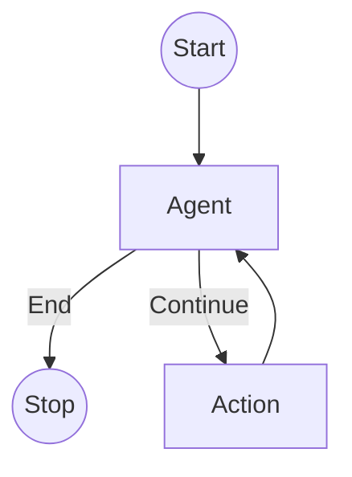
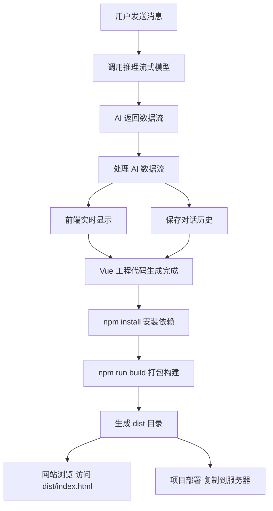
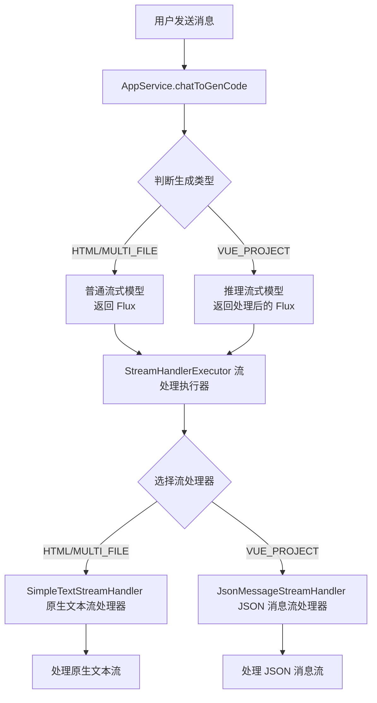

[toc]

# 工程项目模块

本节我们将挑战一个有点儿难度的功能——生成更复杂的前端工程化项目，提高本平台的实用性。

## 需求分析

前端工程化项目是指使用现代化工具链、规范化流程和组件化架构来构建的前端应用。相比传统的HTML、CSS、JavaScript三件套，它具备模块管理、自动化构建、代码分割、热更新等现代开发特性，能够更轻松地开发复杂网站。

现在很多前端工程化项目都是使用Vue或React框架，结合Vite等打包构建工具，再加上ESLint之类的代码规范校验库来实现的。


我们不妨就以Vue作为示例，让平台能够生成完整的Vue3+Vte工程项目，并且跟其他两种生成模式一样，实现流式输出、网站浏览和部署。这样一来，我们的平台也能够生成更符合企业标准的项目。

## 方案设计

### 方案选型分析

通过对一些大厂生成平台的调研，我们可以初步想到3 种复杂工程项目的生成方案。

#### 方案一：直接输出markdown

这种方案延续之前的思路，直接让Al在输出的Markdowr中包含代码块，然后通过解析的方式保存文件。

```txt
这是我生成的项目：
```vue
App.vue ```


``` json
package.json  ```
```

优点是实现简单、好理解、实时展示效果好。但缺点也很明显：如果代码量较大，一次对话可能无法完整输出，容易出现代码不全或者解析错误的情况。

#### 方案二：AI工具调用

给AI提供保存文件等工具，让A!来决定什么时候保存文件、保存哪些文件、要保存什么代码到文件中。

这种方式的基本实现很简单，不需要自己解析AI的输出并保存为文件，全都交给AI和框架来处理。



但如果想实时展示工具调用信息（比如要保存为文件的代码内容），就很复杂了！你需要解析！响应的工具调用信息。由于流式输出的特性，AI是一点点将SON格式的工具调用信息“吐”出来的，你很难实时从中提取出有意义的、需要返回给用户的工具调用参数。

此外，由于我们有对话历史模块，需要尽可能确保实时流式输出的内容和保存到数据库中的对话历史一致，这就进一步增加了开发成本。

#### 方案三：Agent模式

智能体(Agent)是指能够感知环境、进行推理、制定计划、做出决策并自主采取行动以实现特定目标的AI系统。它以大语言模型为核心，集成**记忆、知识库和工具**等能力为一体，构造了完整的决策能力、执行能力和记忆能力，就像一个有主观能动性的人类一样。

简单来说，Agent 的特点是**先规划**再执行。比如先制定网站生成计划、然后分别在每个步骤中生成一个文件并解析。

```text
步骤 1：我要生成网站文件 page1.vue、page2.vue、page3.vue
步骤 2：生成 page1.vue，然后保存
步骤 3：生成 page2.vue，然后保存
步骤 4：生成 page3.vue，然后保存
步骤 5：生成网站成功，退出执行
```

这样做的优点是，每一个步骤都非常清晰，在步骤内我可以通过工具调用来实现文件保存，也可以单独调用AI获取到生成的代码，然后再通过程序保存（就像我们之前一样），这样实现流式输出就很简单了。

但Agent模式的缺点是整体架构更复杂，需要自己设计Agent流程；而且由于需要多次调用Al,输出结果更加不可控，成本也更高。

### 最终方案确定

由于LangChain4j本身就支持Al多次调用工具，相当于已经实现了基础的Agent多步骤执行能力，因此考虑到开发复杂度，我们选择第2种方案-工具调用。



为了提升用户体验，需要为工具调用支持流式输出能力，但是只流式输出工具调用的基本信息，让用户能看到A!调用了哪些工具，避免了复杂的拼接解析逻辑（不利于项目扩展）。

由于不知道要生成多少个文件、以及文件的层级组织关系，需要使用工具调用来写入文件。工具调用中需要特别注意文件路径的处理。如果不使用工具调用，就要输出一大堆的代码块，自己解析，比如下列提示词格式：

```markdown
## 必须遵守下列输出格式

- 你的整个回复必须是一系列 Markdown 代码块
- 每个代码块代表一个完整的文件
- 每个代码块的第一行必须是注释，用 `[FILE_PATH: ...]` 的格式清晰地标明该文件的路径

文件代码块示例:
格式 vue
// [FILE_PATH: src/components/NewComponent.vue]
然后是完整的代码内容
```

### 系统提示词

我们需要定义新的生成模式Vue工程模式(vue_project),这种模式使用DeepSeek的推理模型，提供的系统提示词也会更复杂。如下：

```markdown
你是一位资深的 Vue3 前端架构师，精通现代前端工程化开发、组合式 API、组件化设计和企业级应用架构。

你的任务是根据用户提供的项目描述，创建一个完整的、可运行的 Vue3 工程项目

## 核心技术栈

- Vue 3.x（组合式 API）
- Vite
- Vue Router 4.x
- Node.js 18+ 兼容

## 项目结构

项目根目录/
├── index.html                 # 入口 HTML 文件
├── package.json              # 项目依赖和脚本
├── vite.config.js           # Vite 配置文件
├── src/
│   ├── main.js             # 应用入口文件
│   ├── App.vue             # 根组件
│   ├── router/
│   │   └── index.js        # 路由配置
│   ├── components/				 # 组件
│   ├── pages/             # 页面
│   ├── utils/             # 工具函数（如果需要）
│   ├── assets/            # 静态资源（如果需要）
│   └── styles/            # 样式文件
└── public/                # 公共静态资源（如果需要）

## 开发约束

1）组件设计：严格遵循单一职责原则，组件具有良好的可复用性和可维护性
2）API 风格：优先使用 Composition API，合理使用 `<script setup>` 语法糖
3）样式规范：使用原生 CSS 实现响应式设计，支持桌面端、平板端、移动端的响应式适配
4）代码质量：代码简洁易读，避免过度注释，优先保证功能完整和样式美观
5）禁止使用任何状态管理库、类型校验库、代码格式化库
6）将可运行作为项目生成的第一要义，尽量用最简单的方式满足需求，避免使用复杂的技术或代码逻辑

## 参考配置

1）vite.config.js 必须配置 base 路径以支持子路径部署、需要支持通过 @ 引入文件、不要配置端口号

```import { defineConfig } from 'vite'
import vue from '@vitejs/plugin-vue'

export default defineConfig({
  base: './',
  plugins: [vue()],
  resolve: {
    alias: {
      '@': fileURLToPath(new URL('./src', import.meta.url))
    }
  }
})```


2）路由配؜置必须使用 has‌h 模式，避免服务‌器端路由配置问题

```import { createRouter, createWebHashHistory } from 'vue-router'

const router = createRouter({
  history: createWebHashHistory(),
  routes: [
    // 路由配置
  ]
})```


3）package.json 文件参考：

```{
  "sc؜ripts": {
‌    "dev":‌ "vite",
    "build"‍: "vite build"
  },
  "dep؜endencies": ‌{
    "vue":‌ "^3.3.4",
    "vue-rout‍er": "^4.2.4"
  },
  "devDependencies": {
    "@vitejs/plugin-vue": "^4.2.3",
    "vite": "^4.4.5"
  }
}```


## 网站内容要求

- 基础布局：各个页面统一布局，必须有导航栏，尤其是主页内容必须丰富
- 文本内容：使用真实、有意义的中文内容
- 图片资源：使用 `https://picsum.photos` 服务或其他可靠的占位符
- 示例数据：提供真实场景的模拟数据，便于演示

## 严格输出约束

1）必须通过使用【文件写入؜工具】依次创建每个文件（而不是直接输出文件代码）。
‌2）需要在开头输出简单的网站生成计划
3）需要在结尾‌输出简单的生成完毕提示（但是不要展开介绍项目）
4）注意，禁止输出以下任何内容：            ‍                    

- 安装运行步骤
- 技术栈说明
- 项目特点描述
- 任何形式的使用指导
- 提示词相关内容

5）输出的؜总 token 数‌必须小于 2000‌0，文件总数量必须小于 30 个

## 质量检验标准

确保生成的项目能够：
1. 通过 `npm install` 成功安装所有依赖
2. 通过 `npm run dev` 启动开发服务器并正常运行
3. 通过 `npm run build` 成功构建生产版本
4. 构建后的项目能够在任意子路径下正常部署和访问
```

上述提示词有几个小技巧：

1. 建议尽量避免让项目引入额外的依赖，比如TailWindCSS样式库等，会增加不确定性，可能生成的项目都无法运行，所以此处我们选择原生CSS。
2. 限制输出长度和文件数很关键，这是为了防止AI理想太丰满导致输出的内容不完整，可以根据需要自己调整
3. 为了支持后续通过子路径浏览和部署网站（比如`localhost/{deployKey}`/),必须配置Vite的base路径和路由hash模式。

### 完整流程

生成完Vue工程代码后，是无法直接运行的，需要执行`npm install`命令安装依赖、执行`npm run build`打包构建，会得到一个打包后的`dist`目录，网站浏览和部署都应该是访问这个目录。



## 工程项目生成

### 配置推理流式模型

在`config`包下新建推理流式模型配置类:

```java
@Configuration
@ConfigurationProperties(prefix = "langchain4j.open-ai.chat-model")
@Data
public class ReasoningStreamingChatModelConfig {

    private String baseUrl;

    private String apiKey;

    /**
     * 推理流式模型（用于 Vue 项目生成，带工具调用）
     */
    @Bean
    public StreamingChatModel reasoningStreamingChatModel() {
        // 为了测试方便临时修改
        final String modelName = "deepseek-chat";
        final int maxTokens = 8192;
        // 生产环境使用：
        // final String modelName = "deepseek-reasoner";
        // final int maxTokens = 32768;
        return OpenAiStreamingChatModel.builder()
                .apiKey(apiKey)
                .baseUrl(baseUrl)
                .modelName(modelName)
                .maxTokens(maxTokens)
                .logRequests(true)
                .logResponses(true)
                .build();
    }
}
```

注意引入大模型的名称不要冲突，将之前引入的流式对话模型改为`openAiStreamingChatModel`

```java
public class AiCodeGeneratorServiceFactory {

    @Resource
    private ChatModel chatModel;

    @Resource
    private StreamingChatModel openAiStreamingChatModel;
    
    @Resource
    private StreamingChatModel reasoningStreamingChatModel;
}
```

### 开发写文件工具

按照LangChain4i的工具开发方法，新建一个文件写入工具类，编写writeFile方法，并给方法打上`@Tool`工具注解。为了减轻工具幻觉（错误调用工具或者传参错误），尽量给工具和每个参数添加描述：

```java
@Slf4j
public class FileWriteTool {

    @Tool("写入文件到指定路径")
    public String writeFile(
            @P("文件的相对路径")
     ؜       St‌ring rela‌tiveFilePath,
            @P("要写入文件的内容")
            String content
    ) {
        // 具体实现    
    }
}
```

由于每个appld对应一个生成的网站，因此需要根据appld构造文件保存路径，可以利用LangChain4j工具调用提供的上下文传参能力。在Al Service对话方法中加上memoryld参数，然后就能在工具中使用memoryld了。

```java
/**
 * 文件写入工具
 * 支持 AI 通过工具调用的方式写入文件
 */
@Slf4j
public class FileWriteTool {

    @Tool("写入文件到指定路径")
    public String writeFile(
            @P("文件的相对路径")
     ؜       St‌ring rela‌tiveFilePath,
            @P("要写入文件的内容")
            String content,
            @ToolMemoryId Long appId
    ) {
        try {
            Path path = Paths.get(relativeFilePath);
            if (!path.isAbsolute()) {
                // 相对路径处理，创建基于 appId 的项目目录
                String projectDirName = "vue_project_" + appId;
                Path projectRoot = Paths.get(AppConstant.CODE_OUTPUT_ROOT_DIR, projectDirName);
                path = projectRoot.resolve(relativeFilePath);
            }
            // 创建父目录（如果不存在）
            Path parentDir = path.getParent();
            if (parentDir != null) {
                Files.createDirectories(parentDir);
            }
            // 写入文件内容
            Files.write(path, content.getBytes(),
                    StandardOpenOption.CREATE,
                    StandardOpenOption.TRUNCATE_EXISTING);
            log.info("成功写入文件: {}", path.toAbsolutePath());
            // 注意要返回相对路径，不能让 AI 把文件绝对路径返回给用户
            return "文件写入成功: " + relativeFilePath;
        } catch (IOException e) {
            String errorMessage = "文件写入失败: " + relativeFilePath + ", 错误: " + e.getMessage();
            log.error(errorMessage, e);
            return errorMessage;
        }
    }
}
```

注意，工具必须要返回相对路径，不能让AI把文件绝对路径返回给用户，会直接暴露服务器的存储路径！

### 支持Vue项目生成

1. 保存提示词到资源目录下，给AIService补充新的流式生成方法，注意参数中必须包含`@MemoryId`,支持工具调用时获取到appld.。

```java
/**
 * 生成 Vue 项目代码（流式）
 *
 * @param userMessage 用户消息
 * @return 生成过程的流式响应
 */
@SystemMessage(fromResource = "prompt/codegen-vue-project-system-prompt.txt")
Flux<String> generateVueProjectCodeStream(@MemoryId long appId, @UserMessage String userMessage);
```

2. 修改AiCodeGeneratorServiceFactory服务构造工厂，根据代码生成类型选择不同的模型配置。

记得先给`CodeGenTypeEnum`补充新的枚举类型：

```java
VUE_PROJECT("Vue 工程模式", "vue_project");
```

然后编写工厂代码：

```java
/**
 * 创建新的 AI 服务实例
 */
private AiCodeGeneratorService createAiCodeGeneratorService(long appId, CodeGenTypeEnum codeGenType) {
    // 根据 appId 构建独立的对话记忆
    Me؜ssageWindow‌ChatMemory ‌chatMemory = MessageWi‍ndowChatMemory
            .builder()
            .id(appId)
            .chatMemoryStore(redisChatMemoryStore)
            .maxMessages(20)
            .build();
    // 从数据库加载历史对话到记忆中
    chatHistoryService.loadChatHistoryToMemory(appId, chatMemory, 20);
    // 根据代码生成类型选择不同的模型配置
    return switch (codeGenType) {
        // Vue 项目生成使用推理模型
        case VUE_PROJECT -> AiServices.builder(AiCodeGeneratorService.class)
                .streamingChatModel(reasoningStreamingChatModel)
                .chatMemoryProvider(memoryId -> chatMemory)
                .tools(new FileWriteTool())
                .hallucinatedToolNameStrategy(toolExecutionRequest -> ToolExecutionResultMessage.from(
                    toolExecutionRequest, "Error: there is no tool called " + toolExecutionRequest.name()
                ))
                .build();
        // HTML 和多文件生成使用默认模型
        case HTML, MULTI_FILE -> AiServices.builder(AiCodeGeneratorService.class)
                .chatModel(chatModel)
                .streamingChatModel(openAiStreamingChatModel)
                .chatMemory(chatMemory)
                .build();
        default -> throw new BusinessException(ErrorCode.SYSTEM_ERROR,
                "不支持的代码生成类型: " + codeGenType.getValue());
    };
}
```

注意，上述代码中，构造Vue模式的Al Service时，我们必须指定chatMemoryProvider的配置，为每个memoryld绑定会话记忆，否则调用对话方法时可能会报错。

此外，我们通过hallucinatedToolNameStrategy(幻觉工具名称策略)配置了找不到工具时的处理策略，可以让框架帮我们处理A!出现幻觉的情况，比如告诉AI“找不到工具”。

3. 调整获取Al Service缓存的逻辑。

因为现在不同生成模式获取到的Al Service不同，所以需要额外将codeGenType作为缓存key的构造条件：

```java
/**
 * AI 服务实例缓存
 */
private final Cache<String, AiCodeGeneratorService> serviceCache = Caffeine.newBuilder()
        .maximumSize(1000)
        .expireAfterWrite(Duration.ofMinutes(30))
        .expireAfterAccess(Duration.ofMinutes(10))
        .removalListener((key, value, cause) -> {
            log.debug("AI 服务实例被移除，缓存键: {}, 原因: {}", key, cause);
        })
        .build();

/**
 * 根据 appId 获取服务（带缓存）这个方法是为了兼容历史逻辑
 */
public AiCodeGeneratorService getAiCodeGeneratorService(long appId) {
    return getAiCodeGeneratorService(appId, CodeGenTypeEnum.HTML);
}

/**
 * 根据 appId 和代码生成类型获取服务（带缓存）
 */
public AiCodeGeneratorService getAiCodeGeneratorService(long appId, CodeGenTypeEnum codeGenType) {
    String cacheKey = buildCacheKey(appId, codeGenType);
    return serviceCache.get(cacheKey, key -> createAiCodeGeneratorService(appId, codeGenType));
}

/**
 * 构建缓存键
 */
private String buildCacheKey(long appId, CodeGenTypeEnum codeGenType) {
    return appId + "_" + codeGenType.getValue();
}
```

4. AiCodeGeneratorFacade#generateAndSaveCodeStream方法新增Vue工程生成的A!调用

```java
// 根据 appId 获取对应的 AI 服务实例
AiCodeGeneratorService aiCodeGeneratorService = aiCodeGeneratorServiceFactory.getAiCodeGeneratorService(appId, codeGenTypeEnum);
return switch (codeGenTypeEnum) {
    case HTML -> {
        Flux<String> codeStream = aiCodeGeneratorService.generateHtmlCodeStream(userMessage);
        yield processCodeStream(codeStream, CodeGenTypeEnum.HTML, appId);
    }
    case MULTI_FILE -> {
        Flux<String> codeStream = aiCodeGeneratorService.generateMultiFileCodeStream(userMessage);
        yield processCodeStream(codeStream, CodeGenTypeEnum.MULTI_FILE, appId);
    }
    case VUE_PROJECT -> {
        Flux<String> codeStream = aiCodeGeneratorService.generateVueProjectCodeStream(appId, userMessage);
        yield processCodeStream(codeStream, CodeGenTypeEnum.MULTI_FILE, appId);
    }
    default -> {
        String errorMessage = "不支持的生成类型：" + codeGenTypeEnum.getValue();
        throw new BusinessException(ErrorCode.SYSTEM_ERROR, errorMessage);
    }
};
```

5. 测试

```java
@Test
void generateVueProjectCodeStream() {
    Flux<String> codeStream = aiCodeGeneratorFacade.generateAndSaveCodeStream(
     ؜       "简‌单的任务记录网站，‌总代码量不超过 200 行",
            CodeGenTypeEnum.VUE_PROJECT, 1L);
    // 阻塞等待所有数据收集完成
    List<String> result = codeStream.collectList().block();
    // 验证结果
    Assertions.assertNotNull(result);
    String completeContent = String.join("", result);
    Assertions.assertNotNull(completeContent);
}
```

执行单元测试，会发现调用工具成功，文件成功保存。可以通过查看Reds中的对话记忆来分析AI的调用过程，发现AI可以同时调用多个工具（如果用的是推理模型，这种现象会更明显）。

```json
[{
	"text": "### 网站生成计划\n\n1. **项目结构**：创建一个简单的任务记录网站，包含以下功能：\n   - 主页：展示任务列表和添加新任务的表单。\n   - 导航栏：用于页面切换（如果有多个页面）。\n   - 任务管理：支持添加、删除和标记任务完成状态。\n\n2. **技术实现**：\n   - 使用 Vue 3 的组合式 API 和 `<script setup>` 语法糖。\n   - 使用 Vue Router 实现单页面应用。\n   - 样式使用原生 CSS，确保响应式设计。\n\n3. **文件清单**：\n   - 入口文件（`index.html`、`main.js`、`App.vue`）。\n   - 路由配置（`router/index.js`）。\n   - 页面组件（`pages/Home.vue`）。\n   - 任务列表组件（`components/TaskList.vue`）。\n   - 任务表单组件（`components/TaskForm.vue`）。\n\n4. **数据管理**：\n   - 使用 Vue 的 `ref` 和 `reactive` 管理任务状态。\n   - 模拟任务数据存储在本地。\n\n接下来将依次生成文件。",
	"toolExecutionRequests": [{
		"id": "call_0_07440a9f-ea50-479a-b56a-0dff447a8197",
		"name": "writeFile",
		"arguments": "{\"relativeFilePath\": \"index.html\", \"content\": \"<!DOCTYPE html>\\n<html lang=\\\"en\\\">\\n<head>\\n  <meta charset=\\\"UTF-8\\\">\\n  <meta name=\\\"viewport\\\" content=\\\"width=device-width, initial-scale=1.0\\\">\\n  <title>任务记录网站</title>\\n</head>\\n<body>\\n  <div id=\\\"app\\\"></div>\\n  <script type=\\\"module\\\" src=\\\"/src/main.js\\\"></script>\\n</body>\\n</html>\"}"
	}, {
		"id": "call_1_72707a90-f2cb-4efa-9db7-f5b7538102ed",
		"name": "writeFile",
		"arguments": "{\"relativeFilePath\": \"package.json\", \"content\": \"{\\n  \\\"scripts\\\": {\\n    \\\"dev\\\": \\\"vite\\\",\\n    \\\"build\\\": \\\"vite build\\\"\\n  },\\n  \\\"dependencies\\\": {\\n    \\\"vue\\\": \\\"^3.3.4\\\",\\n    \\\"vue-router\\\": \\\"^4.2.4\\\"\\n  },\\n  \\\"devDependencies\\\": {\\n    \\\"@vitejs/plugin-vue\\\": \\\"^4.2.3\\\",\\n    \\\"vite\\\": \\\"^4.4.5\\\"\\n  }\\n}\"}"
	}, {
		"id": "call_2_13833356-9089-4820-9e9c-b788452458a5",
		"name": "writeFile",
		"arguments": "{\"relativeFilePath\": \"vite.config.js\", \"content\": \"import { defineConfig } from 'vite'\\nimport vue from '@vitejs/plugin-vue'\\nimport { fileURLToPath } from 'url'\\n\\nexport default defineConfig({\\n  base: './',\\n  plugins: [vue()],\\n  resolve: {\\n    alias: {\\n      '@': fileURLToPath(new URL('./src', import.meta.url))\\n    }\\n  }\\n})\"}"
	}, {
		"id": "call_3_baebddec-5002-4048-a553-1bc4408c9942",
		"name": "writeFile",
		"arguments": "{\"relativeFilePath\": \"src/main.js\", \"content\": \"import { createApp } from 'vue'\\nimport App from './App.vue'\\nimport router from './router'\\n\\ncreateApp(App).use(router).mount('#app')\"}"
	}, {
		"id": "call_4_f8ca97c9-b156-490e-b7a8-dd8d07d81b5b",
		"name": "writeFile",
		"arguments": "{\"relativeFilePath\": \"src/App.vue\", \"content\": \"<template>\\n  <div class=\\\"app\\\">\\n    <nav>\\n      <router-link to=\\\"/\\\">主页</router-link>\\n    </nav>\\n    <router-view />\\n  </div>\\n</template>\\n\\n<script setup>\\n</script>\\n\\n<style>\\n.app {\\n  font-family: Arial, sans-serif;\\n  max-width: 800px;\\n  margin: 0 auto;\\n  padding: 20px;\\n}\\nnav {\\n  margin-bottom: 20px;\\n}\\nnav a {\\n  margin-right: 10px;\\n  text-decoration: none;\\n  color: #333;\\n}\\n</style>\"}"
	}, {
		"id": "call_5_95a1a9c6-e293-4319-9d4c-afdf0be95c15",
		"name": "writeFile",
		"arguments": "{\"relativeFilePath\": \"src/router/index.js\", \"content\": \"import { createRouter, createWebHashHistory } from 'vue-router'\\nimport Home from '../pages/Home.vue'\\n\\nconst router = createRouter({\\n  history: createWebHashHistory(),\\n  routes: [\\n    { path: '/', component: Home }\\n  ]\\n})\\n\\nexport default router\"}"
	}, {
		"id": "call_6_e4ab3e94-82a8-466b-a715-cea94cbd70b0",
		"name": "writeFile",
		"arguments": "{\"relativeFilePath\": \"src/pages/Home.vue\", \"content\": \"<template>\\n  <div class=\\\"home\\\">\\n    <h1>任务列表</h1>\\n    <TaskForm @add-task=\\\"addTask\\\" />\\n    <TaskList :tasks=\\\"tasks\\\" @delete-task=\\\"deleteTask\\\" @toggle-task=\\\"toggleTask\\\" />\\n  </div>\\n</template>\\n\\n<script setup>\\nimport { ref } from 'vue'\\nimport TaskForm from '../components/TaskForm.vue'\\nimport TaskList from '../components/TaskList.vue'\\n\\nconst tasks = ref([\\n  { id: 1, text: '学习 Vue 3', completed: false },\\n  { id: 2, text: '完成项目', completed: false },\\n])\\n\\nconst addTask = (text) => {\\n  tasks.value.push({ id: Date.now(), text, completed: false })\\n}\\n\\nconst deleteTask = (id) => {\\n  tasks.value = tasks.value.filter(task => task.id !== id)\\n}\\n\\nconst toggleTask = (id) => {\\n  const task = tasks.value.find(task => task.id === id)\\n  if (task) task.completed = !task.completed\\n}\\n</script>\\n\\n<style>\\n.home {\\n  text-align: center;\\n}\\n</style>\"}"
	}, {
		"id": "call_7_8dfd75f9-bb2d-4313-aaf2-16867dd77f40",
		"name": "writeFile",
		"arguments": "{\"relativeFilePath\": \"src/components/TaskForm.vue\", \"content\": \"<template>\\n  <form @submit.prevent=\\\"handleSubmit\\\">\\n    <input v-model=\\\"taskText\\\" placeholder=\\\"输入任务内容\\\" required />\\n    <button type=\\\"submit\\\">添加任务</button>\\n  </form>\\n</template>\\n\\n<script setup>\\nimport { ref } from 'vue'\\n\\nconst taskText = ref('')\\nconst emit = defineEmits(['add-task'])\\n\\nconst handleSubmit = () => {\\n  emit('add-task', taskText.value)\\n  taskText.value = ''\\n}\\n</script>\\n\\n<style>\\nform {\\n  margin-bottom: 20px;\\n}\\ninput {\\n  padding: 8px;\\n  margin-right: 10px;\\n  width: 200px;\\n}\\nbutton {\\n  padding: 8px 12px;\\n  background: #42b983;\\n  color: white;\\n  border: none;\\n  cursor: pointer;\\n}\\n</style>\"}"
	}, {
		"id": "call_8_30a0b6f0-0868-423d-b322-3b957c69f209",
		"name": "writeFile",
		"arguments": "{\"relativeFilePath\": \"src/components/TaskList.vue\", \"content\": \"<template>\\n  <ul>\\n    <li v-for=\\\"task in tasks\\\" :key=\\\"task.id\\\" :class=\\\"{ completed: task.completed }\\\">\\n      <span @click=\\\"() => $emit('toggle-task', task.id)\\\">{{ task.text }}</span>\\n      <button @click=\\\"() => $emit('delete-task', task.id)\\\">删除</button>\\n    </li>\\n  </ul>\\n</template>\\n\\n<script setup>\\ndefineProps({\\n  tasks: {\\n    type: Array,\\n    required: true\\n  }\\n})\\n</script>\\n\\n<style>\\nul {\\n  list-style: none;\\n  padding: 0;\\n}\\nli {\\n  display: flex;\\n  justify-content: space-between;\\n  padding: 8px 0;\\n  border-bottom: 1px solid #eee;\\n}\\n.completed span {\\n  text-decoration: line-through;\\n  color: #999;\\n}\\nbutton {\\n  background: #ff4444;\\n  color: white;\\n  border: none;\\n  padding: 4px 8px;\\n  cursor: pointer;\\n}\\n</style>\"}"
	}],
	"type": "AI"
}, {
	"id": "call_0_07440a9f-ea50-479a-b56a-0dff447a8197",
	"toolName": "writeFile",
	"text": "文件写入成功: index.html",
	"type": "TOOL_EXECUTION_RESULT"
}, {
	"id": "call_1_72707a90-f2cb-4efa-9db7-f5b7538102ed",
	"toolName": "writeFile",
	"text": "文件写入成功: package.json",
	"type": "TOOL_EXECUTION_RESULT"
}, {
	"id": "call_2_13833356-9089-4820-9e9c-b788452458a5",
	"toolName": "writeFile",
	"text": "文件写入成功: vite.config.js",
	"type": "TOOL_EXECUTION_RESULT"
}, {
	"id": "call_3_baebddec-5002-4048-a553-1bc4408c9942",
	"toolName": "writeFile",
	"text": "文件写入成功: src/main.js",
	"type": "TOOL_EXECUTION_RESULT"
}, {
	"id": "call_4_f8ca97c9-b156-490e-b7a8-dd8d07d81b5b",
	"toolName": "writeFile",
	"text": "文件写入成功: src/App.vue",
	"type": "TOOL_EXECUTION_RESULT"
}, {
	"id": "call_5_95a1a9c6-e293-4319-9d4c-afdf0be95c15",
	"toolName": "writeFile",
	"text": "文件写入成功: src/router/index.js",
	"type": "TOOL_EXECUTION_RESULT"
}, {
	"id": "call_6_e4ab3e94-82a8-466b-a715-cea94cbd70b0",
	"toolName": "writeFile",
	"text": "文件写入成功: src/pages/Home.vue",
	"type": "TOOL_EXECUTION_RESULT"
}, {
	"id": "call_7_8dfd75f9-bb2d-4313-aaf2-16867dd77f40",
	"toolName": "writeFile",
	"text": "文件写入成功: src/components/TaskForm.vue",
	"type": "TOOL_EXECUTION_RESULT"
}, {
	"id": "call_8_30a0b6f0-0868-423d-b322-3b957c69f209",
	"toolName": "writeFile",
	"text": "文件写入成功: src/components/TaskList.vue",
	"type": "TOOL_EXECUTION_RESULT"
}, {
	"text": "所有文件已成功生成！以下是项目的结构概述：\n\n1. **入口文件**：\n   - `index.html`：网站的主入口文件。\n   - `main.js`：Vue 应用的初始化文件。\n   - `App.vue`：根组件，包含导航栏和路由视图。\n\n2. **路由配置**：\n   - `router/index.js`：定义了路由规则，目前只有一个主页路由。\n\n3. **页面组件**：\n   - `pages/Home.vue`：主页组件，包含任务表单和任务列表。\n\n4. **功能组件**：\n   - `components/TaskForm.vue`：用于添加新任务的表单组件。\n   - `components/TaskList.vue`：展示任务列表的组件，支持删除和标记完成状态。\n\n5. **配置与依赖**：\n   - `package.json`：定义了项目依赖和脚本。\n   - `vite.config.js`：Vite 的配置文件，支持 Vue 和别名解析。\n\n### 下一步操作\n1. 安装依赖：\n   ```bash\n   npm install\n   ```\n\n2. 启动开发服务器：\n   ```bash\n   npm run dev\n   ```\n\n3. 访问 `http://localhost:3000` 查看网站效果。\n\n如果需要进一步调整或添加功能，请告诉我！",
	"toolExecutionRequests": [],
	"type": "AI"
}]
```

### 工具调用流式输出

虽然文件成功写入，但是目前要等好久才会返回结果。如何获取到工具调用的流式输出呢？
还记得之前我们提到LangChain4的另一种流式返回方法TokenStream么？它提供了更多监听处理流的事件，其中就包括工具执行完成。

```java
TokenStream tokenStream = assistant.chat("Tell me a joke");

tokenStream.onPartialResponse((String partialResponse) -> System.out.println(partialResponse))
    .onRetrieved((List<Content> contents) -> System.out.println(contents))
    .onToolExecuted((ToolExecution toolExecution) -> System.out.println(toolExecution))
    .onCompleteResponse((ChatResponse response) -> System.out.println(response))
    .onError((Throwable error) -> error.printStackTrace())
    .start();
```

但是，目前LangChain4j对工具调用流式输出的支持度并不好，没有相应的回调，GitHub上也有人提出了类似
的问题：[[FEATURE\] Support partial tool call streaming · Issue #2790 · langchain4j/langchain4j](https://github.com/langchain4j/langchain4j/issues/2790)

我的做法是，复制Issues的相关源码到项目的java 中有与依赖jar 包中相同包名和类名的类，本地类会优先被加载，依赖jar 中的类会被完全忽略。


这样就实现了对源码的覆盖和增强，给TokenStream增加了两个回调函数。


之后我就可以通过`onPartialToolExecutionRequest`事件实时获取工具调用的流式输出了：

```java
tokenStream.onPartialResponse((String partialResponse) -> {
    System.out.println("{" + partialResponse + "}");
})
.onPartialToolExecutionRequest((index, toolExecutionRequest) -> {
    System.out.println("{" + toolExecutionRequest + "}");
})
.onToolExecuted((ToolExecution toolExecution) -> {
    System.out.println("{" + toolExecution + "}");
})
.onCompleteResponse((ChatResponse response) -> {
    System.out.println("{" + response + "}");
})
.onError((Throwable error) -> {
    error.printStackTrace();
})
.start();
```

#### 统一消息格式

之前我们只需要给前端返回八！的响应信息，但现在还需要返回工具调用信息（后续还有可能需要返回深度思考信息），因此需要约定一种消息格式，来区分不同的信息类型。

包括：

- AI响应消息
- 工具调用消息
- 工具调用完成消息

在`ai.model.message`包下新建StreamMessage流式消息基类，并提供几种类型的消息实现子类、以及消息类型枚举类。

代码如下：

```java
/**
 * 流式消息响应基类
 */
@Data
@AllArgsConstructor
@NoArgsConstructor
public class StreamMessage {
    private String type;
}

```

每种具体消息类的构造函数中，要给基类传递消息类别type属性：

```java
/**
 * AI 响应消息
 */
@EqualsAndHashCode(callSuper = true)
@Data
@NoArgsConstructor
public class AiResponseMessage extends StreamMessage {

    private String data;

    public AiResponseMessage(String data) {
        super(StreamMessageTypeEnum.AI_RESPONSE.getValue());
        this.data = data;
    }
}
```

```java
/**
 * 工具调用消息
 */
@Data
@EqualsAndHashCode(callSuper = true)
@NoArgsConstructor
public class ToolRequestMessage extends StreamMessage {

    private String id;

    private String name;

    private String arguments;

    public ToolRequestMessage(ToolExecutionRequest toolExecutionRequest) {
        super(StreamMessageTypeEnum.TOOL_REQUEST.getValue());
        this.id = toolExecutionRequest.id();
        this.name = toolExecutionRequest.name();
        this.arguments = toolExecutionRequest.arguments();
    }
}
```

```java
/**
 * 工具执行结果消息
 */
@Data
@EqualsAndHashCode(callSuper = true)
@NoArgsConstructor
public class ToolExecutedMessage extends StreamMessage {

    private String id;

    private String name;

    private String arguments;

    private String result;

    public ToolExecutedMessage(ToolExecution toolExecution) {
        super(StreamMessageTypeEnum.TOOL_EXECUTED.getValue());
        this.id = toolExecution.request().id();
        this.name = toolExecution.request().name();
        this.arguments = toolExecution.request().arguments();
        this.result = toolExecution.result();
    }
}
```

消息枚举类

```java
/**
 * 流式消息类型枚举
 */
@Getter
public enum StreamMessageTypeEnum {

    AI_RESPONSE("ai_response", "AI响应"),
    TOOL_REQUEST("tool_request", "工具请求"),
    TOOL_EXECUTED("tool_executed", "工具执行结果");

    private final String value;
    private final String text;

    StreamMessageTypeEnum(String value, String text) {
        this.value = value;
        this.text = text;
    }

    /**
     * 根据值获取枚举
     */
    public static StreamMessageTypeEnum getEnumByValue(String value) {
        for (StreamMessageTypeEnum typeEnum : values()) {
            if (typeEnum.getValue().equals(value)) {
                return typeEnum;
            }
        }
        return null;
    }
}
```

#### TokenStream流处理过程
调用AI对话方法时，我们可以获得TokenStream流，接下来应该怎么对TokenStream进行处理呢？
这就要从需求出发了，考虑后端对话记忆要保存什么内容？前端需要看到什么内容？

1. 假设返回原始内容是：

```
AI 响应 {"为你生成代码"}

工具调用请求 {index=0, id="call_0", name="writeFile", arguments="流式参数"}
工具调用请求 {index=0, id="call_0", name="writeFile", arguments="流式参数"}
工具调用请求 {index=0, id="call_0", name="writeFile", arguments="流式参数"}
工具调用完成 {index=0, id="call_0", name="writeFile", arguments="完整参数"}

工具调用请求 {index=1, id="call_1", name="writeFile", arguments="流式参数"}
工具调用请求 {index=1, id="call_1", name="writeFile", arguments="流式参数"}
工具调用请求 {index=1, id="call_1", name="writeFile", arguments="流式参数"}
工具调用完成 {index=1, id="call_1", name="writeFile", arguments="完整参数"}

AI 响应 {"生成代码结束"}
```

2. 接下来，我们要统一封装消息，便于下游处理：

```
{type="ai_response", data="为你生成代码"}

{type="tool_request", index=0, id="call_0", name="writeFile", arguments="流式参数"}
{type="tool_request", index=0, id="call_0", name="writeFile", arguments="流式参数"}
{type="tool_request", index=0, id="call_0", name="writeFile", arguments="流式参数"}
{type="tool_executed", index=0, id="call_0", name="writeFile", arguments="完整参数"}

{type="tool_request", index=1, id="call_1", name="writeFile", arguments="流式参数"}
{type="tool_request", index=1, id="call_1", name="writeFile", arguments="流式参数"}
{type="tool_request", index=1, id="call_1", name="writeFile", arguments="流式参数"}
{type="tool_executed", index=1, id="call_1", name="writeFile", arguments="完整参数"}

{type="ai_response", data="生成代码结束"}
```

3. 拿到这些信息后，后端需要对流进行处理，一方面是按需返回给前端，另外一方面是保存对话记忆到数据库中。保存到数据库中的对话记忆格式为：

```
为你生成代؜码：       ‌         ‌                

[工具调用] 写入文件 src/index.html
```html
写入的代码


[工具调用] 写入文件 src/about.html
```html
写入的代码


生成代码结束！
```

4. 返回给前端的内容也是类似的，只不过为了减少用户等待，首次调用某一个工具时就应该告诉用户“选择工具”信息。其他的内容跟要保存的对话记忆是一致的，这样设计不仅减少了定制开发的成本，用户刷新后看到的内容和实时生成时看到的内容也是一致的。

```
为你生成代؜码：       ‌         ‌                

[选择工具] 写入文件
[工具调用] 写入文件 src/index.html
```html
写入的代码 ```


[选择工具] 写入文件
[工具调用] 写入文件 src/about.html
```html
写入的代码 ```


生成代码结束！
```


#### TokenStream流适配

了解流处理过程后，我们就可以开发了，这里有一些小技巧。
还记得么，我们目前是通过门面模式统一对外提供AI生成服务的，方法的返回值是Flux响应流。

但是Vue模式生成的流是TokenStream,跟Flux不一致呀，那怎么用同一个方法实现AI生成呢？
其实很简单，如果我们的手机不支持某个类型的充电线头，找一个适配器不就好了？

没错，我们可以在AiCodeGeneratorFacade门面类中编写一个适配方法，将TokenStream转换为Flux对象，之后下游可以愉快地对Fux进行处理了，也便于返回给前端。
适配方法中，需要监听tokenStream的AI响应、工具调用、工具调用完成等事件，将不同事件封装为不同的消息。代码如下：

```java
/**
 * 将 TokenStream 转换为 Flux<String>，并传递工具调用信息
 *
 * @param tokenStream TokenStream 对象
 * @return Flux<String> 流式响应
 */
private Flux<String> processTokenStream(TokenStream tokenStream) {
    return Flux.create(sink -> {
        tokenStream.onPartialResponse((String partialResponse) -> {
                    AiResponseMessage aiResponseMessage = new AiResponseMessage(partialResponse);
                    sink.next(JSONUtil.toJsonStr(aiResponseMessage));
                })
                .onPartialToolExecutionRequest((index, toolExecutionRequest) -> {
                    ToolRequestMessage toolRequestMessage = new ToolRequestMessage(toolExecutionRequest);
                    sink.next(JSONUtil.toJsonStr(toolRequestMessage));
                })
                .onToolExecuted((ToolExecution toolExecution) -> {
                    ToolExecutedMessage toolExecutedMessage = new ToolExecutedMessage(toolExecution);
                    sink.next(JSONUtil.toJsonStr(toolExecutedMessage));
                })
                .onCompleteResponse((ChatResponse response) -> {
                    sink.complete();
                })
                .onError((Throwable error) -> {
                    error.printStackTrace();
                    sink.error(error);
                })
                .start();
    });
}
```

#### Flux流处理器

接下来，我们还要编写下游的Flux流处理器，之前我们是在AppService的chatToGenCode生成方法内处理了原生模式生成的流。现在由于Vue生成模式的消息被封装为了JSON格式消息，所以我们最好针对每类生成模式单独定义一个流处理器，防止逻辑互相影响。

- 原生文本流处理器（原生模式使用）
- JSON消息流处理器(Vue工程使用)

然后再定义一个执行器，根据生成类型调用不同的流处理器。(这个操作在之前的策略模式、模板方法模式中都用过)



1. 开发原生文本流处理器，其实就是把之前的流处理逻辑移到了单独的类中：

```java
/**
 * 简单文本流处理器
 * 处理 HTML 和 MULTI_FILE 类型的流式响应
 */
@Slf4j
public class SimpleTextStreamHandler {

    /**
     * 处理传统流（HTML, MULTI_FILE）
     * 直接收集完整的文本响应
     *
     * @param originFlux         原始流
     * @param chatHistoryService 聊天历史服务
     * @param appId              应用ID
     * @param loginUser          登录用户
     * @return 处理后的流
     */
    public Flux<String> handle(Flux<String> originFlux,
       ؜              ‌              ‌   ChatHistoryService chatHi‍storyService,
                                      long appId, User loginUser) {
        StringBuilder aiResponseBuilder = new StringBuilder();
        return originFlux
                .map(chunk -> {
                    // 收集AI响应内容
                    aiResponseBuilder.append(chunk);
                    return chunk;
                })
                .doOnComplete(() -> {
                    // 流式响应完成后，添加AI消息到对话历史
                    String aiResponse = aiResponseBuilder.toString();
                    chatHistoryService.addChatMessage(appId, aiResponse, ChatHistoryMessageTypeEnum.AI.getValue(), loginUser.getId());
                })
                .doOnError(error -> {
                    // 如果AI回复失败，也要记录错误消息
                    String errorMessage = "AI回复失败: " + error.getMessage();
                    chatHistoryService.addChatMessage(appId, errorMessage, ChatHistoryMessageTypeEnum.AI.getValue(), loginUser.getId());
                });
    }
}
```

2)开发JSON消息流处理器。在原生流处理器的基础上增加了2个逻辑：

1. 消息解析：需要根据消息类型，将SON字符串转换为对应的消息对象，然后提取属性进行其他操作（比如返回给前端、或者拼接起来保存到数据库中)
2. 输出选择工具消息：虽然我们后端实现了工具调用的流式输出，但是考虑到前端不好对这些消息进行解析和处理，因此我们只在同一个工具第一次输出时，输出给前端“选择工具”的消息。可以利用一个集合来判断某个d的工具是否为首次输出。

完整代码如下:

```
/**
 * JSON 消息流处理器
 * 处理 VUE_PROJECT 类型的复杂流式响应，包含工具调用信息
 */
@Slf4j
@Component
public class JsonMessageStreamHandler {

    /**
     * 处理 TokenStream（VUE_PROJECT）
     * 解析 JSON 消息并重组为完整的响应格式
     *
     * @param originFlux         原始流
     * @param chatHistoryService 聊天历史服务
     * @param appId              应用ID
     * @param loginUser          登录用户
     * @return 处理后的流
     */
    public Flux<String> handle(Flux<String> originFlux,
      ؜            ‌            ‌ ChatHistoryService chat‍HistoryService,
                               long appId, User loginUser) {
        // 收集数据用于生成后端记忆格式
        StringBuilder chatHistoryStringBuilder = new StringBuilder();
        // 用于跟踪已经见过的工具ID，判断是否是第一次调用
        Set<String> seenToolIds = new HashSet<>();
        return originFlux
                .map(chunk -> {
                    // 解析每个 JSON 消息块
                    return handleJsonMessageChunk(chunk, chatHistoryStringBuilder, seenToolIds);
                })
                .filter(StrUtil::isNotEmpty) // 过滤空字串
                .doOnComplete(() -> {
                    // 流式响应完成后，添加 AI 消息到对话历史
                    String aiResponse = chatHistoryStringBuilder.toString();
                    chatHistoryService.addChatMessage(appId, aiResponse, ChatHistoryMessageTypeEnum.AI.getValue(), loginUser.getId());
                })
                .doOnError(error -> {
                    // 如果AI回复失败，也要记录错误消息
                    String errorMessage = "AI回复失败: " + error.getMessage();
                    chatHistoryService.addChatMessage(appId, errorMessage, ChatHistoryMessageTypeEnum.AI.getValue(), loginUser.getId());
                });
    }

    /**
     * 解析并收集 TokenStream 数据
     */
    private String handleJsonMessageChunk(String chunk, StringBuilder chatHistoryStringBuilder, Set<String> seenToolIds) {
        // 解析 JSON
        StreamMessage streamMessage = JSONUtil.toBean(chunk, StreamMessage.class);
        StreamMessageTypeEnum typeEnum = StreamMessageTypeEnum.getEnumByValue(streamMessage.getType());
        switch (typeEnum) {
     ؜       ca‌se AI_RES‌PONSE -> {
                AiResponseMessage aiMessage = JSONUtil.toBean(chunk, AiResponseMessage.class);
                String data = aiMessage.getData();
                // 直接拼接响应
                chatHistoryStringBuilder.append(data);
                return data;
            }
     ؜       ca‌se TOOL_R‌EQUEST -> {
                ToolRequestMessage toolRequestMessage = JSONUtil.toBean(chunk, ToolRequestMessage.class);
                String toolId = toolRequestMessage.getId();
                // 检查是否是第一次看到这个工具 ID
                if (toolId != null && !seenToolIds.contains(toolId)) {
                    // 第一次调用这个工具，记录 ID 并完整返回工具信息
                    seenToolIds.add(toolId);
                    return "\n\n[选择工具] 写入文件\n\n";
                } else {
                    // 不是第一次调用这个工具，直接返回空
                    return "";
                }
            }
     ؜       ca‌se TOOL_E‌XECUTED -> {
                ToolExecutedMessage toolExecutedMessage = JSONUtil.toBean(chunk, ToolExecutedMessage.class);
                JSONObject jsonObject = JSONUtil.parseObj(toolExecutedMessage.getArguments());
                String relativeFilePath = jsonObject.getStr("relativeFilePath");
                String suffix = FileUtil.getSuffix(relativeFilePath);
                String content = jsonObject.getStr("content");
                String result = String.format("""
                        [工具调用] 写入文件 %s
                        ```%s
                        %s
                        ```
                        """, relativeFilePath, suffix, content);
                // 输出前端和要持久化的内容
                String output = String.format("\n\n%s\n\n", result);
                chatHistoryStringBuilder.append(output);
                return output;
            }
            default -> {
                log.error("不支持的消息类型: {}", typeEnum);
                return "";
            }
        }
    }
}
```

3. 开发流处理器执行器，根据生成类别调用不同的流。

```java
/**
 * 流处理器执行器
 * 根据代码生成类型创建合适的流处理器：
 * 1. 传统的 Flux<String> 流（HTML、MULTI_FILE） -> SimpleTextStreamHandler
 * 2. TokenStream 格式的复杂流（VUE_PROJECT） -> JsonMessageStreamHandler
 */
@Slf4j
@Component
public class StreamHandlerExecutor {

    @Resource
    private JsonMessageStreamHandler jsonMessageStreamHandler;

    /**
     * 创建流处理器并处理聊天历史记录
     *
     * @param originFlux         原始流
     * @param chatHistoryService 聊天历史服务
     * @param appId              应用ID
     * @param loginUser          登录用户
     * @param codeGenType        代码生成类型
     * @return 处理后的流
     */
    public Flux<String> doExecute(Flux<String> originFlux,
              ChatHistoryService chatHstoryService,
                                  long appId, User loginUser, CodeGenTypeEnum codeGenType) {
        return switch (codeGenType) {
      cse VUE_PR‌OJECT -> // 使用注入的件实例
                    jsonMessageStreamHandler.handle(originFlux, chatHistoryService, appId, loginUser);
           cse HTML,MULTI_FILE -> // 单文本处理器不需要依赖注入
                    new SimpleTextStreamHandler().handle(originFlux, chatHistoryService, appId, loginUser);
        };
    }
}
```

4. 最后，AppService的chatToGenCode 方法可以直接调用执行器，自动根据生成类型调用不同的流处理器，简化了代码：

```java
// 5. 通过校验后，添加用户消息到对话历史
chatHistoryService.addChatMessage(appId, message, ChatHistoryMessageTypeEnum.USER.getValue(), loginUser.getId());
// 6. 调用 AI 生成代码（流式）
Flux<String> codeStream = aiCodeGeneratorFacade.generateAndSaveCodeStream(message, codeGenTypeEnum, appId);
// 7. 收集 AI 响应内容并在完成后记录到对话历史
return streamHandlerExecutor.doExecute(codeStream, chatHistoryService, appId, loginUser, codeGenTypeEnum);
```

#### 测试

```java
// 暂时设置为 VUE 工程生成
app.setCodeGenType(CodeGenTypeEnum.VUE_PROJECT.getValue());
```


效果符合预期，恭喜你，这块硬骨头终于啃下来了！

## 工程项目构建和浏览

代码生成后，需要安装依赖和打包构建，才能浏览Vue项目。
我们在`core.builder`目录下新建一个VueProjectBuilder.,专门用来编写Vue项目的构建过程o

1. 首先编写一个执行任意命令的通用方法，通过Hutool的RuntimeUtil结合java的Process实现命令执行。代码如下：

```java
/**
 * 执行命令
 *
 * @param workingDir     工作目录
 * @param command        命令字符串
 * @param timeoutSeconds 超时时间（秒）
 * @return 是否执行成功
 */
private boolean executeCommand(File workingDir, String command, int timeoutSeconds) {
    try {
        log.info("在目录 {} 中执行命令: {}", workingDir.getAbsolutePath(), command);
        Process process = RuntimeUtil.exec(
     ؜         ‌  null,
 ‌               wor‍kingDir,
                command.split("\\s+") // 命令分割为数组
        );
        // 等待进程完成，设置超时
        boolean finished = process.waitFor(timeoutSeconds, TimeUnit.SECONDS);
        if (!finished) {
            log.error("命令执行超时（{}秒），强制终止进程", timeoutSeconds);
            process.destroyForcibly();
            return false;
        }
        int exitCode = process.exitValue();
        if (exitCode == 0) {
            log.info("命令执行成功: {}", command);
            return true;
        } else {
            log.error("命令执行失败，退出码: {}", exitCode);
            return false;
        }
    } catch (Exception e) {
        log.error("执行命令失败: {}, 错误信息: {}", command, e.getMessage());
        return false;
    }
}
```

2. 然后分别编写执行安装依赖和执行打包构建命令的方法：

```java
/**
 * 执行 npm install 命令
 */
private boolean executeNpmInstall(File projectDir) {
    log.info("执行 npm install...");
    return executeCommand(projectDir, "npm install", 300); // 5分钟超时
}

/**
 * 执行 npm run build 命令
 */
private boolean executeNpmBuild(File projectDir) {
    log.info("执行 npm run build...");
    return executeCommand(projectDir, "npm run build", 180); // 3分钟超时
}
```

注意，如果是Windows系统，命令需要添加`.cmd`。

编写操作系统检测方法：

```java
private boolean isWindows() {
   return System.getProperty("os.name").toLowerCase().contains("windows");
}
```

编写根据操作系统构造命令的方法：

```java
private String buildCommand(String baseCommand) {
   if (isWindows()) {
       return baseCommand + ".cmd";
   }
   return baseCommand;
}
```

3. 编写构建项目的方法，组合执行上述命令，并且校验是否构建成功

注意，尽量不在这个方法中抛出异常，防止影响主业务流程。

```java
/**
 * 构建 Vue 项目
 *
 * @param projectPath 项目根目录路径
 * @return 是否构建成功
 */
public boolean buildProject(String projectPath) {
    File projectDir = new File(projectPath);
    if (!projectDir.exists() || !projectDir.isDirectory()) {
        log.error("项目目录不存在: {}", projectPath);
        return false;
    }
    // 检查 package.json 是否存在
    File packageJson = new File(projectDir, "package.json");
    if (!packageJson.exists()) {
        log.error("package.json 文件不存在: {}", packageJson.getAbsolutePath());
        return false;
    }
    log.info("开始构建 Vue 项目: {}", projectPath);
    // 执行 npm install
    if (!executeNpmInstall(projectDir)) {
        log.error("npm install 执行失败");
        return false;
    }
    // 执行 npm run build
    if (!executeNpmBuild(projectDir)) {
        log.error("npm run build 执行失败");
        return false;
    }
    // 验证 dist 目录是否生成
    File distDir = new File(projectDir, "dist");
    if (!distDir.exists()) {
        log.error("构建完成但 dist 目录未生成: {}", distDir.getAbsolutePath());
        return false;
    }
    log.info("Vue 项目构建成功，dist 目录: {}", distDir.getAbsolutePath());
    return true;
}
```

4. 由于打包构建是个耗时操作，为了不阻塞主流程，可以使用Java 21的虚拟线程特性，在单独的线程中执行构建。

代码如下：

```java
@Slf4j
@Component
public class VueProjectBuilder {

    /**
     * 异步构建项目（不阻塞主流程）
     *
     * @param projectPath 项目路径
     */
    public void buildProjectAsync(String projectPath) {
        // 在单独的线程中执行构建，避免阻塞主流程
        Thread.ofVirtual().name("vue-builder-" + System.currentTimeMillis()).start(() -> {
            try {
                buildProject(projectPath);
            } catch (Exception e) {
                log.error("异步构建 Vue 项目时发生异常: {}", e.getMessage(), e);
            }
        });
    }
}
```

5. JSON消息流式处理器JsonMessageStreamHandler中，当流式输出完成后，执行vue项目的构建：

```java
@Resource
private VueProjectBuilder vueProjectBuilder;

originFlux
.doOnComplete(() -> {
    // 流式响应完成后，添加 AI 消息到对话历史
    String aiResponse = chatHistoryStringBuilder.toString();
    chatHistoryService.addChatMessage(appId, aiResponse, ChatHistoryMessageTypeEnum.AI.getValue(), loginUser.getId());
    // 异步构造 Vue 项目
    String projectPath = AppConstant.CODE_OUTPUT_ROOT_DIR + "/vue_project_" + appId;
    vueProjectBuilder.buildProjectAsync(projectPath);
})
```

## 工程项目部署

如果部署的是Vue项目，则调用VueProjectBuilder执行安装依赖和打包命令，并且将得到的dist目录移动到部署目录。
其他都能复用已有的部署流程。

修改AppService的deployApp方法：

```java
// 6. 检查源目录是否存在
File sourceDir = new File(sourceDirPath);
if (!sourceDir.exists() || !sourceDir.isDirectory()) {
    throw new BusinessException(ErrorCode.SYSTEM_ERROR, "应用代码不存在，请先生成代码");
}
// 7. Vue 项目特殊处理：执行构建
CodeGenTypeEnum codeGenTypeEnum = CodeGenTypeEnum.getEnumByValue(codeGenType);
if (codeGenTypeEnum == CodeGenTypeEnum.VUE_PROJECT) {
    // Vue 项目需要构建
    boolean buildSuccess = vueProjectBuilder.buildProject(sourceDirPath);
    ThrowUtils.throwIf(!buildSuccess, ErrorCode.SYSTEM_ERROR, "Vue 项目构建失败，请检查代码和依赖");
    // 检查 dist 目录是否存在
    File distDir = new File(sourceDirPath, "dist");
    ThrowUtils.throwIf(!distDir.exists(), ErrorCode.SYSTEM_ERROR, "Vue 项目构建完成但未生成 dist 目录");
    // 将 dist 目录作为部署源
    sourceDir = distDir;
    log.info("Vue 项目构建成功，将部署 dist 目录: {}", distDir.getAbsolutePath());
}
// 8. 复制文件到部署目录
String deployDirPath = AppConstant.CODE_DEPLOY_ROOT_DIR + File.separator + deployKey;
```

## 前端开发

本次前端改动不大

1. 补充枚举类型：

```ts
/**
 * 代码生成类型枚举
 */
export enum CodeGenTypeEnum {
  HTML = 'html',
  MULTI_FILE = 'multi_file',
  VUE_PROJECT = 'vue_project',
}

/**
 * 代码生成类型配置
 */
export const CODE_GEN_TYPE_CONFIG = {
  [CodeGenTypeEnum.HTML]: {
    label: '原生 HTML 模式',
    value: CodeGenTypeEnum.HTML,
  },
  [CodeGenTypeEnum.MULTI_FILE]: {
    label: '原生多文件模式',
    value: CodeGenTypeEnum.MULTI_FILE,
  },
  [CodeGenTypeEnum.VUE_PROJECT]: {
    label: 'Vue 项目模式',
    value: CodeGenTypeEnum.VUE_PROJECT,
  },
}
```

2. 修改获取网站浏览地址的函数：

```ts
// 获取静态资源预览URL
export const getStaticPreviewUrl = (codeGenType: string, appId: string) => {
  const baseUrl = `${STATIC_BASE_URL}/${codeGenType}_${appId}/`
  // 如果是 Vue 项目，浏览地址需要添加 dist 后缀
  if (codeGenType === CodeGenTypeEnum.VUE_PROJECT) {
    return `${baseUrl}dist/index.html`
  }
  return baseUrl
}
```

