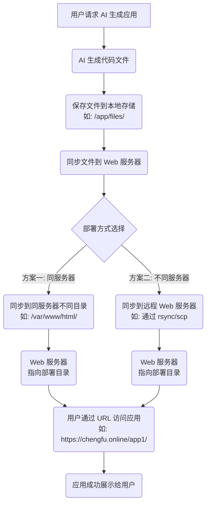

[toc]

# 应用模块

本节我们将**从简单的代码生成工具升级为完整的平台**，实现应用创建、生成、浏览、部署、管理的全流程。

## 需求分析

之前我们实现的是单机版本，用户只能在本地生成代码文件。现在我们要将其升级为平台化系统，这意味着需要支持多用户、应用管理、在线部署等功能。
需要的具体功能包括：

- 用户基础功能
- 创建应用
- 编辑应用信息
- 删除自己的应用
- 查看应用详情
- 分页查询自己的应用列表
- 分页查看精选应用列表
- 用户高级功能
- 实时查看应用效果
- 应用部署
- 管理功能
- 管理所有应用（删除、查询、修改）
- 设置精选应用

## 方案设计

### 核心业务流程

平台化改造的核心在于建立**完整的应用生命周期管理体系**。

用户在主页输入提示词后，系统会创建一个应用记录，然后跳转到对话页面与Ai交互生成网站。生成完成后，用户可以预览效果，满意后进行部署，让网站真正对外提供服务。

这个流程看似简单，但涉及到数据存储、权限控制、文件管理、网站部署等多个技术环节。我们需要设计合理的数据模型来支撑这些功能。

### 库表设计

应用表是整个项目的核心，需要记录应用的基本信息、生成配置、部署信息等。

其中最关键的是`deploykey`字段。由于每个网站应用文件的部署都是隔离的（想象成沙箱)，需要用唯一字段来区分，可以作为应用的存储和访问路径；而且为了便于访问，每个应用的访问路径不能太长。

这里我们参考美团 NoCode 等平台的设计，将 deployKey 设置为 6 位英文数字组成的唯一标识符。

```sql
-- 应用表
create table app
(
    id           bigint auto_increment comment 'id' primary key,
    appName      varchar(256)                       null comment '应用名称',
    cover        varchar(512)                       null comment '应用封面',
    initPrompt   text                               null comment '应用初始化的 prompt',
    codeGenType  varchar(64)                        null comment '代码生成类型（枚举）',
    deployKey    varchar(64)                        null comment '部署标识',
    deployedTime datetime                           null comment '部署时间',
    priority     int      default 0                 not null comment '优先级',
    userId       bigint                             not null comment '创建用户id',
    editTime     datetime default CURRENT_TIMESTAMP not null comment '编辑时间',
    createTime   datetime default CURRENT_TIMESTAMP not null comment '创建时间',
    updateTime   datetime default CURRENT_TIMESTAMP not null on update CURRENT_TIMESTAMP comment '更新时间',
    isDelete     tinyint  default 0                 not null comment '是否删除',
    UNIQUE KEY uk_deployKey (deployKey), -- 确保部署标识唯一
    INDEX idx_appName (appName),         -- 提升基于应用名称的查询性能
    INDEX idx_userId (userId)            -- 提升基于用户 ID 的查询性能
) comment '应用' collate = utf8mb4_unicode_ci;
```

这个设计中有几个值得注意的细节：

1. `priority`优先级字段：我们约定99表示精选应用，这样可以在主页展示高质量的应用，避免用户看到大量测试内容。
   为什么用数字而不用枚举类型呢？原因是这样更利于扩展，比如约定999表示置顶；还可以根据数字灵活调整各个应用的具体展示顺序。
2. 添加索引：给`deployKey、appName、userld`三个经常用于作为查询条件的字段增加索引，提高查询性能。

注意，我们暂时不考虑将应用代码直接保存到数据库字段中，而是保存在文件系统里。这样可以避免数据库和文件存储不一致的问题，也便于后续扩展到对象存储等方案。

## Crud开发

后端开发最终的目标是提供接口，我们先来实现一些基础的接口，也就是“增删改查”：

- 【用户】创建应用（须填写initPrompt)
- 【用户】根据d修改自己的应用（目前只支持修改应用名称）
- 【用户】根据d删除自己的应用
- 【用户】根据id查看应用详情
- 【用户】分页查询自己的应用列表（支持根据名称查询，每页最多20个）
- 【用户】分页查询精选的应用列表（支持根据名称查询，每页最多20个）
- 【管理员】根据id删除任意应用
- 【管理员】根据id更新任意应用(支持更新应用名称、应用封面、优先级)
- 【管理员】分页查询应用列表（支持根据除时间外的任何字段查询，每页数量不限）
- 【管理员】根据id查看应用详情

注意，需求描述地越清楚，后面开发越顺畅，尤其是可以直接作为AI的提示词。

### 数据模型

通过代码生成器生成MyBatis基础代码，随后设置主键生成算法为雪花id

```java
    @Id(keyType = KeyType.Generator,value = KeyGenerators.snowFlakeId)
    private Long id;
```

### 核心功能实现

#### 创建应用

用户创建应用时，只需要填写初始化提示词。系统会自动生成应用名称（取提示词前12位）和默认的代码生成类型。

请求类：

```java
@Data
public class AppAddRequest implements Serializable {

    /**
     * 应用初始化的 prompt
     */
    private String initPrompt;

    private static final long serialVersionUID = 1L;
}

```

接口代码

```java
/**
 * 创建应用
 *
 * @param appAddRequest 创建应用请求
 * @param request       请求
 * @return 应用 id
 */
@PostMapping("/add")
public BaseResponse<Long> addApp(@RequestBody AppAddRequest appAddRequest, HttpServletRequest request) {
    ThrowUtils.throwIf(appAddRequest == null, ErrorCode.PARAMS_ERROR);
    // 参数校验
    String initPrompt = appAddRequest.getInitPrompt();
    ThrowUtils.throwIf(StrUtil.isBlank(initPrompt), ErrorCode.PARAMS_ERROR, "初始化 prompt 不能为空");
    // 获取当前登录用户
    User loginUser = userService.getLoginUser(request);
    // 构造入库对象
    App app = new App();
    BeanUtil.copyProperties(appAddRequest, app);
    app.setUserId(loginUser.getId());
    // 应用名称暂时为 initPrompt 前 12 位
    app.setAppName(initPrompt.substring(0, Math.min(initPrompt.length(), 12)));
    // 暂时设置为多文件生成
    app.setCodeGenType(CodeGenTypeEnum.MULTI_FILE.getValue());
    // 插入数据库
    boolean result = appService.save(app);
    ThrowUtils.throwIf(!result, ErrorCode.OPERATION_ERROR);
    return ResultUtils.success(app.getId());
}
```

#### 更新应用

用户更新应用时，需要进行权限校验，确保只能修改自己的应用。
请求类：

```java
@Data
public class AppUpdateRequest implements Serializable {

    /**
     * id
     */
    private Long id;

    /**
     * 应用名称
     */
    private String appName;

    private static final long serialVersionUID = 1L;
}
```

接口代码：

```java
/**
 * 更新应用（用户只能更新自己的应用名称）
 *
 * @param appUpdateRequest 更新请求
 * @param request          请求
 * @return 更新结果
 */
@PostMapping("/update")
public BaseResponse<Boolean> updateApp(@RequestBody AppUpdateRequest appUpdateRequest, HttpServletRequest request) {
    if (appUpdateRequest == null || appUpdateRequest.getId() == null) {
        throw new BusinessException(ErrorCode.PARAMS_ERROR);
    }
    User loginUser = userService.getLoginUser(request);
    long id = appUpdateRequest.getId();
    // 判断是否存在
    App oldApp = appService.getById(id);
    ThrowUtils.throwIf(oldApp == null, ErrorCode.NOT_FOUND_ERROR);
    // 仅本人可更新
    if (!oldApp.getUserId().equals(loginUser.getId())) {
        throw new BusinessException(ErrorCode.NO_AUTH_ERROR);
    }
    App app = new App();
    app.setId(id);
    app.setAppName(appUpdateRequest.getAppName());
    // 设置编辑时间
    app.setEditTime(LocalDateTime.now());
    boolean result = appService.updateById(app);
    ThrowUtils.throwIf(!result, ErrorCode.OPERATION_ERROR);
    return ResultUtils.success(true);
}
```

注意这里我们手动设置了`editTime`,这是为了区分用户主动编辑和系统自动更新的时间。

#### 用户删除应用

需要进行权限校验，确保只能修改自己的应用。接口代码如下：

```java
/**
 * 删除应用（用户只能删除自己的应用）
 *
 * @param deleteRequest 删除请求
 * @param request       请求
 * @return 删除结果
 */
@PostMapping("/delete")
public BaseResponse<Boolean> deleteApp(@RequestBody DeleteRequest deleteRequest, HttpServletRequest request) {
    if (deleteRequest == null || deleteRequest.getId() <= 0) {
        throw new BusinessException(ErrorCode.PARAMS_ERROR);
    }
    User loginUser = userService.getLoginUser(request);
    long id = deleteRequest.getId();
    // 判断是否存在
    App oldApp = appService.getById(id);
    ThrowUtils.throwIf(oldApp == null, ErrorCode.NOT_FOUND_ERROR);
    // 仅本人或管理员可删除
    if (!oldApp.getUserId().equals(loginUser.getId()) && !UserConstant.ADMIN_ROLE.equals(loginUser.getUserRole())) {
        throw new BusinessException(ErrorCode.NO_AUTH_ERROR);
    }
    boolean result = appService.removeById(id);
    return ResultUtils.success(result);
}
```

#### 用户查看应用详情

应用查询涉及到关联查询用户信息，需要创建App的封装类，包含UserVO用户信息字段：

```java
@Data
public class AppVO implements Serializable {

    /**
     * id
     */
    private Long id;

    /**
     * 应用名称
     */
    private String appName;

    /**
     * 应用封面
     */
    private String cover;

    /**
     * 应用初始化的 prompt
     */
    private String initPrompt;

    /**
     * 代码生成类型（枚举）
     */
    private String codeGenType;

    /**
     * 部署标识
     */
    private String deployKey;

    /**
     * 部署时间
     */
    private LocalDateTime deployedTime;

    /**
     * 优先级
     */
    private Integer priority;

    /**
     * 创建用户id
     */
    private Long userId;

    /**
     * 创建时间
     */
    private LocalDateTime createTime;

    /**
     * 更新时间
     */
    private LocalDateTime updateTime;

    /**
     * 创建用户信息
     */
    private UserVO user;

    private static final long serialVersionUID = 1L;
}
```

AppService中补充查询App关联信息的方法：

```java
@Override
public AppVO getAppVO(App app) {
    if (app == null) {
        return null;
    }
    AppVO appVO = new AppVO();
    BeanUtil.copyProperties(app, appVO);
    // 关联查询用户信息
    Long userId = app.getUserId();
    if (userId != null) {
        User user = userService.getById(userId);
        UserVO userVO = userService.getUserVO(user);
        appVO.setUser(userVO);
    }
    return appVO;
}
```

接口代码中，先查询App,再查询封装类：

```java
/**
 * 根据 id 获取应用详情
 *
 * @param id      应用 id
 * @return 应用详情
 */
@GetMapping("/get/vo")
public BaseResponse<AppVO> getAppVOById(long id) {
    ThrowUtils.throwIf(id <= 0, ErrorCode.PARAMS_ERROR);
    // 查询数据库
    App app = appService.getById(id);
    ThrowUtils.throwIf(app == null, ErrorCode.NOT_FOUND_ERROR);
    // 获取封装类（包含用户信息）
    return ResultUtils.success(appService.getAppVO(app));
}
```

#### 用户分页查询应用

查询请求类，主要定义了可作为查询条件的字段：

```java
@EqualsAndHashCode(callSuper = true)
@Data
public class AppQueryRequest extends PageRequest implements Serializable {

    /**
     * id
     */
    private Long id;

    /**
     * 应用名称
     */
    private String appName;

    /**
     * 应用封面
     */
    private String cover;

    /**
     * 应用初始化的 prompt
     */
    private String initPrompt;

    /**
     * 代码生成类型（枚举）
     */
    private String codeGenType;

    /**
     * 部署标识
     */
    private String deployKey;

    /**
     * 优先级
     */
    private Integer priority;

    /**
     * 创建用户id
     */
    private Long userId;

    private static final long serialVersionUID = 1L;
}
```

在AppService中添加构造查询对象的方法:

```java
@Override
public QueryWrapper getQueryWrapper(AppQueryRequest appQueryRequest) {
    if (appQueryRequest == null) {
        throw new BusinessException(ErrorCode.PARAMS_ERROR, "请求参数为空");
    }
    Long id = appQueryRequest.getId();
    String appName = appQueryRequest.getAppName();
    String cover = appQueryRequest.getCover();
    String initPrompt = appQueryRequest.getInitPrompt();
    String codeGenType = appQueryRequest.getCodeGenType();
    String deployKey = appQueryRequest.getDeployKey();
    Integer priority = appQueryRequest.getPriority();
    Long userId = appQueryRequest.getUserId();
    String sortField = appQueryRequest.getSortField();
    String sortOrder = appQueryRequest.getSortOrder();
    return QueryWrapper.create()
            .eq("id", id)
            .like("appName", appName)
            .like("cover", cover)
            .like("initPrompt", initPrompt)
            .eq("codeGenType", codeGenType)
            .eq("deployKey", deployKey)
            .eq("priority", priority)
            .eq("userId", userId)
            .orderBy(sortField, "ascend".equals(sortOrder));
}
```

分页查询应用时，也需要额外获取创建应用的用户信息，这会涉及到关联查询多个用户信息，我们需要优化查询性能。优化查询逻辑如下：

- 先收集所有userld到集合中
- 根据userld集合批量查询所有用户信息构建Map映射关系userld=>UserVO
- 一次性组装所有AppVO，根据userld从Map中取到需要的用户信息

```java
@Override
public List<AppVO> getAppVOList(List<App> appList) {
    if (CollUtil.isEmpty(appList)) {
        return new ArrayList<>();
    }
    // 批量获取用户信息，避免 N+1 查询问题
    Set<Long> userIds = appList.stream()
            .map(App::getUserId)
            .collect(Collectors.toSet());
    Map<Long, UserVO> userVOMap = userService.listByIds(userIds).stream()
            .collect(Collectors.toMap(User::getId, userService::getUserVO));
    return appList.stream().map(app -> {
        AppVO appVO = getAppVO(app);
        UserVO userVO = userVOMap.get(app.getUserId());
        appVO.setUser(userVO);
        return appVO;
    }).collect(Collectors.toList());
}
```

其实MyBatis Flex提供了关联查询语法，但我们的实现方式会拆分查询阶段，让业务更清晰；直接构造关联查询更复杂的场景。

编写接口代码，注意限制用户只能查询自己的应用、并且对返回结果进行封装：

```java
/**
 * 分页获取当前用户创建的应用列表
 *
 * @param appQueryRequest 查询请求
 * @param request         请求
 * @return 应用列表
 */
@PostMapping("/my/list/page/vo")
public BaseResponse<Page<AppVO>> listMyAppVOByPage(@RequestBody AppQueryRequest appQueryRequest, HttpServletRequest request) {
    ThrowUtils.throwIf(appQueryRequest == null, ErrorCode.PARAMS_ERROR);
    User loginUser = userService.getLoginUser(request);
    // 限制每页最多 20 个
    long pageSize = appQueryRequest.getPageSize();
    ThrowUtils.throwIf(pageSize > 20, ErrorCode.PARAMS_ERROR, "每页最多查询 20 个应用");
    long pageNum = appQueryRequest.getPageNum();
    // 只查询当前用户的应用
    appQueryRequest.setUserId(loginUser.getId());
    QueryWrapper queryWrapper = appService.getQueryWrapper(appQueryRequest);
    Page<App> appPage = appService.page(Page.of(pageNum, pageSize), queryWrapper);
    // 数据封装
    Page<AppVO> appVOPage = new Page<>(pageNum, pageSize, appPage.getTotalRow());
    List<AppVO> appVOList = appService.getAppVOList(appPage.getRecords());
    appVOPage.setRecords(appVOList);
    return ResultUtils.success(appVOPage);
}
```

#### 用户分页查询精选应用
这里参考了大厂的零代码应用生成平台，用户只能在主页查询精选应用列表（还有自己的），这样主页会更干净；同时避免了爬虫，相当于起到了一个管理员审核的作用。

创建constant包和常量类AppConstant,存储应用优先级常量：
```java
public interface AppConstant {

    /**
     * 精选应用的优先级
     */
    Integer GOOD_APP_PRIORITY = 99;

    /**
     * 默认应用优先级
     */
    Integer DEFAULT_APP_PRIORITY = 0;
}
```

接口代码

```java
/**
 * 分页获取精选应用列表
 *
 * @param appQueryRequest 查询请求
 * @return 精选应用列表
 */
@PostMapping("/good/list/page/vo")
public BaseResponse<Page<AppVO>> listGoodAppVOByPage(@RequestBody AppQueryRequest appQueryRequest) {
    ThrowUtils.throwIf(appQueryRequest == null, ErrorCode.PARAMS_ERROR);
    // 限制每页最多 20 个
    long pageSize = appQueryRequest.getPageSize();
    ThrowUtils.throwIf(pageSize > 20, ErrorCode.PARAMS_ERROR, "每页最多查询 20 个应用");
    long pageNum = appQueryRequest.getPageNum();
    // 只查询精选的应用
    appQueryRequest.setPriority(AppConstant.GOOD_APP_PRIORITY);
    QueryWrapper queryWrapper = appService.getQueryWrapper(appQueryRequest);
    // 分页查询
    Page<App> appPage = appService.page(Page.of(pageNum, pageSize), queryWrapper);
    // 数据封装
    Page<AppVO> appVOPage = new Page<>(pageNum, pageSize, appPage.getTotalRow());
    List<AppVO> appVOList = appService.getAppVOList(appPage.getRecords());
    appVOPage.setRecords(appVOList);
    return ResultUtils.success(appVOPage);
}
```

#### 管理员更新应用

管理员可以更新任意应用的应用名称、应用封面和优先级，更新优先级的操作其实就是精选。
管理员编辑请求类：

```java
@Data
public class AppAdminUpdateRequest implements Serializable {

    /**
     * id
     */
    private Long id;

    /**
     * 应用名称
     */
    private String appName;

    /**
     * 应用封面
     */
    private String cover;

    /**
     * 优先级
     */
    private Integer priority;

    private static final long serialVersionUID = 1L;
}
```

编写接口，注意权限控制、编辑时间的设置：

```java
/**
 * 管理员更新应用
 *
 * @param appAdminUpdateRequest 更新请求
 * @return 更新结果
 */
@PostMapping("/admin/update")
@AuthCheck(mustRole = UserConstant.ADMIN_ROLE)
public BaseResponse<Boolean> updateAppByAdmin(@RequestBody AppAdminUpdateRequest appAdminUpdateRequest) {
    if (appAdminUpdateRequest == null || appAdminUpdateRequest.getId() == null) {
        throw new BusinessException(ErrorCode.PARAMS_ERROR);
    }
    long id = appAdminUpdateRequest.getId();
    // 判断是否存在
    App oldApp = appService.getById(id);
    ThrowUtils.throwIf(oldApp == null, ErrorCode.NOT_FOUND_ERROR);
    App app = new App();
    BeanUtil.copyProperties(appAdminUpdateRequest, app);
    // 设置编辑时间
    app.setEditTime(LocalDateTime.now());
    boolean result = appService.updateById(app);
    ThrowUtils.throwIf(!result, ErrorCode.OPERATION_ERROR);
    return ResultUtils.success(true);
}
```

#### 管理员分页查询应用

管理员比普通用户拥有更大的查询范围，支持根据除时间外的任何字段查询，并且每页数量不限。

接口代码：

````java
/**
 * 管理员分页获取应用列表
 *
 * @param appQueryRequest 查询请求
 * @return 应用列表
 */
@PostMapping("/admin/list/page/vo")
@AuthCheck(mustRole = UserConstant.ADMIN_ROLE)
public BaseResponse<Page<AppVO>> listAppVOByPageByAdmin(@RequestBody AppQueryRequest appQueryRequest) {
    ThrowUtils.throwIf(appQueryRequest == null, ErrorCode.PARAMS_ERROR);
    long pageNum = appQueryRequest.getPageNum();
    long pageSize = appQueryRequest.getPageSize();
    QueryWrapper queryWrapper = appService.getQueryWrapper(appQueryRequest);
    Page<App> appPage = appService.page(Page.of(pageNum, pageSize), queryWrapper);
    // 数据封装
    Page<AppVO> appVOPage = new Page<>(pageNum, pageSize, appPage.getTotalRow());
    List<AppVO> appVOList = appService.getAppVOList(appPage.getRecords());
    appVOPage.setRecords(appVOList);
    return ResultUtils.success(appVOPage);
}
````

#### 管理员查看应用详情

这个接口除了权限之外，目前跟用户查看应用详情接口没有区别：

```java
/**
 * 管理员根据 id 获取应用详情
 *
 * @param id 应用 id
 * @return 应用详情
 */
@GetMapping("/admin/get/vo")
@AuthCheck(mustRole = UserConstant.ADMIN_ROLE)
public BaseResponse<AppVO> getAppVOByIdByAdmin(long id) {
    ThrowUtils.throwIf(id <= 0, ErrorCode.PARAMS_ERROR);
    // 查询数据库
    App app = appService.getById(id);
    ThrowUtils.throwIf(app == null, ErrorCode.NOT_FOUND_ERROR);
    // 获取封装类
    return ResultUtils.success(appService.getAppVO(app));
}
```

## 应用生成

### 业务流程设计

现在我们需要将之前实现的A!生成功能与应用管理系统进行集成。参考大厂平台，我们的整个业务流程是：

1. 用户在主页输入提示词创建应用（入库）
2. 获得应用D后跳转到对话页面
3. 系统自动使用初始提示词与AI对话生成网站代码

由于应用的生成过程和Al对话是绑定的，我们可以提供一个名为chatToGencode的应用生成接口，调用之前开发的Al代码生成门面完成任务，并且流式返回给前端。前端不需要区分用户是否是第一次和该应用对话，始终调用这个接口即可，需要怎么做都交给后端来判断。

一定要确保生成的文件能够与应用正确关联，因此这次生成的网站目录名称不再是之前的codeType雪花算法，而是codeGenType_appId,这样就能通过appld查数据库获取应用信息、再根据应用信息找到对应的网站目录了。

### 服务开发

首先需要修改
`CodeFileSaverTemplate` 的`saveCode`和`buildUniqueDir` 方法，使其支持基于 appld 的目录命名:

```java
/**
 * 模板方法：保存代码的标准流程（使用 appId）
 *
 * @param result 代码结果对象
 * @param appId  应用 ID
 * @return 保存的目录
 */
public final File saveCode(T result, Long appId) {
    // 1. 验证输入
    validateInput(result);
    // 2. 构建基于 appId 的目录
    String baseDirPath = buildUniqueDir(appId);
    // 3. 保存文件（具体实现由子类提供）
    saveFiles(result, baseDirPath);
    // 4. 返回目录文件对象
    return new File(baseDirPath);
}

/**
 * 构建基于 appId 的目录路径
 *
 * @param appId 应用 ID
 * @return 目录路径
 */
protected final String buildUniqueDir(Long appId) {
    if (appId == null) {
        throw new BusinessException(ErrorCode.PARAMS_ERROR, "应用 ID 不能为空");
    }
    String codeType = getCodeType().getValue();
    String uniqueDirName = StrUtil.format("{}_{}", codeType, appId);
    String dirPath = FILE_SAVE_ROOT_DIR + File.separator + uniqueDirName;
    FileUtil.mkdir(dirPath);
    return dirPath;
}
```

修改`CodeFilesaverExecutor`的执行方法，补充appld参数：

```
/**
 * 执行代码保存（使用 appId）
 *
 * @param codeResult  代码结果对象
 * @param codeGenType 代码生成类型
 * @param appId       应用 ID
 * @return 保存的目录
 */
public static File executeSaver(Object codeResult, CodeGenTypeEnum codeGenType, Long appId) {
    return switch (codeGenType) {
        case HTML -> htmlCodeFileSaver.saveCode((HtmlCodeResult) codeResult, appId);
        case MULTI_FILE -> multiFileCodeFileSaver.saveCode((MultiFileCodeResult) codeResult, appId);
        default -> throw new BusinessException(ErrorCode.SYSTEM_ERROR, "不支持的代码生成类型: " + codeGenType);
    };
}
```

修改`AiCodeGeneratorFacade`的所有对话方法，都添加appld参数：

```java
/**
 * 统一入口：根据类型生成并保存代码（使用 appId）
 *
 * @param userMessage     用户提示词
 * @param codeGenTypeEnum 生成类型
 * @return 保存的目录
 */
public File generateAndSaveCode(String userMessage, CodeGenTypeEnum codeGenTypeEnum, Long appId) {
    if (codeGenTypeEnum == null) {
        throw new BusinessException(ErrorCode.SYSTEM_ERROR, "生成类型为空");
    }
    return switch (codeGenTypeEnum) {
        case HTML -> {
            HtmlCodeResult result = aiCodeGeneratorService.generateHtmlCode(userMessage);
            yield CodeFileSaverExecutor.executeSaver(result, CodeGenTypeEnum.HTML, appId);
        }
        case MULTI_FILE -> {
            MultiFileCodeResult result = aiCodeGeneratorService.generateMultiFileCode(userMessage);
            yield CodeFileSaverExecutor.executeSaver(result, CodeGenTypeEnum.MULTI_FILE, appId);
        }
        default -> {
            String errorMessage = "不支持的生成类型：" + codeGenTypeEnum.getValue();
            throw new BusinessException(ErrorCode.SYSTEM_ERROR, errorMessage);
        }
    };
}

/**
 * 统一入口：根据类型生成并保存代码（流式，使用 appId）
 *
 * @param userMessage     用户提示词
 * @param codeGenTypeEnum 生成类型
 * @param appId           应用 ID
 */
public Flux<String> generateAndSaveCodeStream(String userMessage, CodeGenTypeEnum codeGenTypeEnum, Long appId) {
    if (codeGenTypeEnum == null) {
        throw new BusinessException(ErrorCode.SYSTEM_ERROR, "生成类型为空");
    }
    return switch (codeGenTypeEnum) {
        case HTML -> {
            Flux<String> codeStream = aiCodeGeneratorService.generateHtmlCodeStream(userMessage);
            yield processCodeStream(codeStream, CodeGenTypeEnum.HTML, appId);
        }
        case MULTI_FILE -> {
            Flux<String> codeStream = aiCodeGeneratorService.generateMultiFileCodeStream(userMessage);
            yield processCodeStream(codeStream, CodeGenTypeEnum.MULTI_FILE, appId);
        }
        default -> {
            String errorMessage = "不支持的生成类型：" + codeGenTypeEnum.getValue();
            throw new BusinessException(ErrorCode.SYSTEM_ERROR, errorMessage);
        }
    };
}

/**
 * 通用流式代码处理方法（使用 appId）
 *
 * @param codeStream  代码流
 * @param codeGenType 代码生成类型
 * @param appId       应用 ID
 * @return 流式响应
 */
private Flux<String> processCodeStream(Flux<String> codeStream, CodeGenTypeEnum codeGenType, Long appId) {
    StringBuilder codeBuilder = new StringBuilder();
    return codeStream.doOnNext(chunk -> {
        // 实时收集代码片段
        codeBuilder.append(chunk);
    }).doOnComplete(() -> {
        // 流式返回完成后保存代码
        try {
            String completeCode = codeBuilder.toString();
            // 使用执行器解析代码
            Object parsedResult = CodeParserExecutor.executeParser(completeCode, codeGenType);
            // 使用执行器保存代码
            File savedDir = CodeFileSaverExecutor.executeSaver(parsedResult, codeGenType, appId);
            log.info("保存成功，路径为：" + savedDir.getAbsolutePath());
        } catch (Exception e) {
            log.error("保存失败: {}", e.getMessage());
        }
    });
}
```

在AppService中编写chatToGenCode方法，调用门面生成代码：

```java
@Override
public Flux<String> chatToGenCode(Long appId, String message, User loginUser) {
    // 1. 参数校验
    ThrowUtils.throwIf(appId == null || appId <= 0, ErrorCode.PARAMS_ERROR, "应用 ID 不能为空");
    ThrowUtils.throwIf(StrUtil.isBlank(message), ErrorCode.PARAMS_ERROR, "用户消息不能为空");
    // 2. 查询应用信息
    App app = this.getById(appId);
    ThrowUtils.throwIf(app == null, ErrorCode.NOT_FOUND_ERROR, "应用不存在");
    // 3. 验证用户是否有权限访问该应用，仅本人可以生成代码
    if (!app.getUserId().equals(loginUser.getId())) {
        throw new BusinessException(ErrorCode.NO_AUTH_ERROR, "无权限访问该应用");
    }
    // 4. 获取应用的代码生成类型
    String codeGenTypeStr = app.getCodeGenType();
    CodeGenTypeEnum codeGenTypeEnum = CodeGenTypeEnum.getEnumByValue(codeGenTypeStr);
    if (codeGenTypeEnum == null) {
        throw new BusinessException(ErrorCode.SYSTEM_ERROR, "不支持的代码生成类型");
    }
    // 5. 调用 AI 生成代码
    return aiCodeGeneratorFacade.generateAndSaveCodeStream(message, codeGenTypeEnum, appId);
}
```

### SSE流式接口开发

`AppController`新增接口，注意要声明为SSE流式返回，使用get请求便于前端使用EventSource对接：

```java
/**
 * 应用聊天生成代码（流式 SSE）
 *
 * @param appId   应用 ID
 * @param message 用户消息
 * @param request 请求对象
 * @return 生成结果流
 */
@GetMapping(value = "/chat/gen/code", produces = MediaType.TEXT_EVENT_STREAM_VALUE)
public Flux<String> chatToGenCode(@RequestParam Long appId,
                                  @RequestParam String message,
                                  HttpServletRequest request) {
    // 参数校验
    ThrowUtils.throwIf(appId == null || appId <= 0, ErrorCode.PARAMS_ERROR, "应用ID无效");
    ThrowUtils.throwIf(StrUtil.isBlank(message), ErrorCode.PARAMS_ERROR, "用户消息不能为空");
    // 获取当前登录用户
    User loginUser = userService.getLoginUser(request);
    // 调用服务生成代码（流式）
    return appService.chatToGenCode(appId, message, loginUser);
}
```

#### 测试

```
# 1. 用户登录
curl -X POST "http://localhost:8123/api/user/login" \
  -H "Content-Type: application/json" \
  -d '{
    "userAccount": "userAccount",
    "userPassword": "userPassword"
  }' \
  -c cookies.txt

# 2. 调用生成代码接口（流式）
curl -G "http://localhost:8123/api/app/chat/gen/code" \
  --data-urlencode "appId=308788496154173440" \
  --data-urlencode "message=我需要一个简单的博客网站" \
  -H "Accept: text/event-stream" \
  -H "Cache-Control: no-cache" \
  -b cookies.txt \
  --no-buffer
```


### SSE流式接口优化

目前虽然能流式输出了，但其实获取到的数据是有问题的！我们还要对SSE接口进行优化，解决2个问题。

#### 1.解决空格丢失问题
前端使用EventSource对接目前的接口时，会出现空格丢失问题。

解决方案是在后端封装数据，可以参考DeepSeek的做法，将原本的返回值封装到JSON中：


再次测试，能正常输出空格：


#### 2.主动告诉前端生成完成
在 SSE中，当服务器关闭连接时，会触发客户端的
onclose事件，这是前端判断流结束的标准方式。但是，onclose事件会在连接正常结束（服务器主动关闭）和异常中断（如网络问题）时都触发，前端就很难区分到底后端是正常响应了所有数据、还是异常中断了。
因此，我们最好在后端添加一个明确的区分流的正常结束和异常中断。

```java
@GetMapping(value = "/chat/gen/code", produces = MediaType.TEXT_EVENT_STREAM_VALUE)
public Flux<ServerSentEvent<String>> chatToGenCode(@RequestParam Long appId,
                                                   @RequestParam String message,
                                                   HttpServletRequest request) {
    // 参数校验
    ThrowUtils.throwIf(appId == null || appId <= 0, ErrorCode.PARAMS_ERROR, "应用ID无效");
    ThrowUtils.throwIf(StrUtil.isBlank(message), ErrorCode.PARAMS_ERROR, "用户消息不能为空");
    // 获取当前登录用户
    User loginUser = userService.getLoginUser(request);
    // 调用服务生成代码（流式）
    Flux<String> contentFlux = appService.chatToGenCode(appId, message, loginUser);
    // 转换为 ServerSentEvent 格式
    return contentFlux
            .map(chunk -> {
                // 将内容包装成JSON对象
                Map<String, String> wrapper = Map.of("d", chunk);
                String jsonData = JSONUtil.toJsonStr(wrapper);
                return ServerSentEvent.<String>builder()
                        .data(jsonData)
                        .build();
            })
            .concatWith(Mono.just(
                    // 发送结束事件
                    ServerSentEvent.<String>builder()
                            .event("done")
                            .data("")
                            .build()
            ));
}
```

再次测试：


之后前端需要从data块中取出数据，并通过
event=-done判断事件结束。

---

## 应用部署

### 部署方案

部署的整体思路是：把本地生成的文件同步到一个**Wb服务器**上。可以是同一个服务器的不同目录，也可以是不同服务器，但显然前者成本更低。




我们有几种部署方案可以选择：
#### 1.使用Serve工具
这是最简单的方案，通过Node.js的serve包可以快速启动一个web服务器，为指定目录提供Web访问服务。
先安装serve工具：

```
npm i -g serve
```

假设code_output目录就是要部署的文件目录，只需要在这个目录内运行serve命令：


就能查看到目录内的网站了。

使用时，只需提前在服务器上启动serve服务器，就能为特定部署目录提供web服务（比如deployed),然后部署时将代码文件移动到这个目录下即可。
这种方案的优点是配置简单；缺点是依赖Node,js环境，需要独立启动Web服务进程，而且性能相对较低。

#### 2. 使用springboot接口

我们可以直接在后端项目中实现一个静态资源服务接口，输入部署路径，返回相应的文件：

```java
@RestController
@RequestMapping("/static")
public class StaticResourceController {

    // 应用生成根目录（用于浏览）
    private static final String PREVIEW_ROOT_DIR = System.getProperty("user.dir") + "/tmp/code_output";

    /**
     * 提供静态资源访问，支持目录重定向
     * 访问格式：http://localhost:8123/api/static/{deployKey}[/{fileName}]
     */
    @GetMapping("/{deployKey}/**")
    public ResponseEntity<Resource> serveStaticResource(
            @PathVariable String deployKey,
            HttpServletRequest request) {
        try {
            // 获取资源路径
            String resourcePath = (String) request.getAttribute(HandlerMapping.PATH_WITHIN_HANDLER_MAPPING_ATTRIBUTE);
            resourcePath = resourcePath.substring(("/static/" + deployKey).length());
            // 如果是目录访问（不带斜杠），重定向到带斜杠的URL
            if (resourcePath.isEmpty()) {
                HttpHeaders headers = new HttpHeaders();
                headers.add("Location", request.getRequestURI() + "/");
                return new ResponseEntity<>(headers, HttpStatus.MOVED_PERMANENTLY);
            }
            // 默认返回 index.html
            if (resourcePath.equals("/")) {
                resourcePath = "/index.html";
            }
            // 构建文件路径
            String filePath = PREVIEW_ROOT_DIR + "/" + deployKey + resourcePath;
            File file = new File(filePath);
            // 检查文件是否存在
            if (!file.exists()) {
                return ResponseEntity.notFound().build();
            }
            // 返回文件资源
            Resource resource = new FileSystemResource(file);
            return ResponseEntity.ok()
                    .header("Content-Type", getContentTypeWithCharset(filePath))
                    .body(resource);
        } catch (Exception e) {
            return ResponseEntity.status(HttpStatus.INTERNAL_SERVER_ERROR).build();
        }
    }

    /**
     * 根据文件扩展名返回带字符编码的 Content-Type
     */
    private String getContentTypeWithCharset(String filePath) {
        if (filePath.endsWith(".html")) return "text/html; charset=UTF-8";
        if (filePath.endsWith(".css")) return "text/css; charset=UTF-8";
        if (filePath.endsWith(".js")) return "application/javascript; charset=UTF-8";
        if (filePath.endsWith(".png")) return "image/png";
        if (filePath.endsWith(".jpg")) return "image/jpeg";
        return "application/octet-stream";
    }
}
```

案的优点是无需额外进程，性能也不如专业的Web服务器

#### 3.使用Nginx映射
Nginx是专业的Web服务器，性能优异，功能丰富。因此这是最推荐的生产环境方案。

1. 首先到Nginx官网下载Nginx,各个操作系统的安装包都有。

下载好Nginx后，找到Nginx配置文件nginx.conf,Windows系统直接到安装目录下找，Mac/Linux系统可以通过命令查看Nginx配置文件位置：

```
nginx -t
```

2. 修改Nginx配置，htp块中添加server块，配置root为项目部署根目录：

```
# 静态资源服务器 - 80 端口
server {
    listen       80;
    server_name  localhost;
    charset      utf-8;
    charset_types text/css application/javascript text/plain text/xml application/json;
    # 项目部署根目录
    root         
    
    # 处理所有请求
    location ~ ^/([^/]+)/(.*)$ {
        try_files /$1/$2 /$1/index.html =404;
    }
}
```

上述配置中使用了ty_fi1es指令，能够按顺序尝试多个文件路径，从而更灵活地处理文件访问。举个例子，当访问`/app/style.css`时，会先尝试找到`/app/style.css`文件，如果不存在则返回`/app/index.htm1`,最后才返回404错误，这样能够适配后续我们要生成的Vue单页面应用。

3. 启动Nginx,或者输入命令来重载配置：

```
nginx -s reload
```

这种方案的性能最佳，最适合生产环境；缺点是需要额外引入Nginx组件。

其实还可以用COS对象存储的静态网站访问能力，同时实现存储+访问；缺点是需要自定义域名，考虑到很多朋友没有域名，所以教程中不选择这种方案。

#### 最终方案

基于以上分析，我们最终选择了混合方案：使用Spring Boot接口实现Al生成的网页预览，使用Nginx提供网站部署服务。

### 开发

部署接口接受appld作为请求参数，返回可访问的URL地址$（部署域名}/{deployKey}。
部署流程如下：

1. 参数校验：比如是否存在App、用户是否有权限部署该应用（仅本人可以部署）
2. 生成deployKey:之前设计库表时已经提到了deployKey的生成逻辑(6位大小写字母+数字)，还要注意不能跟已
   有的key重复；此外，每个app只生成一次deployKey,.已有则不生成。
3. 部署操作：本质是将code_output目录下的临时文件复制到code_deploy目录下，为了简化访问地址，直接将deployKey作为文件名。

1. 首先在`AppConstant`中定义常量：

```java
/**
 * 应用生成目录
 */
String CODE_OUTPUT_ROOT_DIR = System.getProperty("user.dir") + "/tmp/code_output";

/**
 * 应用部署目录
 */
String CODE_DEPLOY_ROOT_DIR = System.getProperty("user.dir") + "/tmp/code_deploy";

/**
 * 应用部署域名
 */
String CODE_DEPLOY_HOST = "http://localhost";
```

CodeFileSaverTemplate中使用文件保存根目录常量（用于保存生成的文件）：

```java
// 文件保存根目录
protected static final String FILE_SAVE_ROOT_DIR = AppConstant.CODE_OUTPUT_ROOT_DIR;
```

StaticResourceController中使用文件保存根目录常量，因为要在生成时就预览效果:

```java
// 应用生成根目录（用于浏览）
private static final String PREVIEW_ROOT_DIR = AppConstant.CODE_OUTPUT_ROOT_DIR;
```

2. 编写部署请求类：

```java
@Data
public class AppDeployRequest implements Serializable {

    /**
     * 应用 id
     */
    private Long appId;

    private static final long serialVersionUID = 1L;
}
```

3. 基于上述流程，在AppService中编写部署服务的代码：

```java
@Override
public String deployApp(Long appId, User loginUser) {
    // 1. 参数校验
    ThrowUtils.throwIf(appId == null || appId <= 0, ErrorCode.PARAMS_ERROR, "应用 ID 不能为空");
    ThrowUtils.throwIf(loginUser == null, ErrorCode.NOT_LOGIN_ERROR, "用户未登录");
    // 2. 查询应用信息
    App app = this.getById(appId);
    ThrowUtils.throwIf(app == null, ErrorCode.NOT_FOUND_ERROR, "应用不存在");
    // 3. 验证用户是否有权限部署该应用，仅本人可以部署
    if (!app.getUserId().equals(loginUser.getId())) {
        throw new BusinessException(ErrorCode.NO_AUTH_ERROR, "无权限部署该应用");
    }
    // 4. 检查是否已有 deployKey
    String deployKey = app.getDeployKey();
    // 没有则生成 6 位 deployKey（大小写字母 + 数字）
    if (StrUtil.isBlank(deployKey)) {
        deployKey = RandomUtil.randomString(6);
    }
    // 5. 获取代码生成类型，构建源目录路径
    String codeGenType = app.getCodeGenType();
    String sourceDirName = codeGenType + "_" + appId;
    String sourceDirPath = AppConstant.CODE_OUTPUT_ROOT_DIR + File.separator + sourceDirName;
    // 6. 检查源目录是否存在
    File sourceDir = new File(sourceDirPath);
    if (!sourceDir.exists() || !sourceDir.isDirectory()) {
        throw new BusinessException(ErrorCode.SYSTEM_ERROR, "应用代码不存在，请先生成代码");
    }
    // 7. 复制文件到部署目录
    String deployDirPath = AppConstant.CODE_DEPLOY_ROOT_DIR + File.separator + deployKey;
    try {
        FileUtil.copyContent(sourceDir, new File(deployDirPath), true);
    } catch (Exception e) {
        throw new BusinessException(ErrorCode.SYSTEM_ERROR, "部署失败：" + e.getMessage());
    }
    // 8. 更新应用的 deployKey 和部署时间
    App updateApp = new App();
    updateApp.setId(appId);
    updateApp.setDeployKey(deployKey);
    updateApp.setDeployedTime(LocalDateTime.now());
    boolean updateResult = this.updateById(updateApp);
    ThrowUtils.throwIf(!updateResult, ErrorCode.OPERATION_ERROR, "更新应用部署信息失败");
    // 9. 返回可访问的 URL
    return String.format("%s/%s/", AppConstant.CODE_DEPLOY_HOST, deployKey);
}
```

这个实现的优点在于支持重复部署。如果应用已经有deployKey,就直接使用现有的；如果没有，就生成一个新的。这样既保证了URL的稳定性，又支持了代码的更新。缺点是不支持区分同一个应用多次部署的版本。

4. 编写接口：

```java
/**
 * 应用部署
 *
 * @param appDeployRequest 部署请求
 * @param request          请求
 * @return 部署 URL
 */
@PostMapping("/deploy")
public BaseResponse<String> deployApp(@RequestBody AppDeployRequest appDeployRequest, HttpServletRequest request) {
    ThrowUtils.throwIf(appDeployRequest == null, ErrorCode.PARAMS_ERROR);
    Long appId = appDeployRequest.getAppId();
    ThrowUtils.throwIf(appId == null || appId <= 0, ErrorCode.PARAMS_ERROR, "应用 ID 不能为空");
    // 获取当前登录用户
    User loginUser = userService.getLoginUser(request);
    // 调用服务部署应用
    String deployUrl = appService.deployApp(appId, loginUser);
    return ResultUtils.success(deployUrl);
}
```

### 测试

找一个生成过网站的appld来测试部署，验证成功。


## 前端模块

后端开发完成后，记得先执行openapi命令，根据接口生成前端请求和数据模型代码。

### 用户输入提示词来创建应用

#### 功能描述

用户可以在首页输入提示词来描述想要创建的网站应用，系统会根据提示词生成相应的网站应用。

#### 实现方式

在首页(`HomePage.vue`)中，用户可以通过文本输入框输入提示词，也可以通过快捷按钮选择预设的提示词模板。

##### 关键代码

```vue
<!-- 用户提示词输入框 -->
<div class="input-section">
  <a-textarea
    v-model:value="userPrompt"
    placeholder="帮我创建个人博客网站"
    :rows="4"
    :maxlength="1000"
    class="prompt-input"
  />
  <div class="input-actions">
    <a-button type="primary" size="large" @click="createApp" :loading="creating">
      <template #icon>
        <span>↑</span>
      </template>
    </a-button>
  </div>
</div>

<!-- 快捷按钮 -->
<div class="quick-actions">
  <a-button
    type="default"
    @click="setPrompt('创建一个现代化的个人博客网站...')"
  >个人博客网站</a-button>
  <!-- 其他快捷按钮 -->
</div>
```

##### 创建应用流程

1. 用户输入提示词或选择预设模板
2. 点击创建按钮，系统检查用户是否已登录
3. 如果未登录，跳转到登录页面
4. 如果已登录，调用`addApp`接口创建应用
5. 创建成功后，跳转到应用对话页面

```typescript
// 创建应用
const createApp = async () => {
  if (!userPrompt.value.trim()) {
    message.warning('请输入应用描述')
    return
  }

  if (!loginUserStore.loginUser.id) {
    message.warning('请先登录')
    await router.push('/user/login')
    return
  }

  creating.value = true
  try {
    const res = await addApp({
      initPrompt: userPrompt.value.trim(),
    })

    if (res.data.code === 0 && res.data.data) {
      message.success('应用创建成功')
      // 跳转到对话页面
      const appId = String(res.data.data)
      await router.push(`/app/chat/${appId}`)
    } else {
      message.error('创建失败：' + res.data.message)
    }
  } catch (error) {
    console.error('创建应用失败：', error)
    message.error('创建失败，请重试')
  } finally {
    creating.value = false
  }
}
```

### AI对话生成应用，并查看

#### 功能描述

用户创建应用后，系统会自动进入对话页面(`AppChatPage.vue`)，AI会根据用户的提示词生成网站应用，并提供实时预览功能。

#### 实现方式

对话页面分为左侧对话区域和右侧预览区域。用户可以与AI进行多轮对话，不断完善和调整生成的网站应用。

##### 对话流程

1. 进入对话页面后，系统自动发送用户的初始提示词
2. AI接收提示词并开始生成网站应用
3. 生成过程中，AI会实时返回生成状态和进度
4. 生成完成后，右侧预览区域会显示生成的网站应用

##### 关键代码

```vue
<!-- 左侧对话区域 -->
<div class="chat-section">
  <!-- 消息区域 -->
  <div class="messages-container" ref="messagesContainer">
    <div v-for="(message, index) in messages" :key="index" class="message-item">
      <!-- 用户消息和AI消息的显示 -->
    </div>
  </div>

  <!-- 用户消息输入框 -->
  <div class="input-container">
    <div class="input-wrapper">
      <a-textarea
        v-model:value="userInput"
        placeholder="请描述你想生成的网站，越详细效果越好哦"
        :rows="4"
        :maxlength="1000"
        @keydown.enter.prevent="sendMessage"
        :disabled="isGenerating || !isOwner"
      />
      <div class="input-actions">
        <a-button
          type="primary"
          @click="sendMessage"
          :loading="isGenerating"
          :disabled="!isOwner"
        >
          <template #icon>
            <SendOutlined />
          </template>
        </a-button>
      </div>
    </div>
  </div>
</div>

<!-- 右侧网页展示区域 -->
<div class="preview-section">
  <div class="preview-header">
    <h3>生成后的网页展示</h3>
    <div class="preview-actions">
      <a-button v-if="previewUrl" type="link" @click="openInNewTab">
        <template #icon>
          <ExportOutlined />
        </template>
        新窗口打开
      </a-button>
    </div>
  </div>
  <div class="preview-content">
    <!-- 预览内容 -->
    <iframe
      v-if="previewUrl && !isGenerating"
      :src="previewUrl"
      class="preview-iframe"
      frameborder="0"
      @load="onIframeLoad"
    ></iframe>
  </div>
</div>
```

##### 代码生成实现

系统使用Server-Sent Events (SSE)技术实现实时流式响应，让用户能够看到AI生成代码的过程：

```typescript
// 生成代码 - 使用 EventSource 处理流式响应
const generateCode = async (userMessage: string, aiMessageIndex: number) => {
  let eventSource: EventSource | null = null
  let streamCompleted = false

  try {
    // 构建URL参数
    const params = new URLSearchParams({
      appId: appId.value || '',
      message: userMessage,
    })

    const url = `${baseURL}/app/chat/gen/code?${params}`

    // 创建 EventSource 连接
    eventSource = new EventSource(url, {
      withCredentials: true,
    })

    let fullContent = ''

    // 处理接收到的消息
    eventSource.onmessage = function (event) {
      if (streamCompleted) return

      try {
        // 解析JSON包装的数据
        const parsed = JSON.parse(event.data)
        const content = parsed.d

        // 拼接内容
        if (content !== undefined && content !== null) {
          fullContent += content
          messages.value[aiMessageIndex].content = fullContent
          messages.value[aiMessageIndex].loading = false
          scrollToBottom()
        }
      } catch (error) {
        console.error('解析消息失败:', error)
        handleError(error, aiMessageIndex)
      }
    }

    // 处理done事件
    eventSource.addEventListener('done', function () {
      if (streamCompleted) return

      streamCompleted = true
      isGenerating.value = false
      eventSource?.close()

      // 延迟更新预览，确保后端已完成处理
      setTimeout(async () => {
        await fetchAppInfo()
        updatePreview()
      }, 1000)
    })
  } catch (error) {
    console.error('创建 EventSource 失败：', error)
    handleError(error, aiMessageIndex)
  }
}
```

### 用户分页查询自己的应用

#### 功能描述

用户可以在首页查看自己创建的所有应用，支持分页查询。

#### 实现方式

在首页(`HomePage.vue`)中，系统会调用`listMyAppVoByPage`接口获取用户的应用列表，并使用`AppCard`组件展示应用信息。

##### 关键代码

```vue
<!-- 我的作品 -->
<div class="section">
  <h2 class="section-title">我的作品</h2>
  <div class="app-grid">
    <AppCard
      v-for="app in myApps"
      :key="app.id"
      :app="app"
      @view-chat="viewChat"
      @view-work="viewWork"
    />
  </div>
  <div class="pagination-wrapper">
    <a-pagination
      v-model:current="myAppsPage.current"
      v-model:page-size="myAppsPage.pageSize"
      :total="myAppsPage.total"
      :show-size-changer="false"
      :show-total="(total: number) => `共 ${total} 个应用`"
      @change="loadMyApps"
    />
  </div>
</div>
```

##### 数据加载实现

```typescript
// 我的应用数据
const myApps = ref<API.AppVO[]>([])
const myAppsPage = reactive({
  current: 1,
  pageSize: 6,
  total: 0,
})

// 加载我的应用
const loadMyApps = async () => {
  if (!loginUserStore.loginUser.id) {
    return
  }

  try {
    const res = await listMyAppVoByPage({
      pageNum: myAppsPage.current,
      pageSize: myAppsPage.pageSize,
      sortField: 'createTime',
      sortOrder: 'desc',
    })

    if (res.data.code === 0 && res.data.data) {
      myApps.value = res.data.data.records || []
      myAppsPage.total = res.data.data.totalRow || 0
    }
  } catch (error) {
    console.error('加载我的应用失败：', error)
  }
}
```

### 分页查询精选的应用列表

#### 功能描述

首页展示系统精选的应用列表，支持分页查询。精选应用是由管理员设置的优质应用示例。

#### 实现方式

在首页(`HomePage.vue`)中，系统会调用`listGoodAppVoByPage`接口获取精选应用列表，并使用`AppCard`组件展示应用信息。

##### 关键代码

```vue
<!-- 精选案例 -->
<div class="section">
  <h2 class="section-title">精选案例</h2>
  <div class="featured-grid">
    <AppCard
      v-for="app in featuredApps"
      :key="app.id"
      :app="app"
      :featured="true"
      @view-chat="viewChat"
      @view-work="viewWork"
    />
  </div>
  <div class="pagination-wrapper">
    <a-pagination
      v-model:current="featuredAppsPage.current"
      v-model:page-size="featuredAppsPage.pageSize"
      :total="featuredAppsPage.total"
      :show-size-changer="false"
      :show-total="(total: number) => `共 ${total} 个案例`"
      @change="loadFeaturedApps"
    />
  </div>
</div>
```

##### 数据加载实现

```typescript
// 精选应用数据
const featuredApps = ref<API.AppVO[]>([])
const featuredAppsPage = reactive({
  current: 1,
  pageSize: 6,
  total: 0,
})

// 加载精选应用
const loadFeaturedApps = async () => {
  try {
    const res = await listGoodAppVoByPage({
      pageNum: featuredAppsPage.current,
      pageSize: featuredAppsPage.pageSize,
      sortField: 'createTime',
      sortOrder: 'desc',
    })

    if (res.data.code === 0 && res.data.data) {
      featuredApps.value = res.data.data.records || []
      featuredAppsPage.total = res.data.data.totalRow || 0
    }
  } catch (error) {
    console.error('加载精选应用失败：', error)
  }
}
```

### 查看应用详情

#### 功能描述

用户可以查看应用的详细信息，包括创建者、创建时间等。

#### 实现方式

系统使用`AppDetailModal`组件展示应用详情，可以在对话页面(`AppChatPage.vue`)中点击"应用详情"按钮打开。

##### 关键代码

```vue
<!-- 应用详情弹窗 -->
<AppDetailModal
  v-model:open="appDetailVisible"
  :app="appInfo"
  :show-actions="isOwner || isAdmin"
  @edit="editApp"
  @delete="deleteApp"
/>
```

##### AppDetailModal组件实现

```vue
<template>
  <a-modal v-model:open="visible" title="应用详情" :footer="null" width="500px">
    <div class="app-detail-content">
      <!-- 应用基础信息 -->
      <div class="app-basic-info">
        <div class="info-item">
          <span class="info-label">创建者：</span>
          <UserInfo :user="app?.user" size="small" />
        </div>
        <div class="info-item">
          <span class="info-label">创建时间：</span>
          <span>{{ formatTime(app?.createTime) }}</span>
        </div>
      </div>

      <!-- 操作栏（仅本人或管理员可见） -->
      <div v-if="showActions" class="app-actions">
        <a-space>
          <a-button type="primary" @click="handleEdit">
            <template #icon>
              <EditOutlined />
            </template>
            修改
          </a-button>
          <a-popconfirm
            title="确定要删除这个应用吗？"
            @confirm="handleDelete"
            ok-text="确定"
            cancel-text="取消"
          >
            <a-button danger>
              <template #icon>
                <DeleteOutlined />
              </template>
              删除
            </a-button>
          </a-popconfirm>
        </a-space>
      </div>
    </div>
  </a-modal>
</template>
```

### 用户修改自己的应用信息

#### 功能描述

用户可以修改自己创建的应用信息，如应用名称。

#### 实现方式

系统提供了应用编辑页面(`AppEditPage.vue`)，用户可以在此页面修改应用信息。

##### 关键代码

```vue
<template>
  <div id="appEditPage">
    <div class="page-header">
      <h1>编辑应用信息</h1>
    </div>

    <div class="edit-container">
      <a-card title="基本信息" :loading="loading">
        <a-form
          :model="formData"
          :rules="rules"
          layout="vertical"
          @finish="handleSubmit"
          ref="formRef"
        >
          <a-form-item label="应用名称" name="appName">
            <a-input
              v-model:value="formData.appName"
              placeholder="请输入应用名称"
              :maxlength="50"
              show-count
            />
          </a-form-item>

          <!-- 其他表单项 -->

          <a-form-item>
            <a-space>
              <a-button type="primary" html-type="submit" :loading="submitting">
                保存修改
              </a-button>
              <a-button @click="resetForm">重置</a-button>
              <a-button type="link" @click="goToChat">进入对话</a-button>
            </a-space>
          </a-form-item>
        </a-form>
      </a-card>
    </div>
  </div>
</template>
```

##### 表单提交实现

```typescript
// 提交表单
const handleSubmit = async () => {
  if (!appInfo.value?.id) return

  submitting.value = true
  try {
    let res
    if (isAdmin.value) {
      // 管理员可以修改更多字段
      res = await updateAppByAdmin({
        id: appInfo.value.id,
        appName: formData.appName,
        cover: formData.cover,
        priority: formData.priority,
      })
    } else {
      // 普通用户只能修改应用名称
      res = await updateApp({
        id: appInfo.value.id,
        appName: formData.appName,
      })
    }

    if (res.data.code === 0) {
      message.success('修改成功')
      // 重新获取应用信息
      await fetchAppInfo()
    } else {
      message.error('修改失败：' + res.data.message)
    }
  } catch (error) {
    console.error('修改失败：', error)
    message.error('修改失败')
  } finally {
    submitting.value = false
  }
}
```

### 用户删除自己的应用

#### 功能描述

用户可以删除自己创建的应用。

#### 实现方式

用户可以在应用详情弹窗中点击"删除"按钮删除应用，或者在应用编辑页面中删除应用。

##### 关键代码

```typescript
// 删除应用
const deleteApp = async () => {
  if (!appInfo.value?.id) return

  try {
    const res = await deleteAppApi({ id: appInfo.value.id })
    if (res.data.code === 0) {
      message.success('删除成功')
      appDetailVisible.value = false
      router.push('/')
    } else {
      message.error('删除失败：' + res.data.message)
    }
  } catch (error) {
    console.error('删除失败：', error)
    message.error('删除失败')
  }
}
```

### 部署应用

#### 功能描述

用户可以将生成的应用部署到服务器，获取可访问的URL。

#### 实现方式

在对话页面(`AppChatPage.vue`)中，用户可以点击"部署按钮"部署应用，部署成功后会显示部署成功弹窗(`DeploySuccessModal`)。

##### 关键代码

```vue
<!-- 部署按钮 -->
<a-button type="primary" @click="deployApp" :loading="deploying">
  <template #icon>
    <CloudUploadOutlined />
  </template>
  部署按钮
</a-button>

<!-- 部署成功弹窗 -->
<DeploySuccessModal
  v-model:open="deployModalVisible"
  :deploy-url="deployUrl"
  @open-site="openDeployedSite"
/>
```

##### 部署实现

```typescript
// 部署应用
const deployApp = async () => {
  if (!appId.value) {
    message.error('应用ID不存在')
    return
  }

  deploying.value = true
  try {
    const res = await deployAppApi({
      appId: appId.value as unknown as number,
    })

    if (res.data.code === 0 && res.data.data) {
      deployUrl.value = res.data.data
      deployModalVisible.value = true
      message.success('部署成功')
    } else {
      message.error('部署失败：' + res.data.message)
    }
  } catch (error) {
    console.error('部署失败：', error)
    message.error('部署失败，请重试')
  } finally {
    deploying.value = false
  }
}
```

##### 部署成功弹窗实现

```vue
<template>
  <a-modal v-model:open="visible" title="部署成功" :footer="null" width="600px">
    <div class="deploy-success">
      <div class="success-icon">
        <CheckCircleOutlined style="color: #52c41a; font-size: 48px" />
      </div>
      <h3>网站部署成功！</h3>
      <p>你的网站已经成功部署，可以通过以下链接访问：</p>
      <div class="deploy-url">
        <a-input :value="deployUrl" readonly>
          <template #suffix>
            <a-button type="text" @click="handleCopyUrl">
              <CopyOutlined />
            </a-button>
          </template>
        </a-input>
      </div>
      <div class="deploy-actions">
        <a-button type="primary" @click="handleOpenSite">访问网站</a-button>
        <a-button @click="handleClose">关闭</a-button>
      </div>
    </div>
  </a-modal>
</template>
```

### 管理员相关功能

#### 功能描述

管理员可以管理所有用户的应用，包括查看、编辑、删除应用，以及设置应用为精选。

#### 实现方式

系统提供了管理员专用的应用管理页面(`AppManagePage.vue`)，管理员可以在此页面管理所有应用。

##### 关键代码

```vue
<template>
  <div id="appManagePage">
    <!-- 搜索表单 -->
    <a-form layout="inline" :model="searchParams" @finish="doSearch">
      <!-- 搜索表单项 -->
    </a-form>
    <a-divider />

    <!-- 表格 -->
    <a-table
      :columns="columns"
      :data-source="data"
      :pagination="pagination"
      @change="doTableChange"
      :scroll="{ x: 1200 }"
    >
      <template #bodyCell="{ column, record }">
        <!-- 表格列渲染 -->
        <template v-else-if="column.key === 'action'">
          <a-space>
            <a-button type="primary" size="small" @click="editApp(record)"> 编辑 </a-button>
            <a-button
              type="default"
              size="small"
              @click="toggleFeatured(record)"
              :class="{ 'featured-btn': record.priority === 99 }"
            >
              {{ record.priority === 99 ? '取消精选' : '精选' }}
            </a-button>
            <a-popconfirm title="确定要删除这个应用吗？" @confirm="deleteApp(record.id)">
              <a-button danger size="small">删除</a-button>
            </a-popconfirm>
          </a-space>
        </template>
      </template>
    </a-table>
  </div>
</template>
```

##### 设置精选应用实现

```typescript
// 切换精选状态
const toggleFeatured = async (app: API.AppVO) => {
  if (!app.id) return

  const newPriority = app.priority === 99 ? 0 : 99

  try {
    const res = await updateAppByAdmin({
      id: app.id,
      priority: newPriority,
    })

    if (res.data.code === 0) {
      message.success(newPriority === 99 ? '已设为精选' : '已取消精选')
      // 刷新数据
      fetchData()
    } else {
      message.error('操作失败：' + res.data.message)
    }
  } catch (error) {
    console.error('操作失败：', error)
    message.error('操作失败')
  }
}
```

### 技术架构

#### 前端技术栈

- **框架**: Vue 3
- **语言**: TypeScript
- **UI组件库**: Ant Design Vue
- **状态管理**: Pinia
- **路由**: Vue Router
- **HTTP客户端**: Axios
- **Markdown渲染**: markdown-it + highlight.js
- **时间处理**: dayjs

#### 目录结构

```
src/
├── api/                 # API接口定义
├── assets/              # 静态资源
├── components/          # 公共组件
├── config/              # 配置文件
├── layouts/             # 布局组件
├── pages/               # 页面组件
│   ├── admin/           # 管理员页面
│   ├── app/             # 应用相关页面
│   └── user/            # 用户相关页面
├── router/              # 路由配置
├── stores/              # 状态管理
└── utils/               # 工具函数
```

#### 组件说明

- **AppCard**: 应用卡片组件，用于展示应用信息
- **AppDetailModal**: 应用详情弹窗组件
- **DeploySuccessModal**: 部署成功弹窗组件
- **MarkdownRenderer**: Markdown渲染组件
- **UserInfo**: 用户信息展示组件

### API接口说明

#### 应用相关接口

- **addApp**: 创建应用
- **deleteApp**: 删除应用
- **updateApp**: 更新应用
- **getAppVoById**: 获取应用详情
- **listMyAppVoByPage**: 分页获取我的应用列表
- **listGoodAppVoByPage**: 分页获取精选应用列表
- **chatToGenCode**: 与AI对话生成代码
- **deployApp**: 部署应用

#### 管理员接口

- **listAppVoByPageByAdmin**: 管理员分页获取应用列表
- **updateAppByAdmin**: 管理员更新应用
- **deleteAppByAdmin**: 管理员删除应用

#### 静态资源接口

- **serveStaticResource**: 获取静态资源

#### 环境配置

系统使用环境变量配置API基础地址和部署域名：

```typescript
// 应用部署域名
export const DEPLOY_DOMAIN = import.meta.env.VITE_DEPLOY_DOMAIN || 'http://localhost'

// API 基础地址
export const API_BASE_URL = import.meta.env.VITE_API_BASE_URL || 'http://localhost:8123/api'

// 静态资源地址
export const STATIC_BASE_URL = `${API_BASE_URL}/static`
```

#### 代码生成类型

系统支持多种代码生成类型：

```typescript
/**
 * 代码生成类型枚举
 */
export enum CodeGenTypeEnum {
  HTML = 'html',
  MULTI_FILE = 'multi_file',
}
```

- **HTML**: 原生HTML模式，生成单个HTML文件
- **MULTI_FILE**: 原生多文件模式，生成多个文件（HTML、CSS、JavaScript等）
