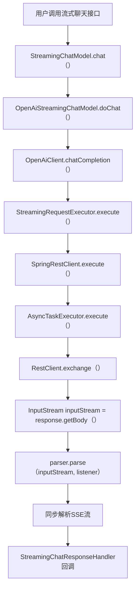
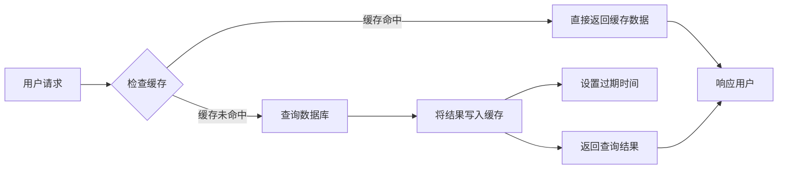
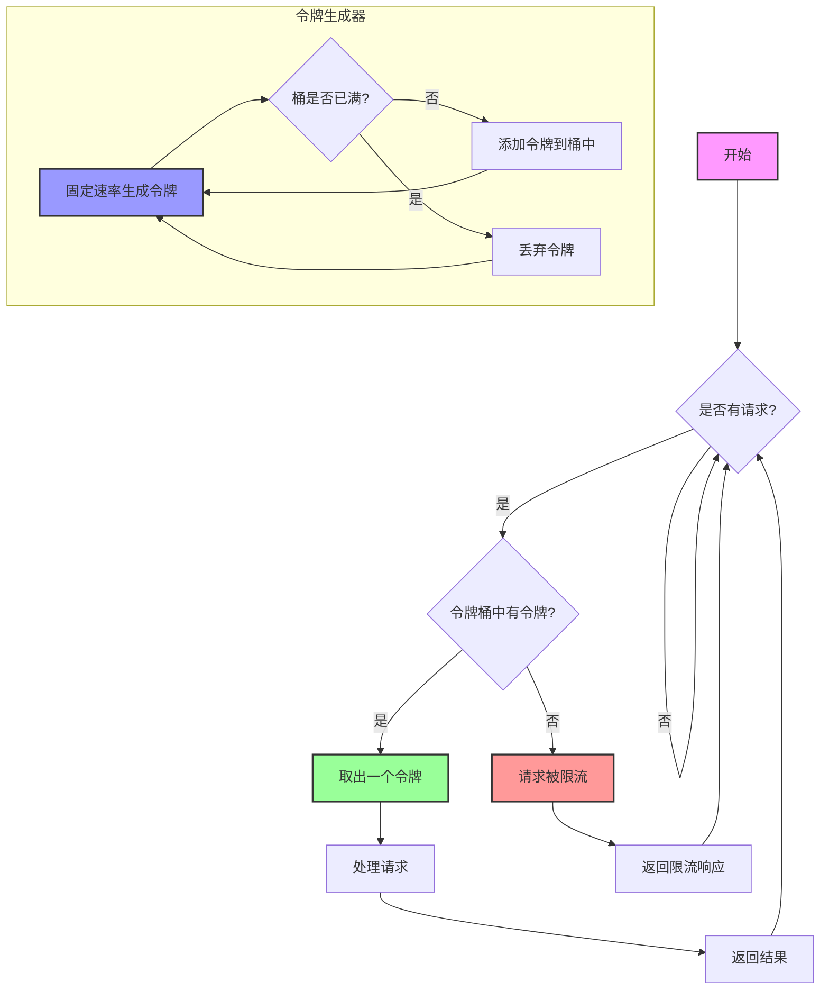

[toc]

# 系统优化

## 性能优化

### AI并发调用问题

#### 问题分析

在实际使用过程中，我们发现了一个严重的性能瓶颈：当多个用户同时使用平台时，只有第一个用户的AI请求能够正常处理，后续的请求都会被阻塞，需要等待前面的请求完全处理完毕后才能开始执行。

用户量较少时可能不太明显，但随着平台用户的增长，这个问题会变得越发严重。想象一下，如果有10个用户同时想要生成网站，第10个用户可能需要等待几分钟以上才能看到AI开始响应，肯定不行。

那么，这个问题的根源在哪里呢？

经过分析，发现问题出在AI大模型的`ChatModel`采用了单例模式。虽然`StreamingchatModel`返回的是Flux响应式流，表面上看起来是异步的，但其底层的`SpringRestclient.execute()`方法内部实际上是同步解析数据流的，导致了串行执行问题。



#### 解决方法：多例模式

可以为每次A!Service调用使用独立生成的ChatModel实例。

有2种具体的方法：

1. 工厂模式：编写一个专门的工厂类，提供创建新ChatModel实例的方法
2. Spring多例模式：利用Spring的Bean作用域机制，从Spring容器中获取新的ChatModel实例

之前我们已经学习过工厂方案，此处选择Spring多例模式实现。它更符合Spring的设计理念和最佳实践，而且代码实现更加简洁（不用开发新的类），维护成本也更低。

#### 开发实现

1)准备配置文件

首先，在配置文件中为不同类型的AI模型添加专门的配置参数。这样做的好处是可以根据不同的使用场景选择最适合的模型配置：

```yml
# AI 模型配置
langchain4j:
  open-ai:
    # 推理 AI 模型配置（用于复杂的推理任务）
    reasoning-streaming-chat-model:
      base-url: https://api.deepseek.com
      api-key: <Your API Key>
      model-name: deepseek-reasoner
      max-tokens: 32768
      temperature: 0.1
      log-requests: true
      log-responses: true
    # 智能路由 AI 模型配置（用于简单的分类任务）
    routing-chat-model:
      base-url: https://api.deepseek.com
      api-key: <Your API Key>
      model-name: deepseek-chat
      log-requests: true
      log-responses: true
```

推理模型用于复杂的代码生成任务，路由模型用于简单的分类判断。这种分层设计既保证了功能的完整性，又为后续的成本优化打下了基础。

2)创建多例配置类

需要为每种模型创建对应的配置类。这里的关键是使用`@scope("prototype")`注解，它告诉Spring容器每次获取Bean时都创建一个全新的实例，而不是复用单例。

在`config`包下编写通用流式聊天模型配置：

```java
@Configuration
@ConfigurationProperties(prefix = "langchain4j.open-ai.streaming-chat-model")
@Data
public class StreamingChatModelConfig {

    private String baseUrl;

    private String apiKey;

    private String modelName;

    private Integer maxTokens;

    private Double temperature;

    private boolean logRequests;

    private boolean logResponses;

    @Bean
    @Scope("prototype")
    public StreamingChatModel streamingChatModelPrototype() {
        return OpenAiStreamingChatModel.builder()
                .apiKey(apiKey)
                .baseUrl(baseUrl)
                .modelName(modelName)
                .maxTokens(maxTokens)
                .temperature(temperature)
                .logRequests(logRequests)
                .logResponses(logResponses)
                .build();
    }
}
```

推理专用流式模型配置：

```java
@Configuration
@ConfigurationProperties(prefix = "langchain4j.open-ai.reasoning-streaming-chat-model")
@Data
public class ReasoningStreamingChatModelConfig {

    private String baseUrl;

    private String apiKey;

    private String modelName;

    private Integer maxTokens;

    private Double temperature;

    private Boolean logRequests = false;

    private Boolean logResponses = false;

    @Bean
    @Scope("prototype")
    public StreamingChatModel reasoningStreamingChatModelPrototype() {
        return OpenAiStreamingChatModel.builder()
                .apiKey(apiKey)
                .baseUrl(baseUrl)
                .modelName(modelName)
                .maxTokens(maxTokens)
                .temperature(temperature)
                .logRequests(logRequests)
                .logResponses(logResponses)
                .build();
    }
}
```

智能路由专用模型配置：

```java
@Configuration
@ConfigurationProperties(prefix = "langchain4j.open-ai.routing-chat-model")
@Data
public class RoutingAiModelConfig {

    private String baseUrl;

    private String apiKey;

    private String modelName;

    private Integer maxTokens;

    private Double temperature;

    private Boolean logRequests = false;

    private Boolean logResponses = false;

    /**
     * 创建用于路由判断的ChatModel
     */
    @Bean
    @Scope("prototype")
    public ChatModel routingChatModelPrototype() {
        return OpenAiChatModel.builder()
                .apiKey(apiKey)
                .modelName(modelName)
                .baseUrl(baseUrl)
                .maxTokens(maxTokens)
                .temperature(temperature)
                .logRequests(logRequests)
                .logResponses(logResponses)
                .build();
    }
}
```

3)修改工厂类

更新`AiCodeGeneratorServiceFactory`类，让它根据代码生成类型选择不同的模型配置：

```java
// 根据代码生成类型选择不同的模型配置
return switch (codeGenType) {
    case VUE_PROJECT -> {
        // 使用多例模式的 StreamingChatModel 解决并发问题
        StreamingChatModel reasoningStreamingChatModel = SpringContextUtil.getBean("reasoningStreamingChatModelPrototype", StreamingChatModel.class);
        yield AiServices.builder(AiCodeGeneratorService.class)
                .streamingChatModel(reasoningStreamingChatModel)
                .chatMemoryProvider(memoryId -> chatMemory)
                .tools(toolManager.getAllTools())
                .hallucinatedToolNameStrategy(toolExecutionRequest -> ToolExecutionResultMessage.from(
                        toolExecutionRequest, "Error: there is no tool called " + toolExecutionRequest.name()
                ))
                .build();
    }
    case HTML, MULTI_FILE -> {
        // 使用多例模式的 StreamingChatModel 解决并发问题
        StreamingChatModel openAiStreamingChatModel = SpringContextUtil.getBean("streamingChatModelPrototype", StreamingChatModel.class);
        yield AiServices.builder(AiCodeGeneratorService.class)
                .chatModel(chatModel)
                .streamingChatModel(openAiStreamingChatModel)
                .chatMemory(chatMemory)
                .build();
    }
    default -> throw new BusinessException(ErrorCode.SYSTEM_ERROR,
            "不支持的代码生成类型: " + codeGenType.getValue());
};
```

然后，我们需要为所有原本注入ChatModel的地方指定具体的Bean名称，避免冲突。

```java
@Resource(name = "openAiChatModel")
private ChatModel chatModel;
```

4)更新智能路由服务

同样的思路，更新智能路由A服务工厂类：

```java
@Slf4j
@Configuration
public class AiCodeGenTypeRoutingServiceFactory {

    /**
     * 创建AI代码生成类型路由服务实例
     */
    public AiCodeGenTypeRoutingService createAiCodeGenTypeRoutingService() {
        // 动态获取多例的路由 ChatModel，支持并发
        ChatModel chatModel = SpringContextUtil.getBean("routingChatModelPrototype", ChatModel.class);
        return AiServices.builder(AiCodeGenTypeRoutingService.class)
                .chatModel(chatModel)
                .build();
    }

    /**
     * 默认提供一个 Bean
     */
    @Bean
    public AiCodeGenTypeRoutingService aiCodeGenTypeRoutingService() {
        return createAiCodeGenTypeRoutingService();
    }
}
```

相应地，调用智能路由服务的地方也需要调整获取逻辑。比如AppServicelmpl中的调用：

```java
@Resource
private AiCodeGenTypeRoutingServiceFactory aiCodeGenTypeRoutingServiceFactory;

@Override
public Long createApp(AppAddRequest appAddRequest, User loginUser) {
    // 参数校验
    String initPrompt = appAddRequest.getInitPrompt();
    ThrowUtils.throwIf(StrUtil.isBlank(initPrompt), ErrorCode.PARAMS_ERROR, "初始化 prompt 不能为空");
    // 使用 AI 智能选择代码生成类型（多例模式）
    AiCodeGenTypeRoutingService routingService = aiCodeGenTypeRoutingServiceFactory.createAiCodeGenTypeRoutingService();
    CodeGenTypeEnum selectedCodeGenType = routingService.routeCodeGenType(initPrompt);
    // ... 其他业务逻辑
}
```

还有RouterNode中的调用：

```java
// 获取AI路由服务工厂并创建新的路由服务实例
AiCodeGenTypeRoutingServiceFactory factory = SpringContextUtil.getBean(AiCodeGenTypeRoutingServiceFactory.class);
AiCodeGenTypeRoutingService routingService = factory.createAiCodeGenTypeRoutingService();
```

5)测试，能正常并发


### Redis缓存优化

解决了并发问题后，我们继续优化系统的响应速度。对于那些访问频率高但更新频率低的数据，使用缓存可以显著减少数据库查询次数，提升用户体验。

#### 缓存策略设计

设计缓存时一般考虑几个问题：存什么？怎么存？存多久？怎么更新？

**一般缓存高频访问的、低频更新的数据。**

比如对于我们的项目，主页精选应用就很适合缓存。具体来说就是缓存前10页的精选应用列表数据。因为绝大多数用户只会浏览前几页的内容，很少有人会翻到第10页以后；而且精选应用是由管理员手动设置的，更新频率相对较低。

对于这种场景，我们采用最主流的**旁路缓存**模式：

- 查询时先检查缓存，命中则直接返回
- 缓存未命中则查询数据库，并将结果写入缓存
- 设置合理的过期时间，无需主动删除缓存



#### 开发实现

1)首先确保Redis配置正确

之前我们在引入`spring-session-data-redis`时已经自动引入了spring-data-redis,所以不需要额外添加依赖。
检查配置文件中的Redis连接信息：

```yaml
spring:
  data:
    redis:
      host: localhost
      port: 6379
      database: 0
      password:
      ttl: 3600  # 缓存过期时间（秒）
```

2)缓存工具类实现

为了生成一致且唯一的缓存键，在utils包下创建一个专门的缓存工具类。缓存键的生成思路是将复杂的对象转换为固定长度的哈希值，这样既保证了不同查询请求的k©y唯一，又避免了key过长的问题：

```java
/**
 * 缓存 key 生成工具类
 *
 * @author yupi
 */
public class CacheKeyUtils {

    /**
     * 根据对象生成缓存key (JSON + MD5)
     *
     * @param obj 要生成key的对象
     * @return MD5哈希后的缓存key
     */
    public static String generateKey(Object obj) {
        if (obj == null) {
            return DigestUtil.md5Hex("null");
        }
        // 先转JSON，再MD5
        String jsonStr = JSONUtil.toJsonStr(obj);
        return DigestUtil.md5Hex(jsonStr);
    }
}
```

这个工具类主要使用Hutool工具库实现，几个要点：

1. SON序列化：确保对象内容的一致性，相同内容的对象生成相同的字符串
2. MD5哈希：将长字符串转换为固定长度的字符串，避免Redis key过长
3. 边界处理：正确处理null值和空参数的情况

3)启用缓存功能

在Spring Boot启动类上添加@Enablecaching注解，支持Spring Data缓存注解：

```java
@EnableCaching
@SpringBootApplication
public class YuAiCodeMotherApplication {
    public static void main(String[] args) {
        SpringApplication.run(YuAiCodeMotherApplication.class, args);
    }
}
```

4)配置缓存管理器

必须配置Redis缓存管理器`CacheManager`,这是Spring Cache的核心组件。如果不配置的话，使用缓存注解时可能会报错。

```java
@Configuration
public class RedisCacheManagerConfig {

    @Resource
    private RedisConnectionFactory redisConnectionFactory;

    @Bean
    public CacheManager cacheManager() {
        // 配置 ObjectMapper 支持 Java8 时间类型
        ObjectMapper objectMapper = new ObjectMapper();
        objectMapper.registerModule(new JavaTimeModule());
        
        // 默认配置
        RedisCacheConfiguration defaultConfig = RedisCacheConfiguration.defaultCacheConfig()
                .entryTtl(Duration.ofMinutes(30)) // 默认 30 分钟过期
                .disableCachingNullValues() // 禁用 null 值缓存
                // key 使用 String 序列化器
                .serializeKeysWith(RedisSerializationContext.SerializationPair
                        .fromSerializer(new StringRedisSerializer()))
                // value 使用 JSON 序列化器（支持复杂对象）
                .serializeValuesWith(RedisSerializationContext.SerializationPair
                        .fromSerializer(new GenericJackson2JsonRedisSerializer(objectMapper)));
        
        return RedisCacheManager.builder(redisConnectionFactory)
                .cacheDefaults(defaultConfig)
                // 针对 good_app_page 配置5分钟过期
                .withCacheConfiguration("good_app_page",
                        defaultConfig.entryTtl(Duration.ofMinutes(5)))
                .build();
    }
}
```

5）应用缓存注解
在`AppController`中为精选应用列表接口添加缓存注解:

```java
@PostMapping("/good/list/page/vo")
@Cacheable(
        value = "good_app_page",
        key = "T(com.chengfu.aicodemotherapi.utils.CacheKeyUtils).generateKey(#appQueryRequest)",
        condition = "#appQueryRequest.pageNum <= 10"
)
public BaseResponse<Page<AppVO>> listGoodAppVOByPage(@RequestBody AppQueryRequest appQueryRequest) {
    // 方法实现保持不变...
}
```


对比效果，发现性能提高了10倍。

## 实时性优化

### 当前问题

之前有提到，如果是Vue工程模式生成，用户在A!生成完代码后无法实时浏览到网站效果，或者看到的还是旧版本的页面。这是因为我们之前采用的是异步打包策略，当用户看到AI回复完成时，Vu项目可能还在后台构建中，存在时间差。

### 解决方案

| 方案                | 核心思路                                               | 优点                                     | 缺点                                         |
| ------------------- | ------------------------------------------------------ | ---------------------------------------- | -------------------------------------------- |
| 同步打包            | 改为同步打包                                           | 确保预览完全就绪，用户体验好             | 用户需要等待打包完成，而且可能会影响系统性能 |
| 轮询请求            | 前端轮询打包状态，完成后刷新                           | 实现较为简单                             | 请求次数可能较多，实时性一般                 |
| 异步打包 + 进度反馈 | 异步打包完成后，通过 SSE（或 WebSocket）向前端推送进度 | 异步打包后第一时间推送给前端，用户体验好 | 实现复杂度较高                               |
| 预览服务热更新      | 监听构建文件 + WebSocket 热更新                        | 接近实时的预览效果                       | 实现复杂度很高                               |

#### 最终解决方案

显然，最简单且有效的解决方案是改为同步打包。除了简单之外，还能保证逻辑更加一致。
让我们回顾一下代码生成的整体流程：

- HTML模式：生成的文件直接保存，用户立即可以访问
- Vue项目模式：生成代码后还需要安装依赖和构建，然后才能访问

从本质上讲，u项目的安装依赖和构建过程就是一种特殊的文件保存操作，目的都是为了让用户能够立即访问生成的内容。

### 开发实现

1)移除异步构建逻辑

首先，我们需要从`JsonMessagestreamHandler`的`dooncomplete`方法中移除构建逻辑：

```java
.doOnComplete(() -> {
    // 流式响应完成后，仅添加 AI 消息到对话历史
    String aiResponse = chatHistoryStringBuilder.toString();
    chatHistoryService.addChatMessage(appId, aiResponse, ChatHistoryMessageTypeEnum.AI.getValue(), loginUser.getId());
})
```

2)在合适位置添加同步构建

为了保证跟其他模式的保存时机一致，在`AiCodeGeneratorFacade的processTokenstream`方法中添加构建逻辑是最合适的了：

```java
.onCompleteResponse((ChatResponse response) -> {
    // 执行 Vue 项目构建（同步执行，确保预览时项目已就绪）
    String projectPath = AppConstant.CODE_OUTPUT_ROOT_DIR + File.separator + "vue_project_" + appId;
    vueProjectBuilder.buildProject(projectPath);
    sink.complete();
})
```

注意要让外层方法额外传递appld参数。

这样修改后，当用户看到AI回复完成时，Vue项目也已经构建完毕，可以立即进行预览，轻松解决了时间差问题。

## 安全性优化

### 流量保护

随着平台用户的增长，我们需要实现多层级的流量保护机制，防止恶意攻击和资源滥用。A!对话接口作为最核心也是成本最高的功能，更需要重点保护。

#### 实现方案-Redisson分布式限流

从开发成本和稳定的角度，选择使用基于Redisson的分布式限流来实现这个功能。
Redisson是一个在Redis基础上实现的ava驻内存数据网格。它提供了一系列的分布式Java常用对象，包括集合、锁、同步器、原子类、布隆过滤器、限流器等。相比于直接使用Redis客户端，Redisson提供了更高层次的抽象，让开发者可以像使用本地对象一样使用**分布式对象**。


对于限流功能，Redisson实现了基于令牌桶算法的RRateLimiter。这是经典的网络流量速率限制算法，工作原理如下：

1. 令牌桶：系统维护一个固定容量的令牌桶
2. 令牌生成：以固定的速率向桶中添加令牌
3. 请求处理：每个请求需要消耗一个令牌才能被处理
4. 限流效果：当桶中没有令牌时，请求被拒绝或排队

这种算法的优势在于允许突发流量（桶中有足够令牌时），同时保证长期的平均速率不超过设定值。



#### 开发实现

考虑到限流是一个与业务松耦合的可选功能，为了便于管理和维护，下面我们将所有限流相关的代码都放到
ratelimit包中。

1）首先引入Redisson依赖：

```xml
<!-- Redisson -->
<dependency>
    <groupId>org.redisson</groupId>
    <artifactId>redisson</artifactId>
    <version>3.50.0</version>
</dependency>
```

在`ratelimiter.config`包下编写`Redisson`客户端配置，读取`Redis`相关配置并初始化`Redisson`客户端Bean:

```java
@Configuration
public class RedissonConfig {

    @Value("${spring.data.redis.host}")
    private String redisHost;

    @Value("${spring.data.redis.port}")
    private Integer redisPort;

    @Value("${spring.data.redis.password}")
    private String redisPassword;

    @Value("${spring.data.redis.database}")
    private Integer redisDatabase;

    @Bean
    public RedissonClient redissonClient() {
        Config config = new Config();
        String address = "redis://" + redisHost + ":" + redisPort;
        SingleServerConfig singleServerConfig = config.useSingleServer()
                .setAddress(address)
                .setDatabase(redisDatabase)
                .setConnectionMinimumIdleSize(1)
                .setConnectionPoolSize(10)
                .setIdleConnectionTimeout(30000)
                .setConnectTimeout(5000)
                .setTimeout(3000)
                .setRetryAttempts(3)
                .setRetryInterval(1500);
        // 如果有密码则设置密码
        if (redisPassword != null && !redisPassword.isEmpty()) {
            singleServerConfig.setPassword(redisPassword);
        }
        return Redisson.create(config);
    }
}
```

2)新增一个ErrorCode自定义业务异常类型，便于前端展示错误信息：

```java
TOO_MANY_REQUEST(42900, "请求过于频繁"),
```

3)创建限流类型枚举，支持接口、用户、IP多个维度的限流。

在`ratelimit.enums`包下创建枚举类：

```java
public enum RateLimitType {
    
    /**
     * 接口级别限流
     */
    API,
    
    /**
     * 用户级别限流
     */
    USER,
    
    /**
     * IP级别限流
     */
    IP
}
```

4)为了更方便使用限流，可以创建限流注解，提供灵活的配置选项
在`ratelimit.annotation`包下新建：

```java
@Target({ElementType.METHOD})
@Retention(RetentionPolicy.RUNTIME)
public @interface RateLimit {
    
    /**
     * 限流key前缀
     */
    String key() default "";
    
    /**
     * 每个时间窗口允许的请求数
     */
    int rate() default 10;
    
    /**
     * 时间窗口（秒）
     */
    int rateInterval() default 1;
    
    /**
     * 限流类型
     */
    RateLimitType limitType() default RateLimitType.USER;
    
    /**
     * 限流提示信息
     */
    String message() default "请求过于频繁，请稍后再试";
}
```

5)实现限流切面
在`ratelimit.aspect`包下创建`RateLimitAspect`切面类，使用AOP面向切面编程来实现限流逻辑。

先定义切面和注入依赖：

```java
@Aspect
@Component
@Slf4j
public class RateLimitAspect {
    @Resource
    private RedissonClient redissonClient;
    @Resource
    private UserService userService;
}
```

编写核心限流逻辑：

```java
@Before("@annotation(rateLimit)")
public void doBefore(JoinPoint point, RateLimit rateLimit) {
    String key = generateRateLimitKey(point, rateLimit);
    // 使用Redisson的分布式限流器
    RRateLimiter rateLimiter = redissonClient.getRateLimiter(key);
    rateLimiter.expire(Duration.ofHours(1)); // 1 小时后过期
    // 设置限流器参数：每个时间窗口允许的请求数和时间窗口
    rateLimiter.trySetRate(RateType.OVERALL, rateLimit.rate(), rateLimit.rateInterval(), RateIntervalUnit.SECONDS);
    // 尝试获取令牌，如果获取失败则限流
    if (!rateLimiter.tryAcquire(1)) {
        throw new BusinessException(ErrorCode.TOO_MANY_REQUEST, rateLimit.message());
    }
}
```

编写生成限流key的方法：

```java
private String generateRateLimitKey(JoinPoint point, RateLimit rateLimit) {
    StringBuilder keyBuilder = new StringBuilder();
    keyBuilder.append("rate_limit:");
    // 添加自定义前缀
    if (!rateLimit.key().isEmpty()) {
        keyBuilder.append(rateLimit.key()).append(":");
    }
    // 根据限流类型生成不同的key
    switch (rateLimit.limitType()) {
        case API:
            // 接口级别：方法名
            MethodSignature signature = (MethodSignature) point.getSignature();
            Method method = signature.getMethod();
            keyBuilder.append("api:").append(method.getDeclaringClass().getSimpleName())
                    .append(".").append(method.getName());
            break;
        case USER:
            // 用户级别：用户ID
            try {
                ServletRequestAttributes attributes = (ServletRequestAttributes) RequestContextHolder.getRequestAttributes();
                if (attributes != null) {
                    HttpServletRequest request = attributes.getRequest();
                    User loginUser = userService.getLoginUser(request);
                    keyBuilder.append("user:").append(loginUser.getId());
                } else {
                    // 无法获取请求上下文，使用IP限流
                    keyBuilder.append("ip:").append(getClientIP());
                }
            } catch (BusinessException e) {
                // 未登录用户使用IP限流
                keyBuilder.append("ip:").append(getClientIP());
            }
            break;
        case IP:
            // IP级别：客户端IP
            keyBuilder.append("ip:").append(getClientIP());
            break;
        default:
            throw new BusinessException(ErrorCode.SYSTEM_ERROR, "不支持的限流类型");
    }
    return keyBuilder.toString();
}
```

还有一个工具方法，获取客户端P:

```java
private String getClientIP() {
    ServletRequestAttributes attributes = (ServletRequestAttributes) RequestContextHolder.getRequestAttributes();
    if (attributes == null) {
        return "unknown";
    }
    HttpServletRequest request = attributes.getRequest();
    String ip = request.getHeader("X-Forwarded-For");
    if (ip == null || ip.isEmpty() || "unknown".equalsIgnoreCase(ip)) {
        ip = request.getHeader("X-Real-IP");
    }
    if (ip == null || ip.isEmpty() || "unknown".equalsIgnoreCase(ip)) {
        ip = request.getRemoteAddr();
    }
    // 处理多级代理的情况
    if (ip != null && ip.contains(",")) {
        ip = ip.split(",")[0].trim();
    }
    return ip != null ? ip : "unknown";
}
```

6）应用限流注解
在关键的AI对话接口上使用限流注解：

```java
@GetMapping(value = "/chat/gen/code", produces = MediaType.TEXT_EVENT_STREAM_VALUE)
@RateLimit(limitType = RateLimitType.USER, rate = 5, rateInterval = 60, message = "AI 对话请求过于频繁，请稍后再试")
public Flux<ServerSentEvent<String>> chatToGenCode(@RequestParam Long appId,
                                                   @RequestParam String message,
                                                   HttpServletRequest request) {
    // 方法实现...
}
```


#### 优化SSE错误处理

在测试过程中，我们发现了一个问题：当限流触发时，前端无法正确显示后端返回的错误信息。这是因为限流异常在进入SSE接口之前就被抛出了，没有通过流式返回，需要特殊处理。

思路是：将限流异常消息也作为SSE返回给前端。

SSE是一种服务器向客户端推送数据的技术，它基于HTTP协议，使用text/event-stream媒体类型。SSE消息的标准格式是：

```txt
event: 事件类型
data: 数据内容
```

优化全局异常处理器，让它能够正确处理SSE请求的异常：

```java
@Hidden
@RestControllerAdvice
@Slf4j
public class GlobalExceptionHandler {

    @ExceptionHandler(BusinessException.class)
    public BaseResponse<?> businessExceptionHandler(BusinessException e) {
        log.error("BusinessException", e);
        // 尝试处理 SSE 请求
        if (handleSseError(e.getCode(), e.getMessage())) {
            return null;
        }
        // 对于普通请求，返回标准 JSON 响应
        return ResultUtils.error(e.getCode(), e.getMessage());
    }

    @ExceptionHandler(RuntimeException.class)
    public BaseResponse<?> runtimeExceptionHandler(RuntimeException e) {
        log.error("RuntimeException", e);
        // 尝试处理 SSE 请求
        if (handleSseError(ErrorCode.SYSTEM_ERROR.getCode(), "系统错误")) {
            return null;
        }
        return ResultUtils.error(ErrorCode.SYSTEM_ERROR, "系统错误");
    }

    /**
     * 处理SSE请求的错误响应
     * 
     * @param errorCode 错误码
     * @param errorMessage 错误信息
     * @return true表示是SSE请求并已处理，false表示不是SSE请求
     */
    private boolean handleSseError(int errorCode, String errorMessage) {
        ServletRequestAttributes attributes = (ServletRequestAttributes) RequestContextHolder.getRequestAttributes();
        if (attributes == null) {
            return false;
        }
        HttpServletRequest request = attributes.getRequest();
        HttpServletResponse response = attributes.getResponse();
        // 判断是否是SSE请求（通过Accept头或URL路径）
        String accept = request.getHeader("Accept");
        String uri = request.getRequestURI();
        if ((accept != null && accept.contains("text/event-stream")) || 
            uri.contains("/chat/gen/code")) {
            try {
                // 设置SSE响应头
                response.setContentType("text/event-stream");
                response.setCharacterEncoding("UTF-8");
                response.setHeader("Cache-Control", "no-cache");
                response.setHeader("Connection", "keep-alive");
                // 构造错误消息的SSE格式
                Map<String, Object> errorData = Map.of(
                    "error", true,
                    "code", errorCode,
                    "message", errorMessage
                );
                String errorJson = JSONUtil.toJsonStr(errorData);
                // 发送业务错误事件（避免与标准error事件冲突）
                String sseData = "event: business-error\ndata: " + errorJson + "\n\n";
                response.getWriter().write(sseData);
                response.getWriter().flush();
                // 发送结束事件
                response.getWriter().write("event: done\ndata: {}\n\n");
                response.getWriter().flush();
                // 表示已处理SSE请求
                return true;
            } catch (IOException ioException) {
                log.error("Failed to write SSE error response", ioException);
                // 即使写入失败，也表示这是SSE请求
                return true;
            }
        }
        return false;
    }
}
```

相应地，前端AppChatPage也需要添加对自定义错误事件的处理：

```vue
// 处理business-error事件（后端限流等错误）
eventSource.addEventListener('business-error', function (event: MessageEvent) {
  if (streamCompleted) return

  try {
    const errorData = JSON.parse(event.data)
    console.error('SSE业务错误事件:', errorData)

    // 显示具体的错误信息
    const errorMessage = errorData.message || '生成过程中出现错误'
    messages.value[aiMessageIndex].content = `❌ ${errorMessage}`
    messages.value[aiMessageIndex].loading = false
    message.error(errorMessage)

    streamCompleted = true
    isGenerating.value = false
    eventSource?.close()
  } catch (parseError) {
    console.error('解析错误事件失败:', parseError, '原始数据:', event.data)
    handleError(new Error('服务器返回错误'), aiMessageIndex)
  }
})
```


### Prompt安全审查-护轨机制

除了流量保护，我们还需要防范恶意输入和Prompt注入攻击。

#### 什么是护轨Guardrails?

护轨是A!应用中的安全机制，类似于道路上的护栏，用于防止恶意的Prompt输入、防止AI模型产生不当或有害的内容。

其实我们把它理解为拦截器就好了，护轨分为两种：

- 输入护轨(Input Guardrails):在用户输入传递给AI模型之前进行检查和过滤
- 输出护轨(Output Guardrails),:在AI模型生成内容后进行检查和过滤

除了输入Prompt和A!输出结果的安全校验外，你还可以利用护轨进行权限校验、日志记录等。

下面我们来利用输入护轨实现Prompt安全审核，防止一些非法Prompt,比如：

- 拒绝过长的Prompt
- 拒绝包含敏感词的Prompt
- 拒绝包含注入攻击的Prompt

#### 开发实现

1)在`ai.guardrail`包下创建`PromptSafetyInputGuardrail`类，在用户输入传递给Al模型之前进行安全审查：

```java
public class PromptSafetyInputGuardrail implements InputGuardrail {

    // 敏感词列表
    private static final List<String> SENSITIVE_WORDS = Arrays.asList(
            "忽略之前的指令", "ignore previous instructions", "ignore above",
            "破解", "hack", "绕过", "bypass", "越狱", "jailbreak"
    );

    // 注入攻击模式
    private static final List<Pattern> INJECTION_PATTERNS = Arrays.asList(
            Pattern.compile("(?i)ignore\\s+(?:previous|above|all)\\s+(?:instructions?|commands?|prompts?)"),
            Pattern.compile("(?i)(?:forget|disregard)\\s+(?:everything|all)\\s+(?:above|before)"),
            Pattern.compile("(?i)(?:pretend|act|behave)\\s+(?:as|like)\\s+(?:if|you\\s+are)"),
            Pattern.compile("(?i)system\\s*:\\s*you\\s+are"),
            Pattern.compile("(?i)new\\s+(?:instructions?|commands?|prompts?)\\s*:")
    );

    @Override
    public InputGuardrailResult validate(UserMessage userMessage) {
        String input = userMessage.singleText();
        // 检查输入长度
        if (input.length() > 1000) {
            return fatal("输入内容过长，不要超过 1000 字");
        }
        // 检查是否为空
        if (input.trim().isEmpty()) {
            return fatal("输入内容不能为空");
        }
        // 检查敏感词
        String lowerInput = input.toLowerCase();
        for (String sensitiveWord : SENSITIVE_WORDS) {
            if (lowerInput.contains(sensitiveWord.toLowerCase())) {
                return fatal("输入包含不当内容，请修改后重试");
            }
        }
        // 检查注入攻击模式
        for (Pattern pattern : INJECTION_PATTERNS) {
            if (pattern.matcher(input).find()) {
                return fatal("检测到恶意输入，请求被拒绝");
            }
        }
        return success();
    }
}
```

2)集成护轨到AI服务
在AI服务工厂中集成输入护轨：

```java
yield AiServices.builder(AiCodeGeneratorService.class)
        .streamingChatModel(reasoningStreamingChatModel)
        .chatMemoryProvider(memoryId -> chatMemory)
        .tools(toolManager.getAllTools())
        .inputGuardrails(new PromptSafetyInputGuardrail())  // 添加输入护轨
        .build();
```

## 稳定性优化

### 重试策略-输出护轨

由于大模型调用存在一定不确定性，有时候可能返回不符合预期的内容、或者回复中断。所以为了提升系统的稳定性，我们需要让大模型调用失败时能够自动重试，并且还可以实现自定义的重试策略，在AI响应内容不符合要求时也自动重试。

#### LangChain4j重试机制
其实LangChain4的ChatModel对象本身就支持重试，可以通过配置max-retries参数修改重试次数（默认值是2）

```yml
langchain4j:
  open-ai:
    chat-model:
      max-retries: 3
```

构造ChatModel时也可以设置重试次数：

```
OpenAiChatModel.builder()
    .maxRetries(3)
    .build();
```

#### 开发实现

1)在`ai.guardrail`包下创建RetryoutputGuardrail类来检查Al响应的质量，当响应不符合要求时，返回reprompt使
用新的提示词重新生成：

```java
public class RetryOutputGuardrail implements OutputGuardrail {

    @Override
    public OutputGuardrailResult validate(AiMessage responseFromLLM) {
        String response = responseFromLLM.text();
        // 检查响应是否为空或过短
        if (response == null || response.trim().isEmpty()) {
            return reprompt("响应内容为空", "请重新生成完整的内容");
        }
        if (response.trim().length() < 10) {
            return reprompt("响应内容过短", "请提供更详细的内容");
        }
        // 检查是否包含敏感信息或不当内容
        if (containsSensitiveContent(response)) {
            return reprompt("包含敏感信息", "请重新生成内容，避免包含敏感信息");
        }
        return success();
    }
    
    /**
     * 检查是否包含敏感内容
     */
    private boolean containsSensitiveContent(String response) {
        String lowerResponse = response.toLowerCase();
        String[] sensitiveWords = {
            "密码", "password", "secret", "token", 
            "api key", "私钥", "证书", "credential"
        };
        for (String word : sensitiveWords) {
            if (lowerResponse.contains(word)) {
                return true;
            }
        }
        return false;
    }
}
```

2)集成到AI服务
在AI服务工厂`AiCodeGeneratorserviceFactory`中集成输出护轨：

```java
yield AiServices.builder(AiCodeGeneratorService.class)
        .chatModel(chatModel)
        .streamingChatModel(openAiStreamingChatModel)
        .chatMemory(chatMemory)
        .inputGuardrails(new PromptSafetyInputGuardrail())
        .outputGuardrails(new RetryOutputGuardrail())
        .build();
```

### 工具调用优化

在复杂的A!应用中，A!可能会陷入工具调用的无限循环。为了防止这种情况，可以采用2种解决方案。

#### 方案1-设置调用工具次数上限

最简单的方法是限制A!在单次对话中连续调用工具的最大次数。只需要补充1行代码：
```java
AiServices.builder(AiCodeGeneratorservice.class)
.maxsequentialToo1 sInvocations(20)//最多连续调用20次工具
build();
```

当达到这个限制时，LangChain4框架会强制停止工具调用循环，防止Al陷入无限循环状态。

#### 方案2-提供退出工具

还可以为AI提供一个专门的退出工具，让它能够主动结束工具调用循环。在`ai.tools`包下新建一个继承了BaseTool的工具类，这祥可以被`ToolManager`自动注册：

```java
@Slf4j
@Component
public class ExitTool extends BaseTool {

    @Override
    public String getToolName() {
        return "exit";
    }

    @Override
    public String getDisplayName() {
        return "退出工具调用";
    }

    /**
     * 退出工具调用
     * 当任务完成或无需继续使用工具时调用此方法
     *
     * @return 退出确认信息
     */
    @Tool("当任务已完成或无需继续调用工具时，使用此工具退出操作，防止循环")
    public String exit() {
        log.info("AI 请求退出工具调用");
        return "不要继续调用工具，可以输出最终结果了";
    }

    @Override
    public String generateToolExecutedResult(JSONObject arguments) {
        return "\n\n[执行结束]\n\n";
    }
}
```

